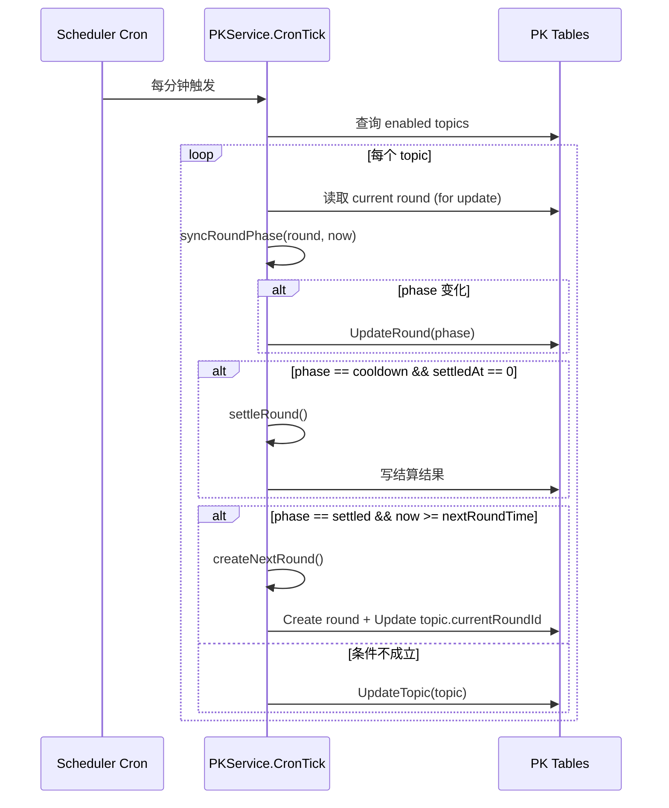
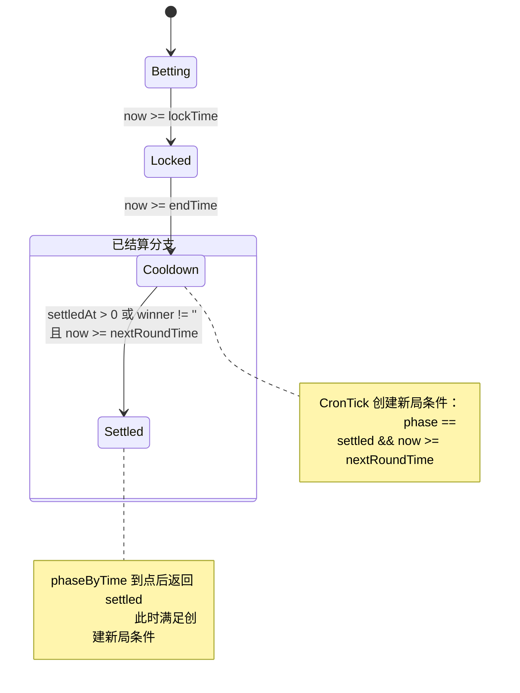
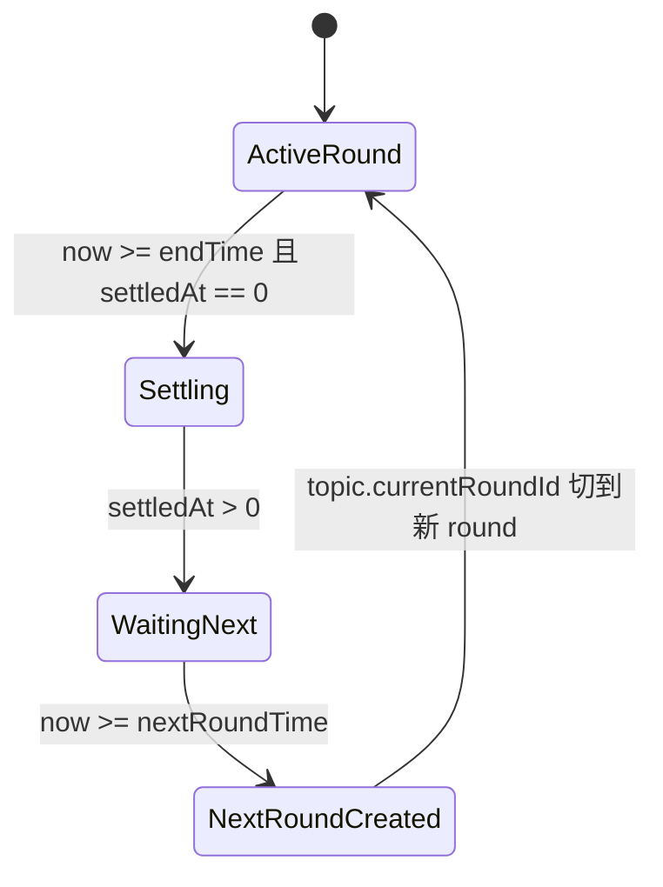
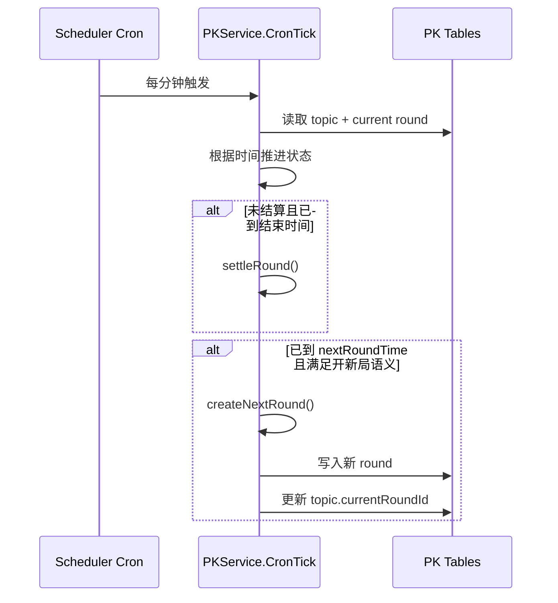

# 对立PK新一局未生成问题分析（UML版）

## 1. 问题背景

- 现象：线上日志中每分钟都出现 `pk cron tick start/done`，并且出现 `PK_FLOW` 的 `pk cron scan topics`，但没有出现 `pk next round trigger` 或 `pk next round create done`。
- 影响：对局结束后，用户侧查询不到新的 PK 对局（`currentRoundId` 未推进到新 round）。

## 2. 日志侧观测结论

- 调度器正常运行：PK 轮询任务按 `*/1 * * * *` 每分钟触发。
- `PKService.CronTick()` 正常执行：能扫描到 `topicCount=16`。
- 未出现失败日志：没有 `pk cron tick failed`、`pk next round create failed`。
- 未出现触发日志：没有 `pk next round trigger`，说明创建新局的判断分支未进入。

## 3. 现状时序（基于当前实现）

## 4. 现状状态机（关键矛盾点）

### 4.1 状态白话解释（给业务和运营看）

- `betting`（可下注期）
	- 白话：这一局正在进行中，大家还能下注、站队、互动。
	- 用户感知：页面通常会显示“可下注”或倒计时到封盘。
	- 何时进入：新一局刚创建时默认就是这个状态。

- `locked`（封盘期）
	- 白话：不让继续下注了，但这一局还没正式出结果。
	- 用户感知：还能看盘面变化，但下注入口关闭。
	- 何时进入：到达 `lockTime` 后自动进入。

- `cooldown`（冷却/等待期开）
	- 白话：这局已经结束到可结算阶段，系统会做结算，等待进入下一局窗口。
	- 用户感知：这一局基本收尾，通常不再接受新的下注互动。
	- 何时进入：到达 `endTime` 后进入；或已结算但还没到 `nextRoundTime`。

- `settled`（已结算完成）
	- 白话：这一局的胜负和结算都已经完成，理论上应该切到新的一局。
	- 用户感知：旧局应视为历史局，前台应看到新局成为当前局。
	- 何时进入：已结算且时间到达/超过 `nextRoundTime` 后。

- 本次故障的直白描述
	- 本来想在 `cooldown` 时“到点开新局”，但状态机会在到点瞬间先把局面算成 `settled`。
	- 结果：开新局判断卡在“必须是 cooldown”这个条件上，导致新局没被创建或没被切换成当前局。

## 5. 根因分析

已修复：创建新局判定改为依赖 `settled` 状态，和状态机在 `nextRoundTime` 之后的计算结果保持一致。

即：

- 创建新局当前条件：`phase == settled && now >= nextRoundTime`
- 状态计算逻辑：当 `settledAt > 0` 且 `now >= nextRoundTime` 时返回 `settled`

因此在临界时刻后，`phase` 与创建新局条件一致，轮询可进入创建新局分支。

## 6. 代码定位

- PK 轮询入口与新局触发判断：internal/services/pk_service.go（`CronTick`）
- phase 计算逻辑：internal/services/pk_service.go（`phaseByTime`）
- 调度任务注册：internal/scheduler/cron.go

## 7. 拟修复方案（不改代码，仅方案）

方案已落地：创建新局判断从 `phase == cooldown` 改为 `phase == settled`。

当前判定语义：到达下一局时间，且当前 round 已进入结算完成态（settled），允许创建下一局。

### 7.1 目标状态机

### 7.1.1 修复后状态白话版

- `ActiveRound`：当前活跃局，用户在这个局里下注和互动。
- `Settling`：到收盘时间后，系统进入结算计算阶段。
- `WaitingNext`：结算完成，等待到“下一局开始时间”。
- `NextRoundCreated`：创建新局并把 `currentRoundId` 切过去，用户端应看到新局。

### 7.2 目标时序

## 8. 验证计划（修复后）

- 日志验证
	- 必须出现：`pk next round trigger`
	- 必须出现：`pk next round row created`
	- 必须出现：`pk topic currentRound switched`
- 数据验证
	- topic 的 `current_round_id` 发生变化
	- 新 round 的 `round_no = prev.round_no + 1`
	- 新 round 的 `start_time/lock_time/end_time/next_round_time` 连续正确
- 接口验证
	- 用户侧列表/详情读取到新 `currentRoundId`

## 9. 风险与注意事项

- 并发风险：多实例同时跑 cron 时，需要保证 `createNextRound` 幂等（当前已有 roundNo 重复检查）。
- 历史脏数据风险：若旧数据 phase 已是 settled 且 topic 未切换，需要一次性回补策略。
- 观测性建议：保留 `PK_FLOW` 标记日志，便于后续排障。

