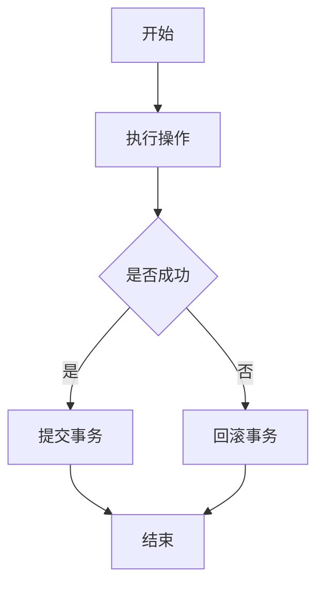
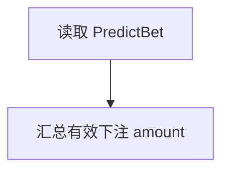
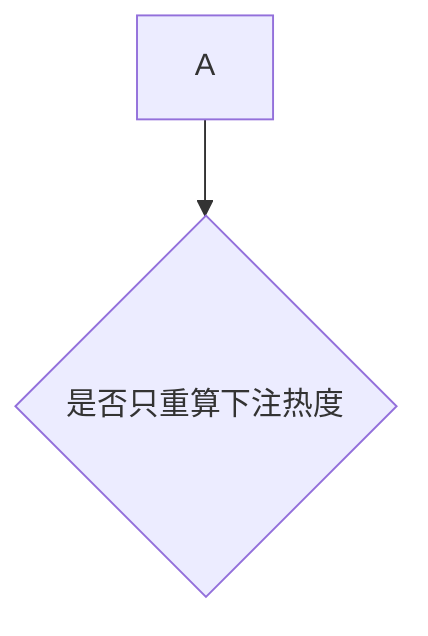
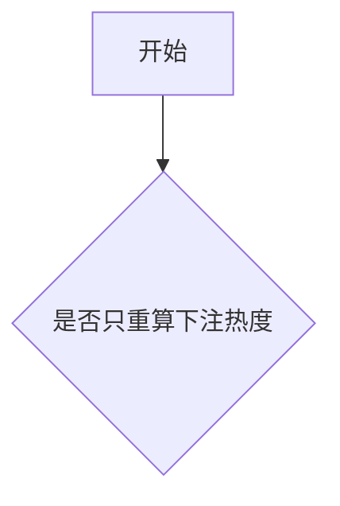
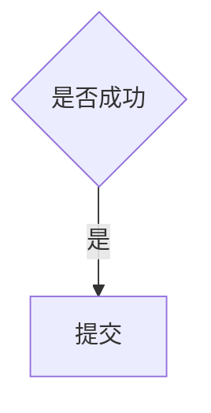

# Mermaid 流程图防错提示词

> 用途：写 Mermaid `flowchart` 前复制本提示词，降低解析错误概率。

## 推荐提示词

请生成 Mermaid flowchart，并严格遵守以下规则：

1. 所有节点文本都用双引号包裹，例如 `A["用户提交下注"]`。
2. 判断节点也用双引号包裹，例如 `B{"是否成功"}`。
3. 连线标签用双引号包裹，例如 `A -- "是" --> B`。
4. 节点文本中不要直接写英文括号表达式，例如 `sum(amount)`、`foo(bar)`。
5. 如果必须表达函数或公式，改成自然语言，例如 `汇总有效下注 amount`。
6. 节点文本中避免直接出现 `{}`、`[]`、`()`、`|`、`<`、`>`。
7. API 路径可以放在引号节点里，例如 `A["POST /api/coin/bet"]`。
8. 不要把多个节点和连线写在同一行。
9. 每一条边单独一行。
10. 只使用简单节点形状：普通节点 `["文本"]` 和判断节点 `{"文本"}`。

## 安全模板



## 常见错误

### 1. 节点文本包含括号

不推荐：

```mermaid
flowchart TD
  A[读取 PredictBet]
  A --> B[sum(amount)]
```

推荐：



### 2. 判断节点文本未加引号

不推荐：



推荐：



### 3. 连线标签未加引号

不推荐：



推荐：


