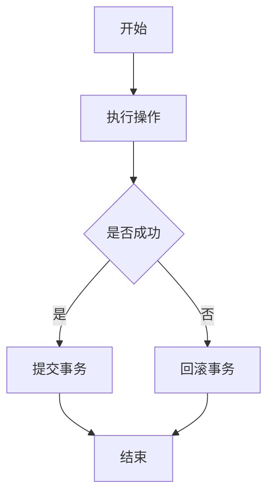
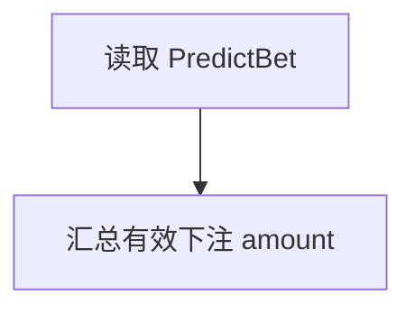
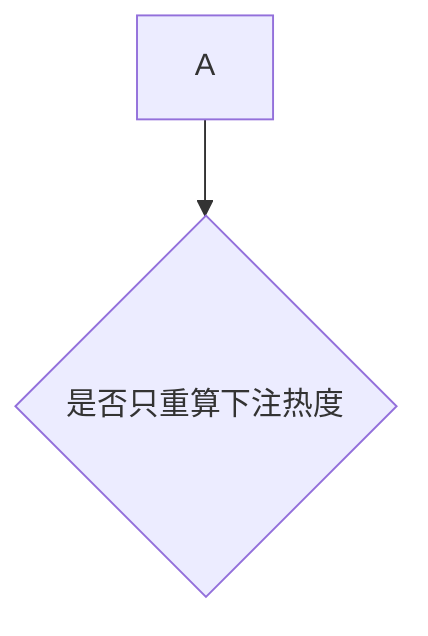
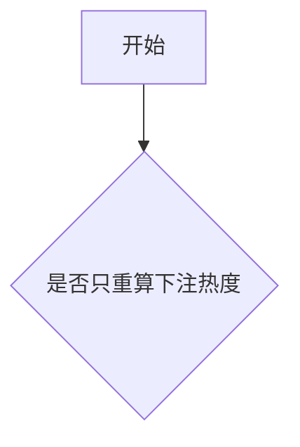
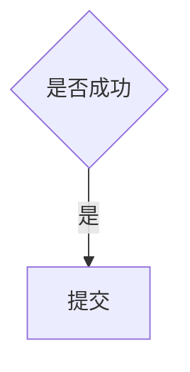

# Mermaid 流程图防错提示词

> 用途：写 Mermaid `flowchart` 前复制本提示词，降低解析错误概率。

## 推荐提示词

请生成 Mermaid flowchart，并严格遵守以下规则：

1. 所有节点文本都用双引号包裹，例如 `A["用户提交下注"]`。
2. 判断节点也用双引号包裹，例如 `B{"是否成功"}`。
3. 连线标签用双引号包裹，例如 `A -- "是" --> B`。
4. 允许在节点文本保留公式，但必须使用“公式安全写法”（见下文），不要直接写裸括号表达式。
5. 若公式不影响理解，优先用自然语言；若要保留公式，按安全模板改写。
6. 节点文本中避免直接出现未转义的 `{}`、`[]`、`()、|、<、>`。
7. API 路径可以放在引号节点里，例如 `A["POST /api/coin/bet"]`。
8. 不要把多个节点和连线写在同一行。
9. 每一条边单独一行。
10. 只使用简单节点形状：普通节点 `["文本"]` 和判断节点 `{"文本"}`。

## 公式安全写法（本次修复沉淀）

当流程图需要展示公式文本时，使用以下约定：

1. 节点内公式括号统一转义：
  - `(` 写成 `&#40;`
  - `)` 写成 `&#41;`
2. 乘号建议使用 `×`，求和建议使用 `Σ`。
3. 公式前加语义前缀，避免整段都是符号：
  - 例如：`"计算对数增益：log&#40;1 + L&#41;"`
4. 不在节点中放复杂嵌套公式；超过一层嵌套时拆成两个节点。
5. 所有边标签依然必须加双引号。

推荐公式节点示例：

```mermaid
flowchart LR
  A["点赞事件"] --> B["累计 H_like = Σ&#40;1 × U&#41;"]
  C["评论/回复"] --> D["计算 Base：Base = 3 × A × U × T × C"]
  D --> E["计算对数增益：log&#40;1 + L&#41;"]
  F["下注金额"] --> G["计算 H_coin = sqrt&#40;BetAmount&#41; × 0.5 × U"]
```



## 安全模板



## 常见错误

### 1. 节点文本包含括号

不推荐：

```mermaid
flowchart TD
  A[读取 PredictBet]
  A --> B[sum(amount)]
```

推荐：



如果必须保留公式（安全写法）：

```mermaid
flowchart TD
  A["读取 PredictBet"]
  A --> B["汇总 amount：sum&#40;amount&#41;"]
```



### 2. 判断节点文本未加引号

不推荐：



推荐：



### 3. 连线标签未加引号

不推荐：



推荐：


