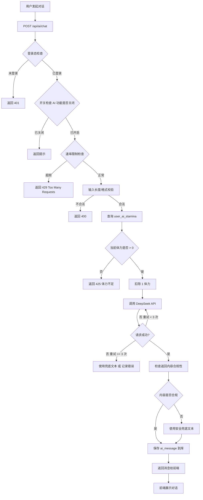
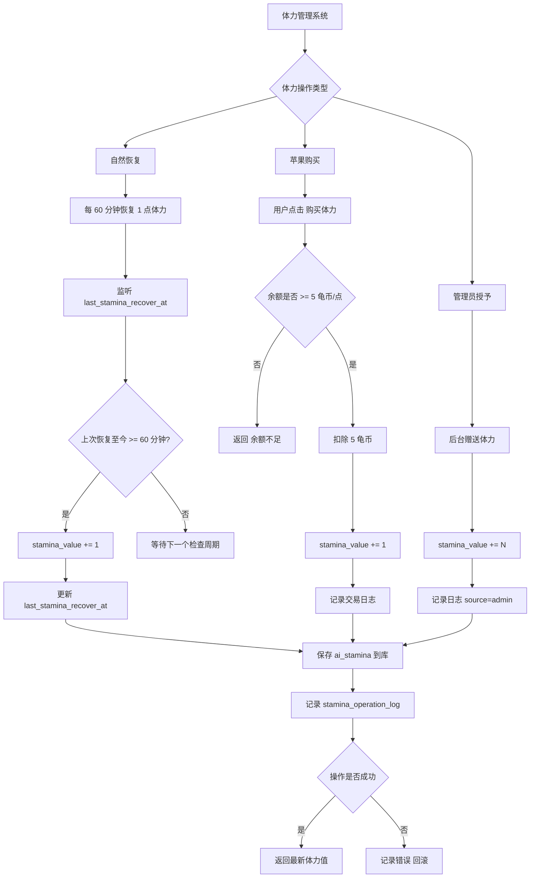
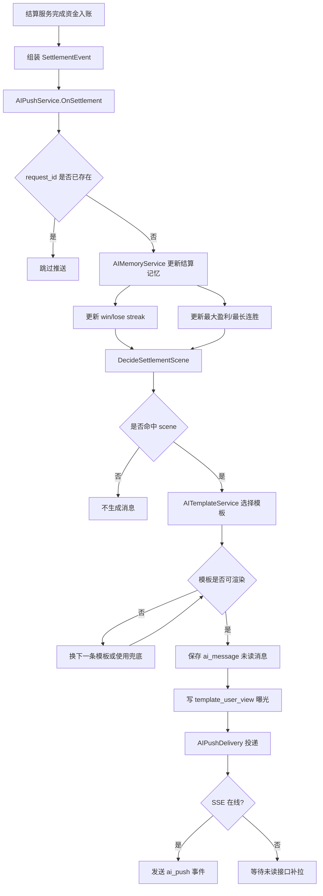
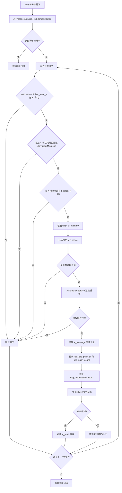
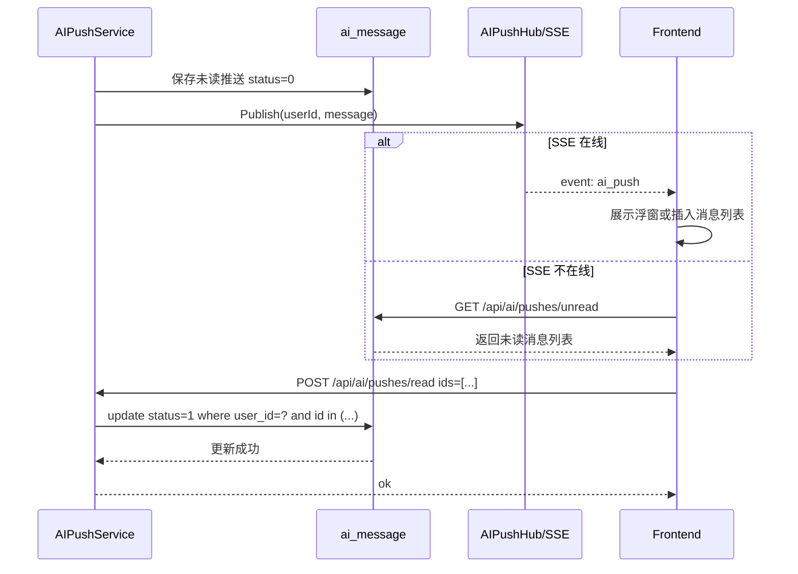
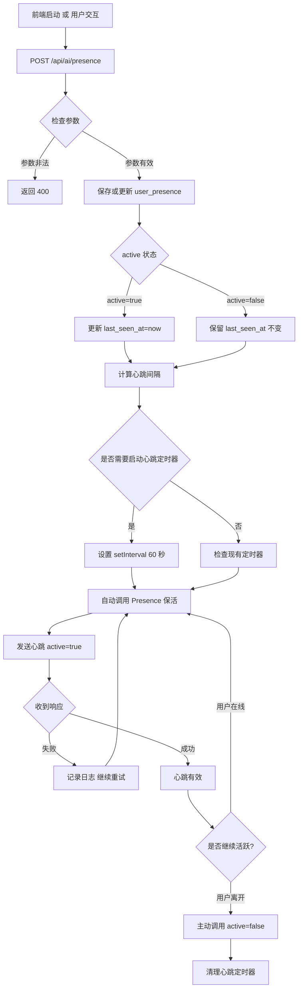
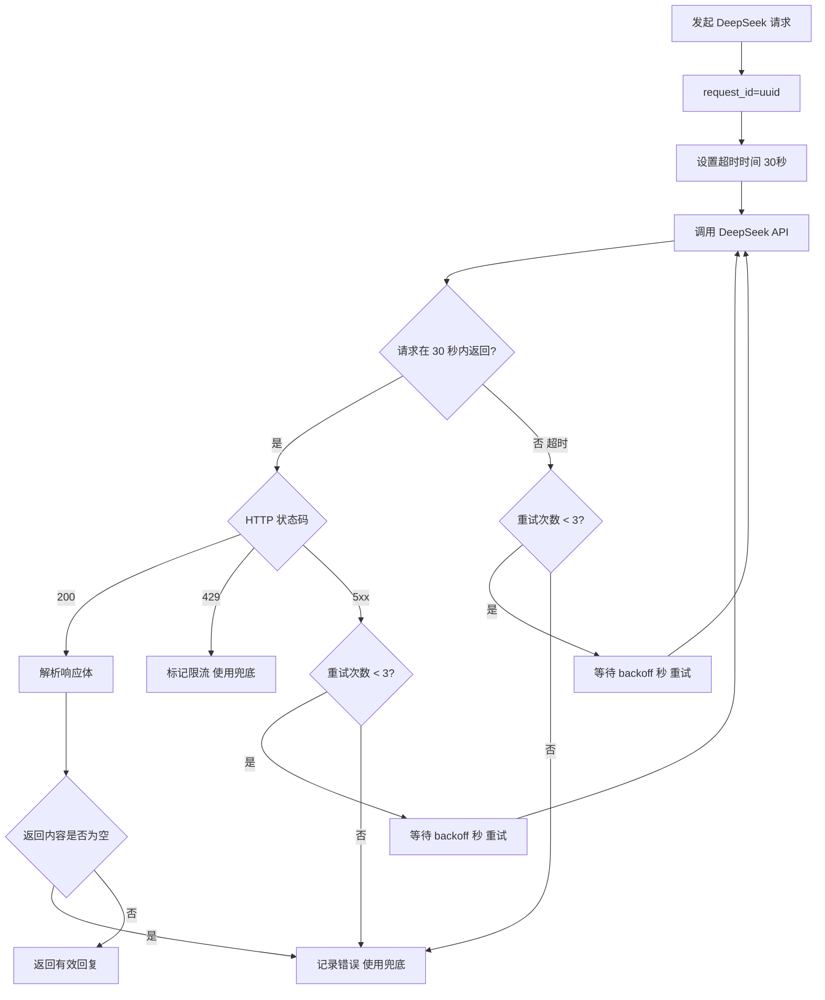

# AI 系统核心流程图

> 本文汇总 AI 系统的所有重要流程，包括主动对话、推送投递、体力系统等。详细设计见相应的 04-特性详情介绍-*.md 文件。

## 1. 主动对话链路流程



## 2. 体力系统流程



## 3. 结算推送流程



## 4. 闲置推送流程



## 5. 投递与已读闭环



## 6. Presence 心跳与在线判定流程



## 7. DeepSeek 超时重试策略



## 8. 消息模板去重与选择

```mermaid
flowchart TD
  A[命中推送场景] --> B[scene=lose_streak 或 win_streak 等]
  B --> C[查询 template_user_view]
  C --> D[按 曝光次数 升序 排序模板]
  D --> E{是否存在 未曝光 的模板}
  E -- 是 --> F[选择 最少曝光 的模板]
  E -- 否 --> G{是否 超过 24h 的模板}
  G -- 是 --> H[选择 最少曝光 的历史模板]
  G -- 否 --> I[降级为 通用兜底模板]
  F --> J[渲染模板]
  H --> J
  I --> J
  J --> K{是否存在占位符}
  K -- 是 --> L[替换占位符 如 {user_name}}]
  K -- 否 --> M[模板已完成]
  L --> N{占位符替换成功?}
  N -- 是 --> M
  N -- 否 --> O[使用兜底模板重试]
  O --> J
  M --> P[返回最终消息]
```
