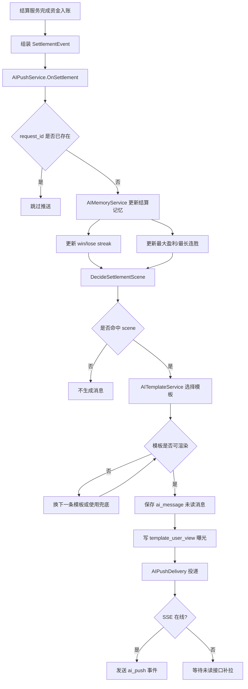
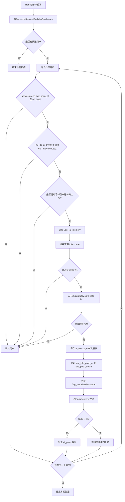
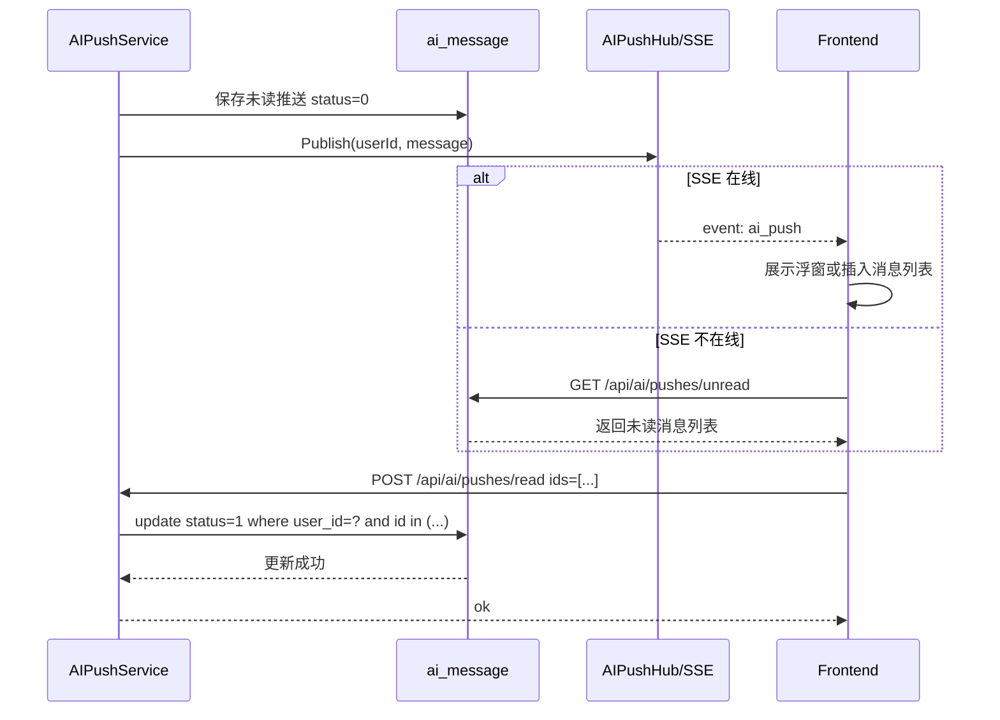

# 主动推送流程图

> 本文只放主动推送相关流程图。文字方案见 [10-主动推送实现设计.md](./10-主动推送实现设计.md)，前端协议见 [11-前端推送协议设计.md](./11-前端推送协议设计.md)。

## 1. 结算推送流程

```mermaid
flowchart TD
  A[结算服务完成资金入账] --> B[组装 SettlementEvent]
  B --> C[AIPushService.OnSettlement]
  C --> D{request_id 是否已存在}
  D -- 是 --> E[跳过推送]
  D -- 否 --> F[AIMemoryService 更新结算记忆]
  F --> G[更新 win/lose streak]
  F --> H[更新最大盈利/最长连胜]
  G --> I[DecideSettlementScene]
  H --> I
  I --> J{是否命中 scene}
  J -- 否 --> K[不生成消息]
  J -- 是 --> L[AITemplateService 选择模板]
  L --> M{模板是否可渲染}
  M -- 否 --> N[换下一条模板或使用兜底]
  N --> M
  M -- 是 --> O[保存 ai_message 未读消息]
  O --> P[写 template_user_view 曝光]
  P --> Q[AIPushDelivery 投递]
  Q --> R{SSE 在线?}
  R -- 是 --> S[发送 ai_push 事件]
  R -- 否 --> T[等待未读接口补拉]
```

## 2. 闲置推送流程

```mermaid
flowchart TD
  A[cron 每分钟触发] --> B[AIPresenceService.FindIdleCandidates]
  B --> C{是否有候选用户}
  C -- 否 --> D[结束本轮扫描]
  C -- 是 --> E[逐个处理用户]
  E --> F{active=true 且 last_seen_at 在 60 秒内?}
  F -- 否 --> Z1[跳过用户]
  F -- 是 --> G{距上次 AI 互动是否超过 idleTriggerMinutes?}
  G -- 否 --> Z1
  G -- 是 --> H{是否超过冷却且未达每日上限?}
  H -- 否 --> Z1
  H -- 是 --> I[读取 user_ai_memory]
  I --> J[选择可用 idle scene]
  J --> K{是否有可用记忆}
  K -- 否 --> Z1
  K -- 是 --> L[AITemplateService 渲染模板]
  L --> M{模板是否完整}
  M -- 否 --> Z1
  M -- 是 --> N[保存 ai_message 未读消息]
  N --> O[更新 last_idle_push_at 和 idle_push_count]
  O --> P[更新 flag_meta.lastPushedAt]
  P --> Q[AIPushDelivery 投递]
  Q --> R{SSE 在线?}
  R -- 是 --> S[发送 ai_push 事件]
  R -- 否 --> T[等待未读接口补拉]
  Z1 --> U{还有下一个用户?}
  S --> U
  T --> U
  U -- 是 --> E
  U -- 否 --> V[结束本轮扫描]
```

## 3. 投递与已读闭环

```mermaid
sequenceDiagram
  participant Backend as AIPushService
  participant DB as ai_message
  participant Hub as AIPushHub/SSE
  participant FE as Frontend

  Backend->>DB: 保存未读推送 status=0
  Backend->>Hub: Publish(userId, message)
  alt SSE 在线
    Hub-->>FE: event: ai_push
    FE->>FE: 展示浮窗或插入消息列表
  else SSE 不在线
    FE->>DB: GET /api/ai/pushes/unread
    DB-->>FE: 返回未读消息列表
  end
  FE->>Backend: POST /api/ai/pushes/read ids=[...]
  Backend->>DB: update status=1 where user_id=? and id in (...)
  DB-->>Backend: 更新成功
  Backend-->>FE: ok
```
