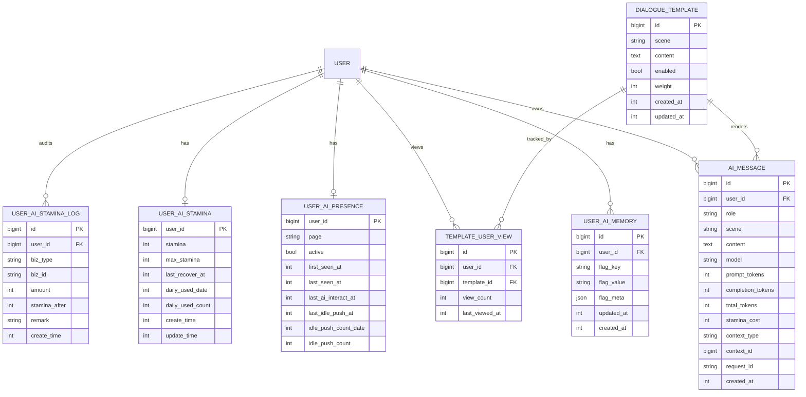
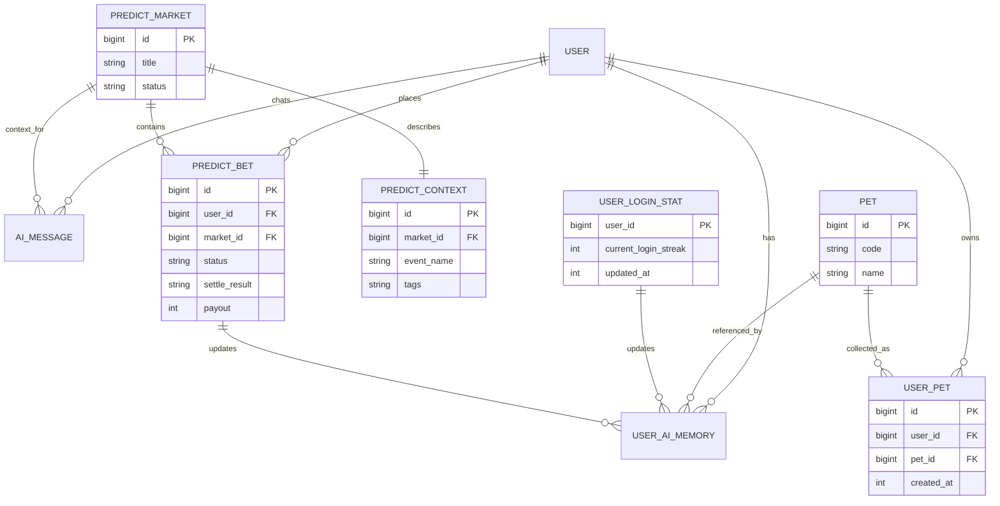

# AI 聊天 ER 关系图

> 本文补充 AI 聊天相关数据模型的 ER 关系图。表结构仍以 [05-数据模型与接口.md](./05-数据模型与接口.md) 为准。

## 1. AI 模块核心 ER 图

## 2. 关系说明

| 关系 | 说明 |
| --- | --- |
| `USER 1:N AI_MESSAGE` | 一个用户有多条 AI 对话和主动推送消息。 |
| `USER 1:N USER_AI_MEMORY` | 一个用户有多个记忆 Flag。 |
| `USER 1:1 USER_AI_PRESENCE` | 一个用户保留一份当前在线/闲置状态。 |
| `USER 1:1 USER_AI_STAMINA` | 一个用户保留一份当前 AI 体力状态。 |
| `USER 1:N USER_AI_STAMINA_LOG` | 一个用户有多条体力消耗、恢复、调整流水。 |
| `USER 1:N TEMPLATE_USER_VIEW` | 一个用户对多条模板有曝光记录。 |
| `DIALOGUE_TEMPLATE 1:N TEMPLATE_USER_VIEW` | 一条模板会被多个用户看到。 |
| `DIALOGUE_TEMPLATE 1:N AI_MESSAGE` | 主动推送消息可记录来源模板。 |

## 3. 建议唯一约束

| 表 | 唯一约束 | 用途 |
| --- | --- | --- |
| `user_ai_memory` | `(user_id, flag_key)` | 每个用户每类记忆只保留一条当前值。 |
| `template_user_view` | `(user_id, template_id)` | 记录用户对某模板的累计曝光。 |
| `user_ai_presence` | `(user_id)` | 每个用户只有一份在线状态。 |
| `user_ai_stamina` | `(user_id)` | 每个用户只有一份当前体力状态。 |

## 4. 建议索引

| 表 | 索引 | 用途 |
| --- | --- | --- |
| `ai_message` | `(user_id, created_at)` | 查询聊天历史。 |
| `ai_message` | `(user_id, scene, created_at)` | 查询主动推送或特定场景消息。 |
| `ai_message` | `(context_type, context_id)` | 按预测市场等上下文追踪消息。 |
| `user_ai_memory` | `(user_id, flag_key)` | 读取记忆问答上下文。 |
| `dialogue_template` | `(scene, enabled)` | 按场景选择可用模板。 |
| `template_user_view` | `(user_id, view_count)` | 模板去重和最少曝光选择。 |
| `user_ai_presence` | `(last_seen_at)` | 扫描在线/闲置用户。 |
| `user_ai_stamina_log` | `(user_id, create_time)` | 查询用户体力流水。 |
| `user_ai_stamina_log` | `(biz_type, biz_id)` | 幂等记录聊天扣减、苹果恢复等业务来源。 |

## 5. 与业务表的上下文关系

AI 模块不直接决定下注、结算、开蛋、登录奖励，只读取业务事实或响应业务事件。

## 6. 业务事件到记忆 Flag

| 业务事件 | 来源表/服务 | 更新的 AI 记忆 |
| --- | --- | --- |
| 投票结算完成 | `PredictBet` / 结算服务 | `vote_win_streak`、`vote_lose_streak` |
| 单场盈利刷新最大值 | `PredictBet` / 结算服务 | `biggest_win_amount`、`biggest_win_event` |
| 用户第一次开蛋 | 宠物开蛋服务 | `first_egg_turtle` |
| 第一次抽到 SSS | 宠物开蛋服务 | `first_sss` |
| 每日登录结算 | 登录/签到服务 | `current_login_streak` |
| 获得新龟种 | 宠物收集服务 | `total_turtles_owned` |
| 主动聊天成功 | `AIChatService` | `total_dialogue_count` |

## 7. 设计注意事项

1. `ai_message.context_type/context_id` 是弱关联，用于支持不同业务上下文，不建议强制外键。
2. `dialogue_template` 到 `ai_message` 可以增加 `template_id` 字段，便于追踪主动推送来源。
3. `user_ai_memory.flag_meta` 建议使用 JSON 存扩展信息，但核心查询字段仍放 `flag_key/flag_value`。
4. `user_ai_presence` 是状态表，不建议保存长期在线历史；如需统计可另建日志表。
5. AI 表只记录辅助表达和消息，不承载预测市场的资金事实。
6. `user_ai_stamina` 是目标独立体力模型；当前代码临时用龟币扣费时，可先只保留 `ai_message.stamina_cost` 兼容展示。
