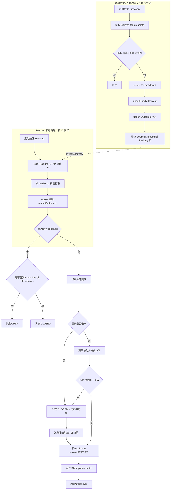
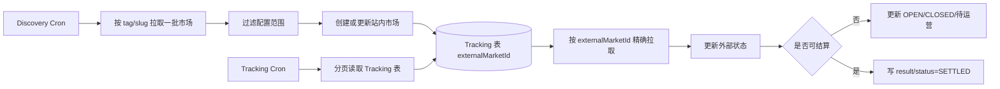
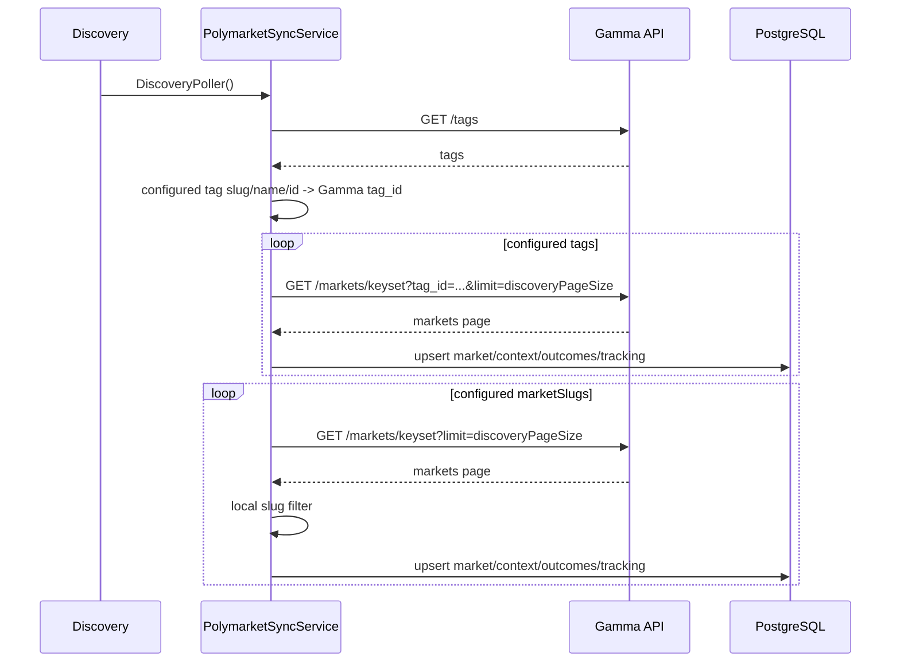
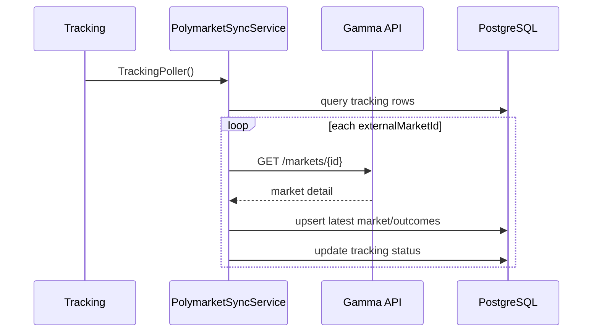
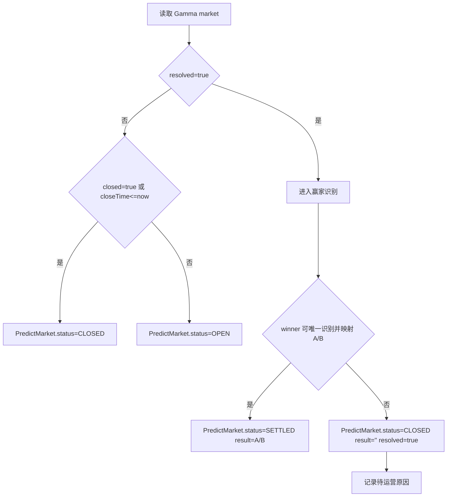
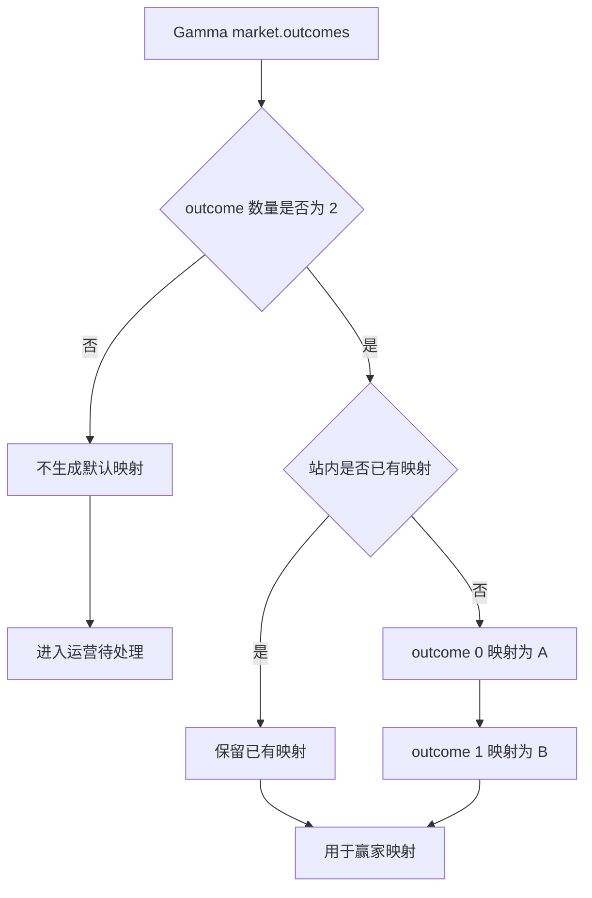
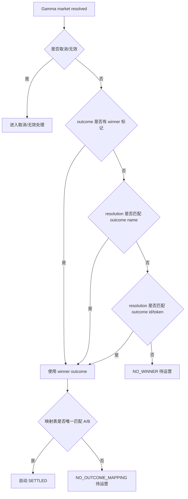
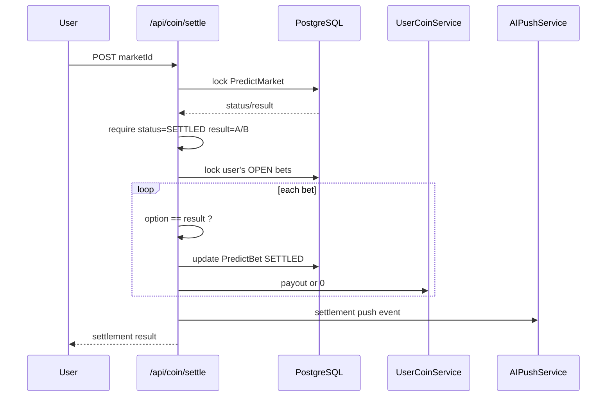
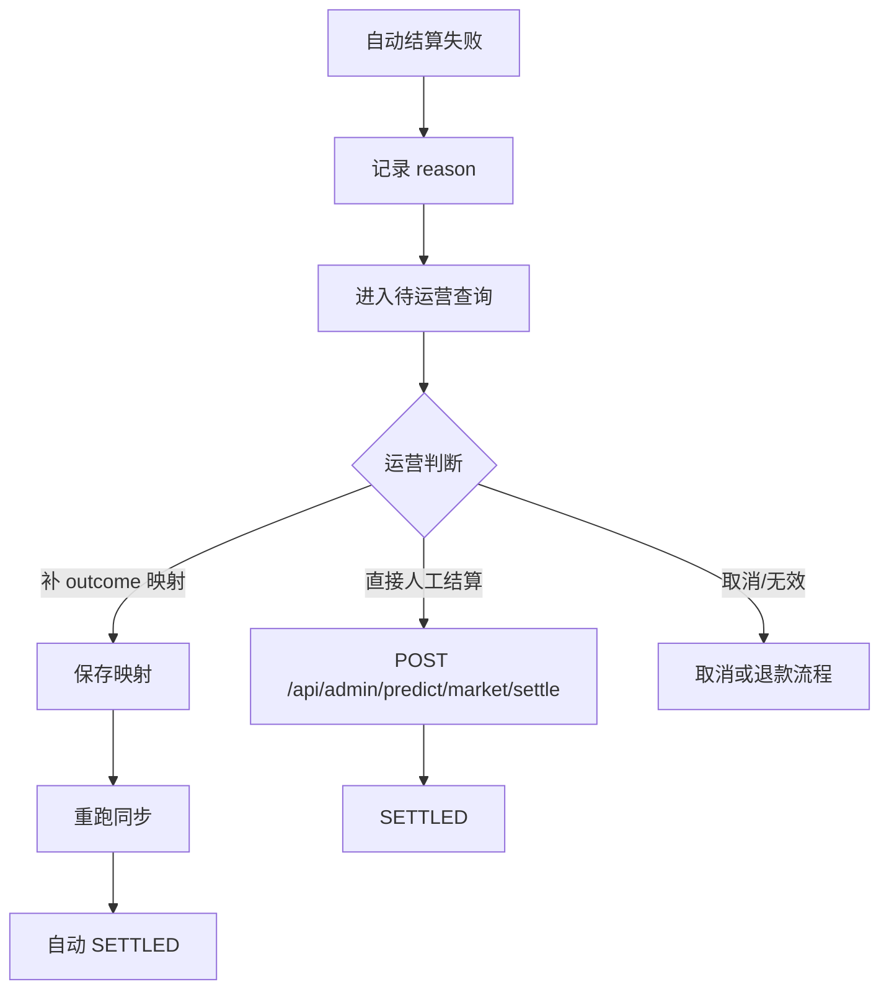
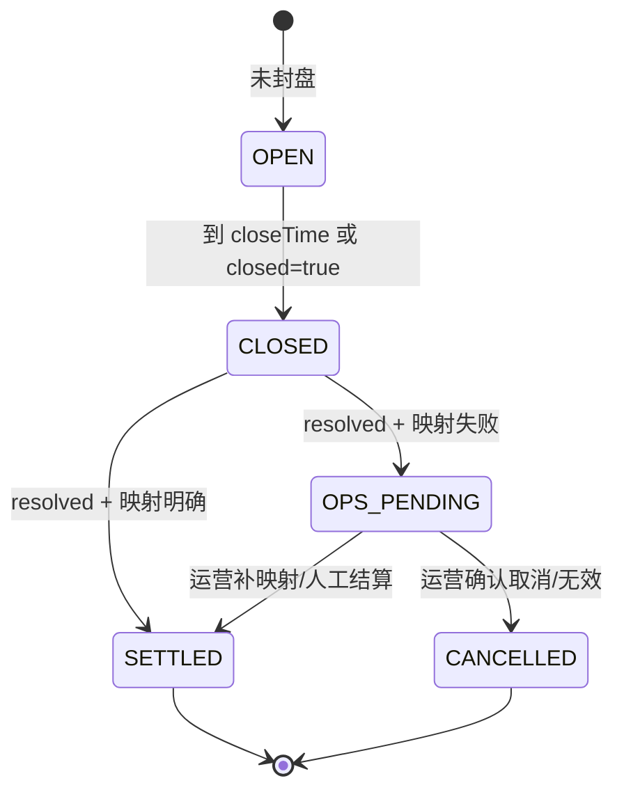

# Polymarket自动结算流程图

> 本文只描述流程闭环，不写代码。目标是说明每个市场从数据拉取到最终结算，必须落到明确状态：可下注、已封盘、已自动结算、待运营处理或取消处理。

## 1. 总闭环



闭环要求：

- Discovery 和 Tracking 是两个独立轮巡，不要求同一次任务串行完成。
- Discovery 只保证发现、创建、登记 externalMarketId。
- Tracking 只按已登记 externalMarketId 精确拉取，并负责推进状态与结算闭环。
- 未开始且可下注：`OPEN`
- 已封盘但未有结果：`CLOSED`
- 有明确结果：`SETTLED`
- 有外部结果但无法映射：`CLOSED + 待运营`
- 取消/无效：不进入自动派奖，进入取消处理或运营处理

## 2. 数据拉取流程

双轮巡调度关系：



要点：

- Discovery 可按 tag/slug 分页拉取，每次只处理一批，比如 50 个。
- Discovery 发现到的 market ID 必须持久化，不能只依赖下一次 tag 分页再次出现。
- Tracking 每轮从已持久化 ID 中取一批处理，保证 market ID `99` 这类已登记市场后续能被继续跟踪。
- 自动结算触发点在 Tracking，不在 Discovery。



Tracking 精确拉取：



实现约束：

- `tags` 和 `marketSlugs` 只决定同步范围。
- 每个同步到的 market 必须执行 upsert。
- upsert 后必须进入状态判定，不允许停在未知状态。

## 3. 市场状态判定



状态不变量：

| 场景 | status | result | 用户能否下注 | 用户能否结算 |
|------|--------|--------|--------------|--------------|
| 未封盘 | `OPEN` | 空 | 能 | 不能 |
| 已封盘未出结果 | `CLOSED` | 空 | 不能 | 不能 |
| resolved 但无法映射 | `CLOSED` | 空 | 不能 | 不能 |
| resolved 且映射明确 | `SETTLED` | `A/B` | 不能 | 能 |

## 4. Outcome 映射流程



映射保护：

- 默认映射只用于二元市场。
- 已有映射不被同步覆盖。
- 运营校正后的映射优先级最高。
- 没有映射时不自动结算。

## 5. 赢家识别流程



禁止规则：

- 禁止用 `outcomePrices` 单独判断赢家。
- 禁止用标题模糊匹配赢家。
- 禁止把所有 `Yes` 固定视为 A，必须通过映射表。

## 6. 用户结算流程



资金不变量：

- 自动结算只写市场结果，不直接派奖。
- 用户派奖只发生在 `/api/coin/settle`。
- `PredictBet.status=SETTLED` 后重复调用不会重复派奖。

## 7. 运营兜底流程



待运营查询最小条件：

```text
sourceModel = Polymarket
resolved = true
status = CLOSED
result = ''
```

失败 reason：

| reason | 说明 | 闭环动作 |
|--------|------|----------|
| `NO_WINNER` | 外部没有可识别赢家 | 运营确认结果 |
| `NO_OUTCOME_MAPPING` | winner 找不到 A/B 映射 | 补映射 |
| `AMBIGUOUS_OUTCOME` | 匹配到多个 outcome | 人工确认 |
| `INVALID_MARKET_TYPE` | 非二元市场 | 人工处理 |
| `CANCELLED_OR_INVALID` | 外部取消/无效 | 退款或作废 |

## 8. 每个市场必须落入的终态



终态定义：

- `SETTLED`：用户可结算，资金闭环完成。
- `CANCELLED`：进入退款或作废流程，不能派奖。
- `OPS_PENDING`：不是数据库最终状态，表示运营查询视图中的待处理集合。

数据库当前没有 `CANCELLED` 市场状态；落地前需要先决定是新增状态，还是用 `CLOSED + issue reason` 表示。

## 9. 验收口径

- 每次同步后的 Polymarket 市场不允许停留在未知状态。
- resolved 且映射明确的市场必须自动 `SETTLED`。
- resolved 但映射失败的市场必须能被运营查询出来。
- 自动结算不能覆盖已人工结算的 `result`。
- 自动结算不能直接修改用户余额。
- 用户重复结算不能重复派奖。
- 取消/无效市场不能自动走 WIN/LOSE 派奖。
