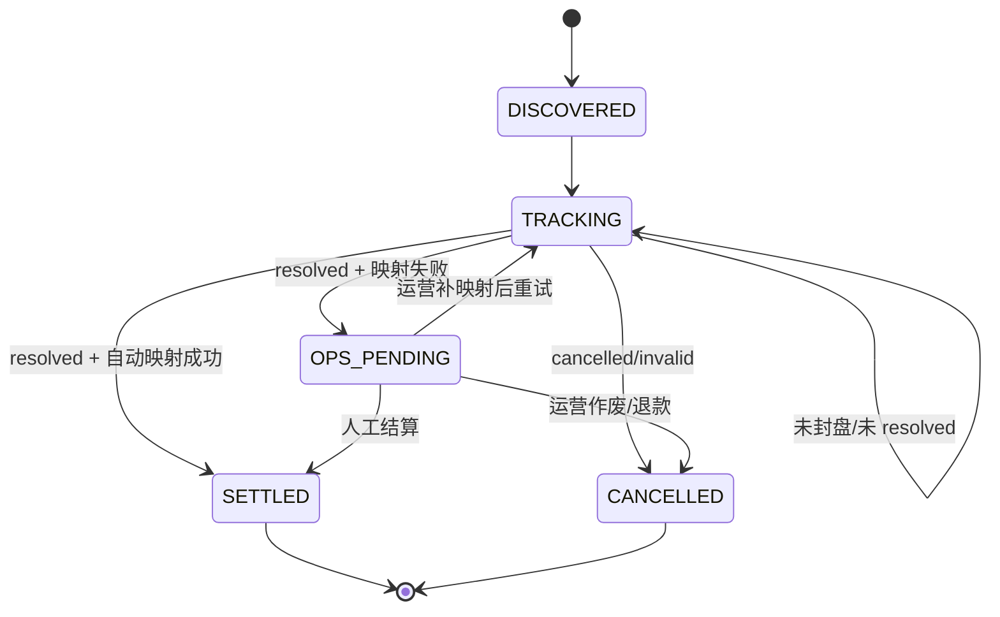

# Polymarket双轮巡跟踪设计

> 本文描述 Discovery 发现轮巡 + Tracking 状态轮巡。目标是保证“已经发现的每个市场”后续都能通过 market ID 精确跟踪并走向明确终态。

## 1. 目标

当前单轮巡问题：

- tag 分页只能发现当前页返回的市场。
- market slug 扫描依赖列表顺序，不能证明某个市场一定会被扫到。
- 市场一旦离开前几页，后续状态变化可能跟丢。

双轮巡目标：

```text
Discovery 负责发现新市场并记录 ID
Tracking 负责按已记录 ID 精确拉取状态直到闭环
```

闭环定义：

- `SETTLED`：自动或人工写入结果，用户可结算。
- `OPS_PENDING`：外部 resolved 但无法自动映射，运营待处理。
- `CANCELLED`：外部取消/无效，进入退款或作废流程。

## 2. Discovery 发现轮巡

职责：

- 按数据库启用标签拉取一批市场。
- 为每个新市场创建站内 market/context/outcome/tracking 记录。

流程：

```text
DiscoveryPoller
  -> GET /tags
  -> GET /markets/keyset?tag_id=...&limit=trackingBatchSize
  -> for each market:
       upsert PredictMarket
       upsert PredictContext
       upsert Outcome 映射
       upsert Tracking(externalMarketId, status=TRACKING)
```

范围：

- Discovery 不负责最终结算。
- Discovery 不保证发现全网所有市场。
- Discovery 只保证把“本次看到的市场 ID”持久化。

建议频率：

```text
*/30 * * * *
```

如果页面需要更及时发现新市场，可调整为：

```text
*/10 * * * *
```

## 3. Tracking 状态轮巡

职责：

- 查询本地 tracking 表中需要继续跟踪的市场。
- 按 externalMarketId 精确拉取。
- 推进市场状态。
- resolved 后尝试自动结算。
- 失败时进入运营待处理。

查询条件：

```text
tracking_status in (TRACKING, OPS_PENDING_RETRY)
next_track_at <= now
```

流程：

```text
TrackingPoller
  -> query tracking rows
  -> for each row:
       GET /markets/{externalMarketId}
       upsert PredictMarket latest fields
       upsert Outcome latest fields
       if unresolved:
          update nextTrackAt
       if resolved:
          try auto settlement
          success -> tracking_status=SETTLED
          failed -> tracking_status=OPS_PENDING
```

建议频率：

```text
*/5 * * * *
```

接近封盘或已封盘市场可以更高频：

```text
closeTime - now <= 1h -> 每 1 分钟
closed=true unresolved -> 每 1 分钟
```

## 4. Market ID 精确拉取

目标：

- 确保本地已经记录的 externalMarketId 后续不会因为分页变化而跟丢。

接口形态：

```text
GET /markets/{id}
```

客户端能力：

```text
GammaClient.GetMarketByID(ctx, id)
```

失败处理：

| 情况 | 动作 |
|------|------|
| 200 | upsert 并推进状态 |
| 404 | failCount+1，超过阈值进入 OPS_PENDING |
| 429 | 延后 nextTrackAt |
| 5xx/网络错误 | failCount+1，保留 TRACKING |

验收：

- 配置或数据库中有 ID=99 时，Tracking 必须请求 `/markets/99`。
- 只要接口 200，必须更新对应站内市场。
- 不能依赖 tag 分页证明 ID=99 会被拉到。

## 5. Tracking 状态表

建议新增：

```text
t_predict_market_tracking
```

字段：

| 字段 | 说明 |
|------|------|
| `market_id` | 站内 PredictMarket.Id |
| `source` | `Polymarket` |
| `external_market_id` | Polymarket market id 字符串 |
| `tracking_status` | DISCOVERED/TRACKING/SETTLED/OPS_PENDING/CANCELLED |
| `last_discovered_at` | 最近发现时间 |
| `last_tracked_at` | 最近精确跟踪时间 |
| `next_track_at` | 下次跟踪时间 |
| `fail_count` | 连续失败次数 |
| `last_error` | 最近错误 |
| `closed_at` | 本地检测到封盘时间 |
| `settled_at` | 本地完成结算时间 |

唯一键：

```text
unique(source, external_market_id)
unique(market_id)
```

## 6. Tracking 状态机



状态说明：

| 状态 | 说明 |
|------|------|
| `DISCOVERED` | Discovery 首次发现 |
| `TRACKING` | Tracking 持续精确拉取 |
| `SETTLED` | 已写入站内最终结果 |
| `OPS_PENDING` | 需要运营处理 |
| `CANCELLED` | 取消/无效，进入退款或作废 |

## 7. 与自动结算关系

Tracking 拉到 resolved 后调用自动结算：

```text
TrackingPoller
  -> GetMarketByID
  -> detectExternalWinner
  -> mapWinnerToOption
  -> mark SETTLED or OPS_PENDING
```

成功：

```text
PredictMarket.status = SETTLED
PredictMarket.result = A/B
tracking_status = SETTLED
```

失败：

```text
PredictMarket.status = CLOSED
PredictMarket.result = ''
tracking_status = OPS_PENDING
last_error = reason
```

## 8. 调度策略

基础策略：

| 市场阶段 | nextTrackAt |
|----------|-------------|
| OPEN 且距离 closeTime > 24h | now + 6h |
| OPEN 且距离 closeTime <= 24h | now + 1h |
| OPEN 且距离 closeTime <= 1h | now + 5m |
| CLOSED unresolved | now + 1m |
| OPS_PENDING | 不自动频繁重试，等待运营动作 |

错误退避：

```text
nextTrackAt = now + min(2^failCount minutes, 1h)
```

## 9. 运营闭环

运营处理入口：

```text
tracking_status = OPS_PENDING
```

运营动作：

- 补 outcome 映射。
- 人工调用 admin settle。
- 标记取消/无效。
- 重置 tracking_status 为 TRACKING 触发重试。

验收：

- 每个 OPS_PENDING 都能看到失败 reason。
- 每个 OPS_PENDING 都能被运营推进到 SETTLED 或 CANCELLED。

## 10. 验收清单

- [ ] Discovery 每轮最多拉配置数量的新市场。
- [ ] Discovery 发现 market 后保存 externalMarketId。
- [ ] Tracking 只基于本地 externalMarketId 精确拉取。
- [ ] Tracking 不依赖分页顺序。
- [ ] ID=99 被记录后，后续每次跟踪都请求 ID=99。
- [ ] resolved 且映射成功的市场进入 SETTLED。
- [ ] resolved 但映射失败的市场进入 OPS_PENDING。
- [ ] 取消/无效市场不自动派奖。
- [ ] 所有 TRACKING 市场都有 nextTrackAt。
- [ ] 连续失败有 failCount 和 lastError。
