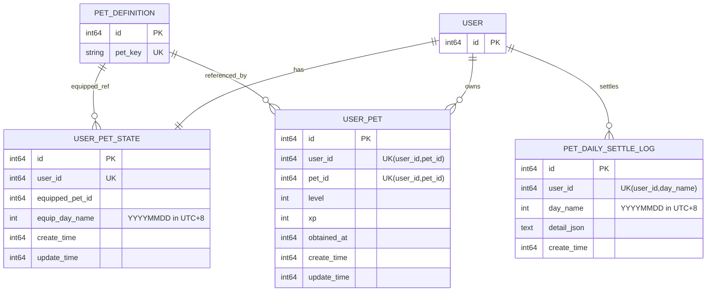
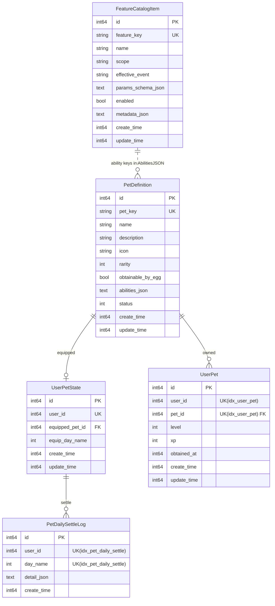

# Pet（用户侧）数据模型关系图

> 本文只描述 **UserPetState / UserPet / PetDailySettleLog** 的实体关系与关键约束，便于前后端/测试/运营快速对齐。
>
> 口径：
> - `day_name` 使用北京时间（UTC+8）日切，格式 `YYYYMMDD`（int）。

---

## 实体关系（ER）

---

## 表说明与约束
# Pet 模型关系（ER 图）

> 目的：把“宠物系统”当前已经落库（或已定义）的模型关系画清楚，方便前后端/运营对齐。
>
> 口径说明：
> - 用户侧与日切：北京时间（UTC+8）。
> - `petId` 当前实现指向 `PetDefinition.Id`（内部自增主键）；对外建议稳定使用 `petKey`。
> - `AbilitiesJSON` 与 `FeatureCatalogItem` 之间是“JSON 引用关系”，不是强外键。

---

## 实体关系图（Mermaid ER）

---

## 模型字段与索引要点（对照当前 Go Model）

### `PetDefinition`

- 唯一键：`PetKey`（`uniqueIndex`）
- `AbilitiesJSON`：JSON 文本，结构为 `map[featureKey]any`（目前允许任意结构，强校验在 service 层做）
- `Status`：软删除/上下架状态（与项目现有 `constants.Status*` 对齐）

### `FeatureCatalogItem`

- 唯一键：`FeatureKey`（`uniqueIndex`）
- `enabled=false`：运行时应拒绝挂载或跳过执行（当前 `PetAbilityService.validateAbilities` 对挂载做了弱校验）
- `ParamsSchemaJSON`：预留给“后台动态表单 + 轻校验”；真正强校验建议走 typed params（见 `prompt/project/特征.md`）

### `UserPetState`

- 唯一键：`UserId`（1 个用户只有 1 行状态）
- `EquippedPetId`：当前装备龟种（指向 `PetDefinition.Id`）
- `EquipDayName`：北京时间 `YYYYMMDD`，用于“每日只可切龟一次”

### `UserPet`

- 组合唯一键：`(user_id, pet_id)`（`uniqueIndex:idx_user_pet`）
- 等级与经验：`level/xp` 每只龟独立成长

### `PetDailySettleLog`

- 幂等唯一键：`(user_id, day_name)`（`uniqueIndex:idx_pet_daily_settle`）
- `DetailJSON`：缓存当日结算 summary（重复登录快速返回）

---

## 实现侧注意事项

- **不要把 `PetDefinition.Id` 当作稳定对外 ID**：对外建议用 `petKey`。
- `AbilitiesJSON` 与 `FeatureCatalogItem` 是“JSON 引用”，不是 DB 外键：
  - 所以 **保存/更新 abilities 时**要校验 featureKey 是否存在且 enabled。
  - 线上执行时也要容错（避免配置误删导致 panic）。
- `equip_day_name`、`day_name` 一律用 `internal/pkg/biztime` 计算，避免 `time.Local` 导致日切错乱。
