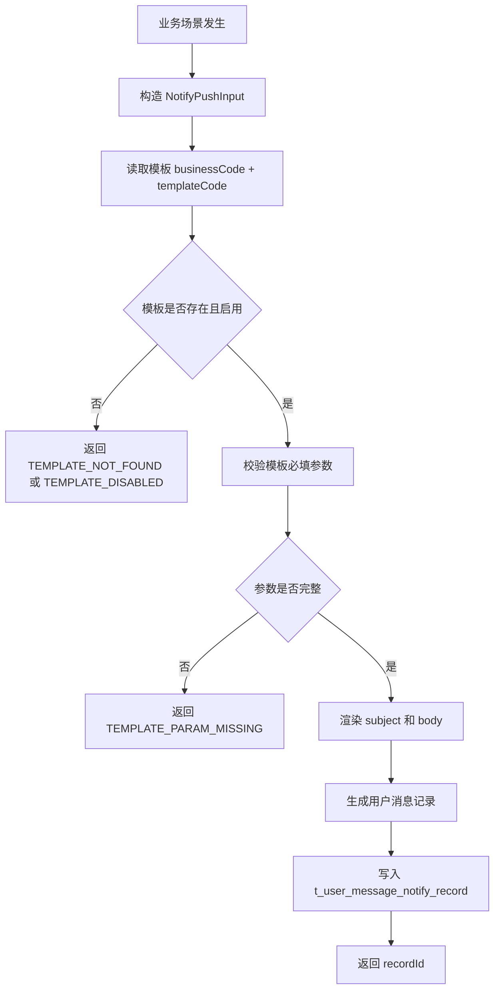
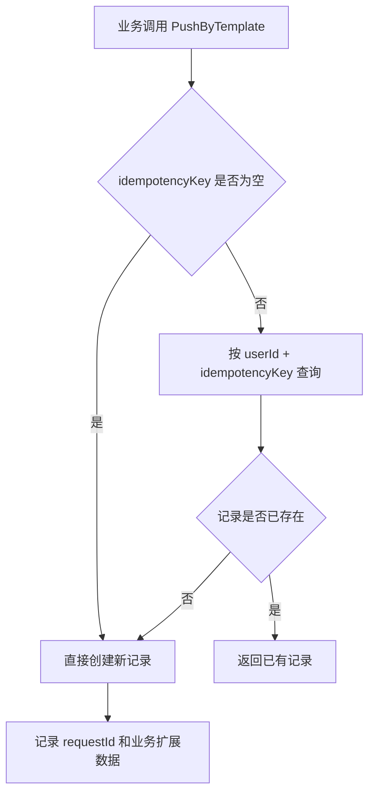
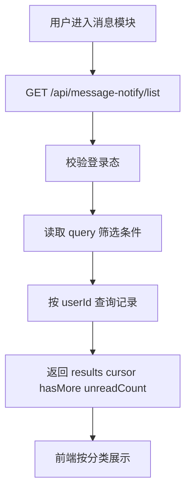
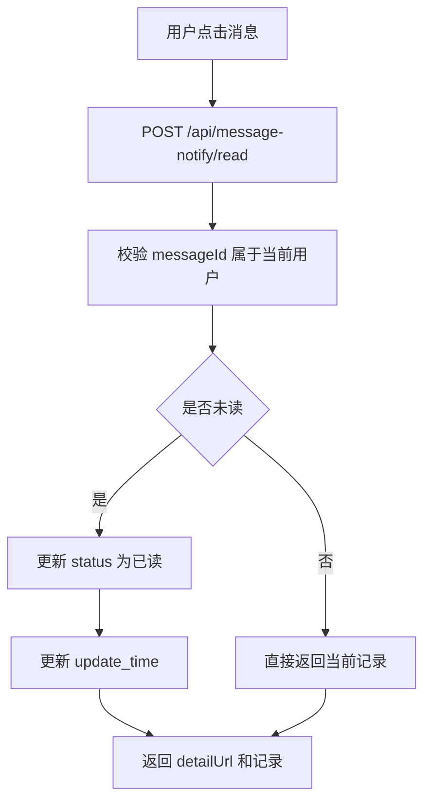
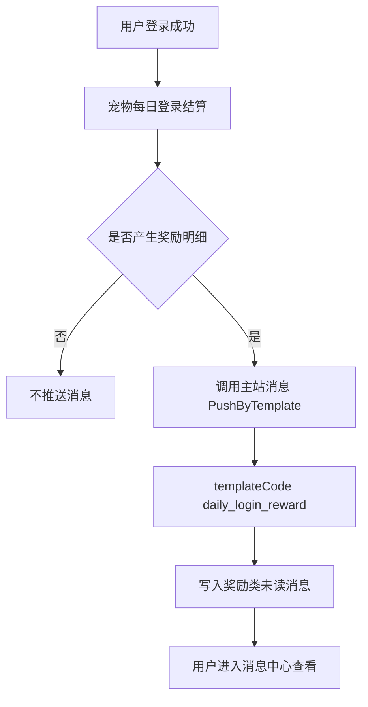
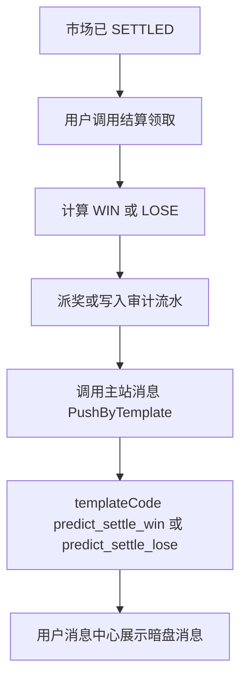

# 主站消息流程图

## 1. 业务场景推送流程

```mermaid
flowchart TD
  A["业务场景发生"] --> B["构造 NotifyPushInput"]
  B --> C["读取模板 businessCode + templateCode"]
  C --> D{"模板是否存在且启用"}
  D -- "否" --> E["返回 TEMPLATE_NOT_FOUND 或 TEMPLATE_DISABLED"]
  D -- "是" --> F["校验模板必填参数"]
  F --> G{"参数是否完整"}
  G -- "否" --> H["返回 TEMPLATE_PARAM_MISSING"]
  G -- "是" --> I["渲染 subject 和 body"]
  I --> J["生成用户消息记录"]
  J --> K["写入 t_user_message_notify_record"]
  K --> L["返回 recordId"]
```

## 2. 幂等推送流程

```mermaid
flowchart TD
  A["业务调用 PushByTemplate"] --> B{"idempotencyKey 是否为空"}
  B -- "是" --> C["直接创建新记录"]
  B -- "否" --> D["按 userId + idempotencyKey 查询"]
  D --> E{"记录是否已存在"}
  E -- "是" --> F["返回已有记录"]
  E -- "否" --> C
  C --> G["记录 requestId 和业务扩展数据"]
```

## 3. 消息列表读取流程

```mermaid
flowchart TD
  A["用户进入消息模块"] --> B["GET /api/message-notify/list"]
  B --> C["校验登录态"]
  C --> D["读取 query 筛选条件"]
  D --> E["按 userId 查询记录"]
  E --> F["返回 results cursor hasMore unreadCount"]
  F --> G["前端按分类展示"]
```

## 4. 点击消息已读流程

```mermaid
flowchart TD
  A["用户点击消息"] --> B["POST /api/message-notify/read"]
  B --> C["校验 messageId 属于当前用户"]
  C --> D{"是否未读"}
  D -- "否" --> E["直接返回当前记录"]
  D -- "是" --> F["更新 status 为已读"]
  F --> G["更新 update_time"]
  G --> H["返回 detailUrl 和记录"]
  E --> H
```

## 5. 每日登录奖励验证流程

```mermaid
flowchart TD
  A["用户登录成功"] --> B["宠物每日登录结算"]
  B --> C{"是否产生奖励明细"}
  C -- "否" --> D["不推送消息"]
  C -- "是" --> E["调用主站消息 PushByTemplate"]
  E --> F["templateCode daily_login_reward"]
  F --> G["写入奖励类未读消息"]
  G --> H["用户进入消息中心查看"]
```

## 6. 预测暗盘结算验证流程

```mermaid
flowchart TD
  A["市场已 SETTLED"] --> B["用户调用结算领取"]
  B --> C["计算 WIN 或 LOSE"]
  C --> D["派奖或写入审计流水"]
  D --> E["调用主站消息 PushByTemplate"]
  E --> F["templateCode predict_settle_win 或 predict_settle_lose"]
  F --> G["用户消息中心展示暗盘消息"]
```
