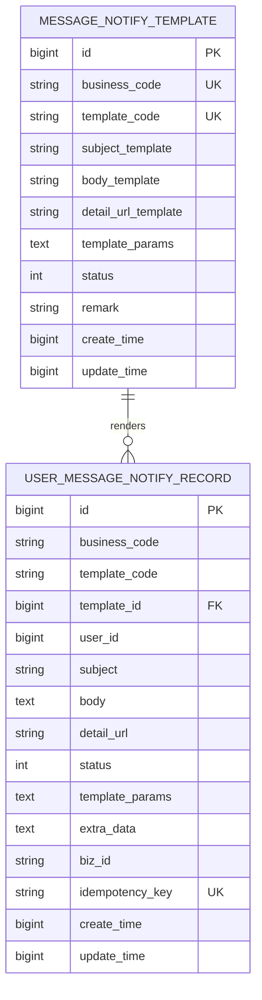

# 主站消息 ER 关系图

## 1. ER 图



## 2. 关系说明

- 一个模板可以渲染出多条用户消息记录。
- 一条用户消息记录只关联一个模板。
- 用户消息记录保存渲染后的标题和正文，模板修改不影响历史记录。

## 3. 关键唯一约束

模板唯一：

```text
business_code + template_code
```

用户消息幂等唯一：

```text
user_id + idempotency_key
```

## 4. 查询路径

用户消息列表：

```text
user_id + create_time desc + id desc
```

用户未读数：

```text
user_id + status
```

业务类型 tab：

```text
user_id + business_code + create_time desc
```
