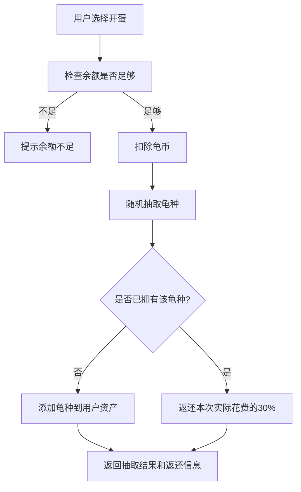
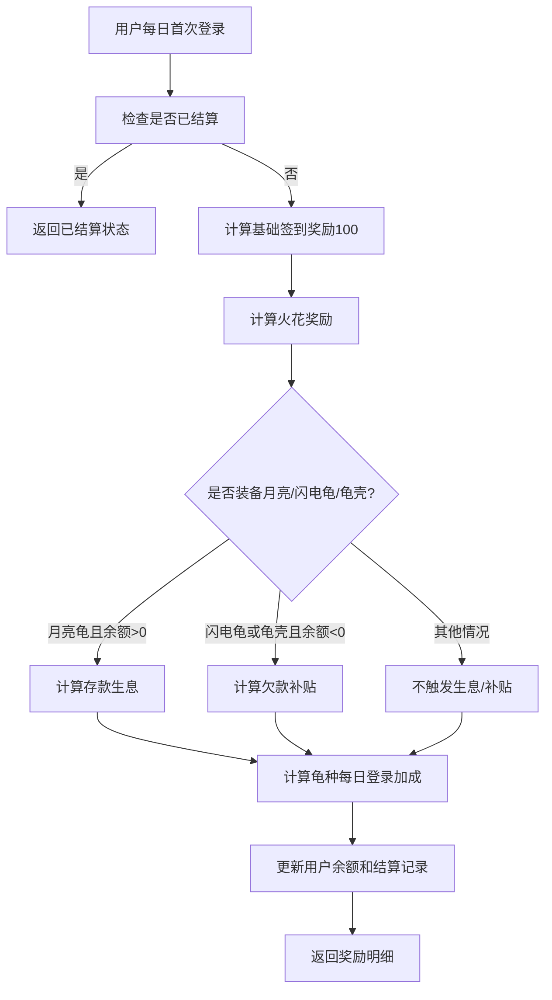
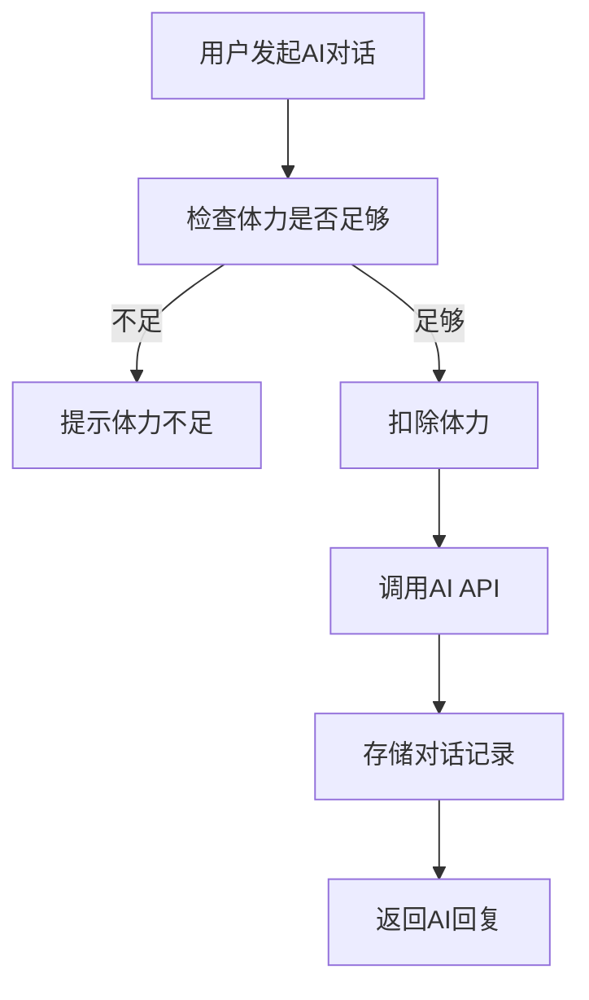
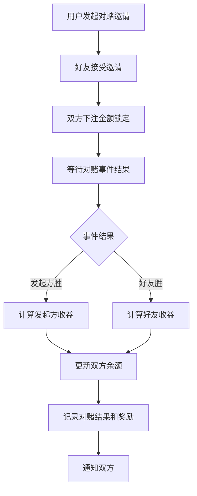
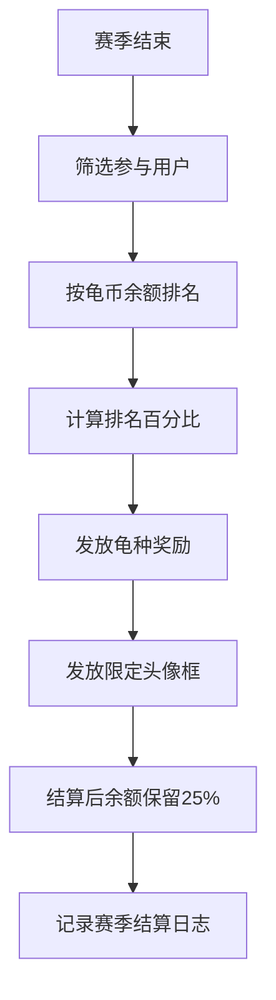

# 宠物系统：用户侧宠物使用

> 本文档描述“用户侧如何使用宠物系统”，是索引页 `宠物.md` 的子文档。
> 重点：用户行为触发哪些规则，哪些规则影响金币、体力、AI 对话、开蛋、装扮、状态等。

---

## 页面与交互（用户视角）

- 宠物展示：龟种外观 × 场景 × 头像框（显示在宠物页上方）
- 底部导航（4页）：能力 / 龟种 / 装扮 / 状态

> 注：具体页面字段清单与聚合数据口径目前仍属于缺口，建议后续补齐。

---

## P0 主链路（必须闭环）

### 每日登录结算

- 触发：北京时间当日首次打开 App
- 幂等：同一天只结算 1 次
- 结算内容：签到基础 100 + 火花加成 +（补贴 or 生息）+ 龟种每日登录加成

### 切换龟种

- 每日仅可切换一次（北京时间）
- 欠款未还清（余额 < 0）时禁止切换（DEBT_UNPAID）
- 切换当日不再结算旧龟补贴/生息，新龟从次日 0 点生效

### 欠账（余额可为负）

- lightning 欠账上限 -300；龟壳欠账上限 -1000
- 无利息

---

## 核心玩法（P1/P2，规则已给出口径）

### 体力系统 + 龟粮

- 体力上限 100；每小时恢复 5
- AI 对话消耗 -5（无头龟 -4）
- 苹果：价格 5（糖果龟折扣 4），回复体力 +2，经验 +1

### AI 对话

- 体力不足直接拒绝，不调用 LLM
- mood_state 注入 system prompt，影响语气
- 对话记录写入 ai_chat_history（或独立表）

### 开蛋系统

- 费用 500（含折扣）
- 概率按稀有度表
- 重复返还：实际花费 * 30% floor

### 装扮与成就

- 头像框/场景通过成就解锁
- 连胜计数规则（vote_streak_qualified / upset_streak）

### 小游戏联动（下海捕捞）

- 每日第一局返币 = score / 200 floor
- 宝箱龟额外 +25%
- 能力同步：S 护盾×1；SS/SSS 体积-30%

### 等级系统

- 每龟独立等级，最高 10
- XP 来源：喂龟粮/AI 对话/下注
- 升级公式：50 + 20*N

### 赛季系统

- 赛季末按余额排名发奖，结算后余额保留 25%

---

## 核心流程图（用“图”讲清楚）

> 说明：以下流程图与规则正文均从索引页 `宠物.md` 迁移而来，作为用户侧规则的“单一事实来源”。

### 开蛋流程

### 每日登录结算流程

### AI 对话流程

### 私人对赌流程

> 注：该流程涉及“好友/对赌”的完整状态机，目前仍属缺口；先保留流程骨架，待补齐接口与幂等策略。

### 赛季结算流程

## 宠物特性总览（影响哪些功能）

> 这部分用于帮助前后端理解：一项“特性”会在哪些功能里生效，从而避免规则散落。

### 推荐交付里程碑（便于排期）

- **M0（P0）**：统一“每日结算”主链路（基础签到+火花+欠账/补贴/生息）与切龟校验（每日一次、欠款锁龟）。
- **M1（P1）**：开蛋经济闭环（折扣+重复返还），并补齐 AI 体力减免、幸运骰。
- **M2（P1）**：下注/对赌增强（首次下注奖、手续费减免、爆冷、对赌胜利奖励、窃取）。
- **M3（P2）**：小游戏能力、赛季排名提升、贡献值加成等后置玩法。

### 功能维度：哪些功能会被“宠物特性”影响

| 功能模块 | 会被哪些特性影响 | 备注 |
| --- | --- | --- |
| 每日登录 & 签到 | 登录加成、火花倍率、幸运骰、欠款补贴、存款生息 | 需统一“北京时间日切”与幂等（同一天只结算一次） |
| 开蛋系统 | 抽奖折扣、重复返还 | 折扣影响“实际花费”，返还按实际花费 30% |
| AI 对话 | 体力消耗减免、心情系统（语气） | 体力不足不调用 LLM |
| 体力系统 | 体力消耗减免、龟粮折扣（若启用） | 需和“苹果售价”口径统一 |
| 小游戏联动 | 护盾、体积缩小、收益加成 | 需要明确“取整顺序”和“每日第一局奖励”幂等 |
| 投票下注（预测市场） | 手续费减免、首次下注奖励、爆冷奖励 | 需要统一“胜率口径/取整/上限” |
| 好友 & 私人对赌 | 对赌胜利奖励、窃取 | 窃取需要处理余额不足与取整 |
| 赛季系统 | 赛季排名提升 | 需明确加权策略如何落到排序 |
| 龟种切换 | 欠账未还清禁止切换、每日切换限制 | 需要明确错误码：DEBT_UNPAID / EQUIP_DAILY_LIMIT |

## 龟种（资产）配置

这一节用于定义“龟种资产”的静态配置口径，便于前后端/运营对齐。

### 字段说明

- **龟种ID**：业务枚举（如 `basic` / `stone`），用于存档与配置匹配
- **稀有度**：C / B / A / S / SS / SSS
- **小游戏能力**：下海捕捞（基础），以及护盾/缩小等附加
- **特殊能力**：影响签到、抽奖、对决/对赌、利息/补贴、体力消耗等规则

### C（普通）

| 龟种ID | 名称 | 小游戏能力 | 特殊能力 |
| --- | --- | --- | --- |
| basic | 小龟 | 下海捕捞 | 新用户默认形象，注册时赠送 500 龟币；无等级加成 |
| stone | 石头龟 | 下海捕捞 | 每日登录额外奖励 +25 龟币 |
| bamboo | 竹叶龟 | 下海捕捞 | 每日登录额外奖励 +25 龟币 |

### B（稀有）

| 龟种ID | 名称 | 小游戏能力 | 特殊能力 |
| --- | --- | --- | --- |
| angel | 天使龟 | 下海捕捞 | 每日登录额外奖励 +40 龟币 |
| ice | 寒冰龟 | 下海捕捞 | 每日登录额外奖励 +40 龟币 |
| ninja | 忍者龟 | 下海捕捞 | 每日登录额外奖励 +15 龟币；抽奖消耗龟币 -5% |
| two_head | 双头龟 | 下海捕捞 | 龟势对决贡献值 +15% × (1 + 10% × 当前等级)；满级(Lv.10)贡献值加成为 +30% |
| ghost | 幽灵龟 | 下海捕捞 | 投票下注手续费减免 (5% + 0.3% × 等级)；每日减免上限 (300 + 5 × 等级) 龟币 |
| diamond | 钻石龟 | 下海捕捞 | 赛季结算时排名百分比额外提升 (1.7% + 0.05% × 等级)；满级为 2.2% |
| fortune | 财神龟 | 下海捕捞 | 每日首次投票下注后额外获得 50 龟币 |
| dice | 骰子龟 | 下海捕捞 | 每日登录自动触发「幸运骰」，随机获得 0~(90 + 2 × 等级) 龟币（均匀分布）；满级上限为 110 龟币 |

### A（史诗）

| 龟种ID | 名称 | 小游戏能力 | 特殊能力 |
| --- | --- | --- | --- |
| rainbow | 彩虹龟 | 下海捕捞 | 每日登录额外奖励 +60 龟币 |
| gambler | 赌神龟 | 下海捕捞 | 每与一位不同好友完成私人对赌额外获得 (50 + 2 × 等级) 龟币（每天与同一好友只计一次，每日总上限 400 龟币）；满级单次奖励 70 龟币 |
| hunter | 猎人龟 | 下海捕捞 | 下注时事件胜率 < 35% 且最终结算获胜，奖励额外 +15% × (1 + 3% × 等级)；满级为 +19.5% |
| pirate | 海盗龟 | 下海捕捞 | 好友对赌获胜时，额外窃取输家输掉龟币的 (10% + 0.7% × 等级)；满级为 17%；余额不足取全部 |
| candy | 糖果龟 | 下海捕捞 | 购买龟粮价格 -20%，即 16 龟币/个 |
| bubble | 泡泡龟 | 下海捕捞 | 抽奖消耗龟币 -(10% + 1% × 等级)；满级折扣为 -20% |
| line | 线条龟 | 下海捕捞 | 龟势对决贡献值 +25% × (1 + 10% × 当前等级)；满级(Lv.10)贡献值加成为 +50% |
| lightning | 闪电龟 | 下海捕捞 | 欠账上限 -300 龟币，每日补贴欠款额的 (20% + 0.5% × 等级)；满级补贴为 25%；欠款未还清时禁止切换龟种（错误码 DEBT_UNPAID） |

### S（传说）

| 龟种ID | 名称 | 小游戏能力 | 特殊能力 |
| --- | --- | --- | --- |
| phoenix | 凤凰龟 | 下海捕捞 + 护盾×1 | 每日登录额外奖励 +100 龟币 |
| lava | 熔岩龟 | 下海捕捞 + 护盾×1 | 火花奖励 × (1.3 + 0.03 × 等级)；满级倍率为 1.6×；翻倍额外部分上限 400 龟币/天 |
| cyber | 赛博龟 | 下海捕捞 + 护盾×1 | 好友对赌获胜时，额外窃取输家输掉龟币的 (15% + 0.7% × 等级)；满级为 22%；余额不足取全部 |
| crystal | 水晶龟 | 下海捕捞 + 护盾×1 | 抽奖消耗龟币 -(18% + 0.9% × 等级)；满级折扣为 -27% |
| chest | 宝箱龟 | 下海捕捞 + 护盾×1 | 小游戏奖励 × (1 + 5% × 等级) + 25% 基础；龟势对决奖励同公式；满级两者均为 +75% |
| space | 星际龟 | 下海捕捞 + 护盾×1 | 余额 > 0 时每日自动生息 3%（上限 1000 龟币/天）；龟势对决贡献值 +15% × (1 + 10% × 当前等级)；满级为 +30% |

### SS（神话）

| 龟种ID | 名称 | 小游戏能力 | 特殊能力 |
| --- | --- | --- | --- |
| hiding | 缩头乌龟 | 下海捕捞 + 体积-30% | 龟势对决获胜时获得完整赢方奖励；失败时获得赢方奖励的 (40% + 2% × 等级)；满级为 60% |
| headless | 无头龟 | 下海捕捞 + 体积-30% | AI对话体力消耗 -1（即 -4 体力/次）；每日登录额外奖励 +50 龟币 |

### SSS（至尊）

| 龟种ID | 名称 | 小游戏能力 | 特殊能力 |
| --- | --- | --- | --- |
|  |  |  |  |

## 体力系统

### 基本规则

- 体力上限：100
- AI对话消耗：每次 -5（装备无头龟时 -4）
- 体力不足时，拒绝对话请求并返回提示

### 体力回复

- 每小时回复 5 点，上限 100
- 体力满时停止计算，不溢出

> 后端实现建议：存储 stamina_current 和 stamina_last_regen_at，查询时实时计算当前值（每小时+5），无需定时任务。

### 龟粮（苹果）

- 一个苹果售价：5 龟币
- 一个苹果回复体力：2 点（不超上限）
- 一个苹果提供经验值：+1 XP
- 糖果龟装备时购买折扣：-20%，即 4 龟币/个

## 开蛋系统

### 抽取规则

- 单次费用：500龟币（忍者龟 475 / 泡泡龟 450 / 水晶龟 410 龟币）
- 可出任意龟种，包括已拥有的
- 稀有度概率：C 40% / B 30% / A 15% / S 10% / SS 4% / SSS 1%
- C 级（3只）：小龟 / 石头龟 / 竹叶龟，概率均分
- B 级（8只）：天使龟 / 寒冰龟 / 忍者龟 / 双头龟 / 幽灵龟 / 钻石龟 / 财神龟 / 骰子龟，概率均分
- A 级（7只）：彩虹龟 / 赌神龟 / 猎人龟 / 海盗龟 / 糖果龟 / 泡泡龟 / 线条龟 / 闪电龟，概率均分
- S 级（7只）：凤凰龟 / 熔岩龟 / 赛博龟 / 水晶龟 / 宝箱龟 / 星际龟 / 闪电龟，概率均分
- 无保底机制

### 重复龟种返还规则

- 若本次开蛋结果为已拥有龟种，自动返还本次费用的 30%
- 普通返还：500 × 30% = 150 龟币
- 忍者龟折扣下返还：475 × 30% = 142 龟币（向下取整）
- 泡泡龟折扣下返还：450 × 30% = 135 龟币
- 水晶龟折扣下返还：410 × 30% = 123 龟币（向下取整）
- 返还龟币在同一结算中计入余额（业务要求：需要返回 is_duplicate / refund_amount）

## 龟壳（SSS）特殊能力详解

龟壳（SSS）与闪电龟（A）均提供欠账能力，但规格不同；存款生息为龟壳与星际龟（S）专属，各自利率不同。

### 欠账系统

- 龟壳（SSS）：欠账上限 -1000 龟币
- 闪电龟（A）：欠账上限 -300 龟币
- 余额显示：账户余额可正常显示负数，如「-320 🪙」
- 无利息：欠款期间不产生额外利息
- 锁龟机制：欠款未还清（余额 < 0）时，禁止切换龟种；后端在切换龟种时校验，返回错误码 DEBT_UNPAID

### 每日欠款补贴

- 触发条件：当日结算时余额 < 0（仍有欠款）
- 龟壳补贴金额：|当前欠款额| × 22%（向下取整）
- 闪电龟补贴金额：|当前欠款额| × 25%（向下取整）
- 例（龟壳）：余额 -500 → 补贴 110 龟币，余额变为 -390
- 例（闪电龟）：余额 -200 → 补贴 50 龟币，余额变为 -150
- 补贴直接计入余额（帮助还款），不额外发放到其他账户
- 结算时机：装备龟壳或闪电龟后，从第二天北京时间 0 点起开始触发欠款补贴；装备星际龟或龟壳后，从第二天 0 点起开始触发存款生息
- 切换龟种后当日不再结算原龟种的补贴/生息，新龟种从次日 0 点生效
- 补贴与生息在每日北京时间 0 点与登录奖励同批次结算

### 存款生息系统

- 触发条件：当日结算时余额 > 0（账户有存款）
- 龟壳（SSS）生息利率：余额 × 5%（向下取整），每日上限 1000 龟币
- 星际龟（S）生息利率：余额 × 3%（向下取整），每日上限 1000 龟币
- 例（龟壳）：余额 10,000 → 生息 500 龟币；余额 25,000 → 上限 1000 龟币
- 例（星际龟）：余额 10,000 → 生息 300 龟币；余额 34,000 → 上限 1000 龟币
- 所有正余额龟币均自动生息，无需用户手动操作
- 生息与欠款补贴互斥：同一天只能触发其中一个（余额 < 0 时补贴，余额 > 0 时生息，余额 = 0 时两者均不触发）

### 后端字段补充

- turtle_coins 字段需支持负整数存储，前端展示层需处理负数样式
- 建议新增 daily_shell_settled: Boolean 字段（或复用每日结算逻辑），防止同一天重复结算补贴/生息

## 装扮系统

### 头像框解锁条件

| 头像框ID | 名称 | 解锁条件 | 追踪字段 |
| --- | --- | --- | --- |
| red_frame | 红头像框 | 默认拥有 | — |
| none | 无头像框 | 默认拥有 | — |
| lava_frame | 熔岩头像框 | 投票连胜 5 局（每局须下注 ≥ 100 龟币） | vote_streak_qualified ≥ 5 |
| dark_frame | 暗黑头像框 | 小游戏历史最高分 ≥ 15000 | game_best_score ≥ 15000 |
| moon_frame | 月牙头像框 | 收集 12 只龟 | len(owned_turtles) ≥ 12 |
| sakura_frame | 樱花头像框 | 小游戏历史最高分 ≥ 20000 | game_best_score ≥ 20000 |
| upset_frame | 爆冷头像框 | 连续猜对 4 次胜率 < 25% 的事件（每局须下注 ≥ 100 龟币） | upset_streak ≥ 4 |
| galaxy_frame | ⭐ 星河头像框 | 赛季结算前 3% 专属奖励（限定） | 限定发放 |
| phantom_frame | 👻 幽冥头像框 | 赛季结算 3%~10% 专属奖励（限定） | 限定发放 |
| aurora_frame | 🌌 极光头像框 | 赛季结算 10%~25% 专属奖励（限定） | 限定发放 |
| koi_frame | 🐟 锦鲤头像框 | 赛季结算 25%~40% 专属奖励（限定） | 限定发放 |

### 场景解锁条件

| 场景ID | 名称 | 解锁条件 | 追踪字段 |
| --- | --- | --- | --- |
| grassland | 草地 | 默认拥有 | — |
| coral | 海底珊瑚 | 默认拥有 | — |
| starry | 星空 | 累计投票 25 次 | total_votes ≥ 25 |
| lava_cave | 熔岩洞穴 | 收集 8 只龟 | len(owned_turtles) ≥ 8 |

> 注意：星空和熔岩洞穴场景由原购买制改为成就解锁，不再消耗龟币。

### 连胜计数规则

- vote_streak_qualified：每局下注 ≥ 100 龟币且猜对，+1；猜错则归零
- upset_streak：每局下注 ≥ 100 龟币、事件胜率 < 25% 且猜对，+1；猜错则归零
- 两个连胜计数相互独立，不互相影响
- 达到解锁条件时立即解锁对应头像框，计数不重置（可继续累积）

## 火花系统

### 触发条件

- 用户连续两天及以上完成每日首次登录即可累积火花
- 与当前装备龟种无关，切换龟种不影响火花计数

### 火花计数规则

- 每满足一天连续登录，login_streak +1
- 中断连续登录（跳过一天），login_streak 归零

### 奖励计算

当日登录总奖励 = 100（基础）+ y（火花加成，向下取整）

**y = 100 × (1 - e^(-0.1x))**

其中 x 为当前连续登录天数（login_streak）；y 初期增长快，后期趋近 100（总奖励趋近 200 龟币）

例：x=0 → 总奖励 100 龟币；x=3 → 125 龟币；x=7 → 150 龟币；x=14 → 175 龟币；x=30 → 195 龟币

### 龟种每日切换限制

- 每位用户每天（北京时间）仅可切换龟种一次
- 后端以 last_equip_date 字段记录上次切换日期，切换前校验是否与当日相同
- 当日已切换时，返回错误码 EQUIP_DAILY_LIMIT，头像框和场景的切换不受此限制

> 待确认：每日判断时区以北京时间（UTC+8）0 点为准，请后端确认并统一。

## AI 对话（补充）

### 调用流程

- 前端发起对话 → 后端扣除体力（stamina consume 接口）→ 后端调用千问 API → 返回结果并存储
- 体力不足（< 5，无头龟 < 4）时，后端返回错误码，不调用 AI

### 对话存储

- 每条记录包含：角色（user/assistant）、内容、时间戳
- 存储在 ai_chat_history 字段（或独立表），供「记忆」页面调用展示

### 待确认

- AI 调用由后端统一对接 API（建议）还是前端直连：建议后端调用以保护 API Key
- 记忆页面展示内容：全量对话记录 / 每日摘要 / 关键词标签（待产品确认）

## 每日登录 & 签到（补充）

- 触发时机：用户每日北京时间首次打开 App
- 后端检查 last_login_date，若非当日则视为新的一天登录
- 奖励展示：签到界面显示「100 + 火花加成」，并返回本次奖励龟币数量（基础100 + 火花加成）

## 小游戏联动（下海捕捞）（补充）

### 每日龟币奖励

- 每位用户每天第一局下海捕捞结束后，发放龟币 = 本局分数 ÷ 200（向下取整）
- 例：本局得分 2,000 → 奖励 10 龟币；得分 399 → 奖励 1 龟币
- 仅第一局触发，当日后续游戏不再发放，需后端记录当日是否已发放
- 宝箱龟装备时，小游戏龟币奖励额外 +25%（向下取整后再乘）

### 龟种能力同步规则

- C / B / A 级：仅下海捕捞，无额外游戏加成
- S 级：下海捕捞 + 护盾 ×1（每局可免疫一次碰撞）
- SS / SSS 级：下海捕捞 + 体积缩小 30%

## 心情系统

龟的心情基于用户近期投票表现动态计算，展示在状态页面，并影响 AI 对话语气。

### 心情状态定义

| 状态 | ID | 触发条件 | AI 对话语气 |
| --- | --- | --- | --- |
| 亢奋 🔥 | elated | 连胜 5 局及以上 | 激动、夸张，大量感叹号，频繁称赞用户 |
| 开心 | happy | 连胜 2-4 局，或近 20 局胜率 > 60% | 活泼、鼓励 |
| 平静 | calm | 无明显连胜/连败，近 20 局胜率 40-60% | 客观中立 |
| 低落 | sad | 连败 3-4 局，或近 20 局胜率 30-40% | 说话变少，语气轻柔 |
| 沮丧 | depressed | 连败 5 局及以上，或近 20 局胜率 < 30% | 消极、自我怀疑，偶尔抱怨 |

### 优先级规则

- 连胜/连败优先于胜率：只要有进行中的连胜或连败，以连胜/连败判断心情
- 连胜/连败均不存在时（最近一局为首胜/首败），以近 20 局胜率判断
- 心情状态在每次投票结算后实时更新，写入 mood_state 字段
- 新用户默认心情为平静（calm）

### AI 对话中的应用

- 后端在调用模型 API 时，将当前 mood_state 注入 System Prompt
- 心情仅影响语气，不影响分析内容的准确性

### 状态页面展示

- 「状态」页面展示：当前心情、近期胜率统计、连胜/连败记录
- 原「记忆」页面 AI 对话历史并入「状态」页面底部展示

## 等级系统（详细口径）

每只龟独立计算等级与经验值，最高等级为 10 级。等级与龟种绑定，切换龟种后等级各自保留。

### 经验值来源

| 行为 | 经验值 | 说明 |
| --- | --- | --- |
| 喂龟粮（每个苹果） | +1 XP | 喂给当前装备龟，计入该龟经验 |
| AI 对话（每次） | +5 XP | 完成一次对话后计入，与体力消耗同步触发 |
| 投票下注（每次） | +3 XP | 下注成功后即时计入，无论输赢 |
| 投票下注金额 | +1 XP / 100龟币 | 向下取整，例：下注 350 龟币 → +3 XP |

### 升级规则

- 经验值仅计入当前装备龟种，切换龟种后经验各自独立累积
- 满级（10级）后经验值不再增加，不溢出
- 升级所需经验公式：从第 N 级升至第 N+1 级需要 50 + 20 × N 经验值

| 当前等级 | 升至下一级所需 XP | 累计总 XP（从 1 级起） |
| --- | --- | --- |
| Lv.1 → Lv.2 | 70 | 70 |
| Lv.2 → Lv.3 | 90 | 160 |
| Lv.3 → Lv.4 | 110 | 270 |
| Lv.4 → Lv.5 | 130 | 400 |
| Lv.5 → Lv.6 | 150 | 550 |
| Lv.6 → Lv.7 | 170 | 720 |
| Lv.7 → Lv.8 | 190 | 910 |
| Lv.8 → Lv.9 | 210 | 1,120 |
| Lv.9 → Lv.10 | 230 | 1,350 |
| Lv.10（满级） | — | — |

### 后端字段

- turtle_level: Object —— key 为龟种 ID，value 为当前等级（1-10）
- turtle_xp: Object —— key 为龟种 ID，value 为当前经验值
- 建议在 `/pet/stamina/restore`、`/ai/chat`、投票下注接口处分别触发对应 XP 增加逻辑

### 等级效果

**实际奖励 = 基础奖励 × (1 + 加成比例 × 当前等级)**

| 龟种 | 基础效果 | 等级加成公式 | 满级(Lv.10)效果 |
| --- | --- | --- | --- |
| 石头龟 | 登录 +25 龟币 | 25 × (1 + 5% × 等级) | 37 |
| 竹叶龟 | 登录 +25 龟币 | 25 × (1 + 5% × 等级) | 37 |
| 天使龟 | 登录 +40 龟币 | 40 × (1 + 5% × 等级) | 60 |
| 寒冰龟 | 登录 +40 龟币 | 40 × (1 + 5% × 等级) | 60 |
| 忍者龟 | 登录 +15 龟币 | 15 × (1 + 5% × 等级) | 22 |
| 财神龟 | 首次下注 +50 龟币 | 50 × (1 + 5% × 等级) | 75 |
| 彩虹龟 | 登录 +60 龟币 | 60 × (1 + 5% × 等级) | 90 |
| 凤凰龟 | 登录 +100 龟币 | 100 × (1 + 5% × 等级) | 150 |
| 无头龟 | 登录 +50 龟币 | 50 × (1 + 10% × 等级) | 100 |
| 泡泡龟（抽奖） | 抽奖消耗龟币 -(10% + 1% × 等级) | 公式 | -20% |
| 水晶龟（抽奖） | 抽奖消耗龟币 -(18% + 0.9% × 等级) | 公式 | -27% |
| 熔岩龟（火花） | 火花奖励倍率 | 火花 × (1.3 + 0.03 × 等级) | 1.6× |
| 宝箱龟（奖励） | 奖励加成 | 基础 × (1 + 5% × 等级) | +75% |
| 幽灵龟（手续费） | 减免与上限 | (5% + 0.3% × 等级)；上限 (300 + 5 × 等级) | 8% / 350 |
| 钻石龟（赛季） | 排名提升 | (1.7% + 0.05% × 等级) | 2.2% |

## 赛季系统（详细口径）

每三个月为一个赛季，赛季结束时按用户龟币排名发放稀有度龟种奖励。

### 赛季周期

- 每赛季时长：3 个月（90 天）
- 结算时机：赛季结束日北京时间 0 点，与每日登录奖励同批次处理
- 参与条件：赛季内至少完成 1 次投票下注（防止僵尸账号占位）

### 排名奖励

| 排名区间 | 龟种奖励 | 限定头像框 | 说明 |
| --- | --- | --- | --- |
| 前 3% | SSS 随机 | ⭐ 星河头像框 | 已拥有则返还 500 龟币 |
| 3% ~ 10% | SS 随机 | 👻 幽冥头像框 | 已拥有则返还 350 龟币 |
| 10% ~ 25% | S 随机 | 🌌 极光头像框 | 已拥有则返还 200 龟币 |
| 25% ~ 40% | A 或 B 随机 | 🐟 锦鲤头像框 | 已拥有则返还 100 龟币 |
| 40% 以下 | — | — | 无奖励 |

### 限定头像框说明

- 限定头像框仅通过赛季奖励获得，不可通过成就解锁，不可开蛋获得
- 已拥有限定头像框时，重复发放不返还龟币

### 排名计算

- 排名依据：赛季结束时用户的龟币余额（含负数，负数排名靠后）
- 同分处理：同余额时，赛季内更早达到该余额的用户排名更高
- 排名百分比 = 用户排名 ÷ 本赛季参与总人数

### 赛季结束余额保留规则

- 赛季结束结算后，用户龟币余额保留 25%，其余 75% 清零，作为新赛季起点
- 余额为负数时同样保留 25%（欠款也只保留 25%）
- 保留后余额写入 turtle_coins 字段，season_start_balance 记录该值作为新赛季基准

### 后端字段补充

- 建议新增 season_id: Integer 字段，记录当前赛季编号
- 建议新增 season_start_balance: Integer 字段，记录每赛季开始时的龟币快照
- 赛季奖励发放后需记录到奖励日志，防止重复发放

---

## 仍待补充的用户侧规则（缺口）

1) 好友系统如何定义/展示（来源、字段、隐私）
2) 私人对赌完整状态机与幂等结算/争议处理
3) 下注增强能力（fortune/ghost/hunter 等）的落点与胜率口径
4) “记忆页并入状态页”展示范围与交互
