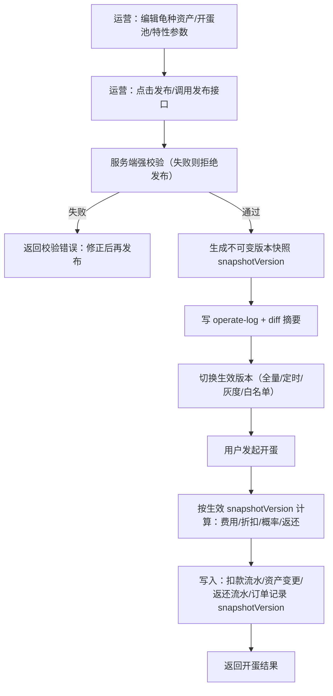

# 宠物系统：运营侧宠物维护

> 本文档描述“运营侧如何维护宠物系统配置”，是索引页 `宠物.md` 的子文档。
> 目标：让运营侧具备**可配置、可审计、可回滚、可止血**的能力，保障宠物相关的金币玩法长期可运营。

---

## 模块划分（建议 IA）

### 宠物（龟种）资产库（Pet Catalog）

- 龟种列表：按稀有度/是否上架/是否可开蛋获得/是否赛季奖励筛选
- 龟种编辑：
  - 基础信息：petId、名称、稀有度、描述
  - 展示资源：icon/cover/动效/排序权重
  - 能力挂载：把“特征库”中的特征挂到某个龟种
- 上架/下架：
  - 对新用户是否可获得（开蛋/赛季/活动）
  - 对存量用户是否可继续装备/升级/展示

### 特征库（能力库）与规则参数（Feature Library）

> 对应 `宠物.md` 的【特性清单】。

特征库是“龟种能力”的配置中心。运营侧在这里维护：

- **能力开关**：某个能力是否生效、对哪些用户/版本生效
- **能力参数**：倍率、封顶、次数、阈值、取整等
- **互斥与依赖**：例如“欠款补贴 vs 存款生息”互斥
- **生效时机**：能力在哪个结算点生效（每日结算/开蛋结算/下注结算/小游戏结算…）

#### 特征模板清单（建议最小规范）

> 说明：这里的 `featureKey` 是建议的内部标识；具体落地可按后端字段命名统一。

| featureKey（建议） | 中文名称 | 作用域 | 生效时机 | 主要配置参数（示例） | 典型龟种 | 优先级 |
| --- | --- | --- | --- | --- | --- | --- |
| signin_bonus | 每日登录加成 | 单龟种 | 每日登录结算 | bonusCoins（固定值）；levelScale（随等级比例，可选）；enabled | stone/bamboo/angel/ice/rainbow/phoenix/headless | P0 |
| spark_multiplier | 火花倍率加成 | 单龟种 | 每日登录结算（火花计算） | baseMultiplier；levelScale；extraCapPerDay（额外部分日封顶）；rounding=floor | lava | P0 |
| debt | 欠账（余额可为负） | 单龟种/全局约束 | 余额变动/切龟校验/每日结算 | debtFloor（最低余额，例如 -300/-1000）；forbidEquipWhenDebt=true；errorCode=DEBT_UNPAID | lightning、龟壳（SSS） | P0 |
| debt_subsidy | 欠款补贴 | 单龟种 | 每日登录结算 | subsidyRate；rounding=floor；capPerDay（可选）；enabled | lightning、龟壳（SSS） | P0 |
| deposit_interest | 存款生息 | 单龟种 | 每日登录结算 | interestRate；capPerDay；rounding=floor；enabled | space、龟壳（SSS） | P0 |
| equip_daily_limit | 每日切换限制 | 全局规则 | 切龟校验 | maxEquipsPerDay=1；timezone=UTC+8；errorCode=EQUIP_DAILY_LIMIT | 全体龟种（全局） | P0 |
| first_bet_bonus | 首次下注奖励 | 单龟种 | 当日第一次下注成功后 | bonusCoins；levelScale（可选）；dailyOnce=true；enabled | fortune | P1 |
| dice_daily_reward | 幸运骰（日奖） | 单龟种 | 每日登录结算 | minCoins=0；maxCoins（可随等级）；distribution=uniform；enabled | dice | P1 |
| egg_discount | 开蛋折扣 | 单龟种 | 开蛋扣费 | discountRate 或 discountedPrice；rounding（价格取整）；enabled | ninja/bubble/crystal | P1 |
| egg_duplicate_refund | 重复返还 | 全局规则/可配置 | 开蛋结算 | refundRate=0.3；rounding=floor；enabled | 全体龟种（全局） | P1 |
| food_discount | 龟粮折扣 | 单龟种 | 商城购买龟粮 | discountRate；finalPrice；enabled | candy | P1 |
| chat_stamina_discount | AI 体力消耗减免 | 单龟种 | AI 对话扣体力 | staminaDelta=-1（或 finalCost=4）；enabled | headless | P1 |
| bet_fee_discount | 下注手续费减免 | 单龟种 | 下注结算/收取手续费 | feeDiscountRate；dailyCap；rounding；enabled | ghost | P1 |
| upset_bonus | 爆冷奖励 | 单龟种 | 下注结算（赢时） | winRateThreshold；bonusRate；levelScale；capPerDay（可选） | hunter | P1 |
| duel_win_bonus | 对赌胜利奖励 | 单龟种 | 私人对赌结算（赢时） | bonusCoins；uniqueFriendDaily=true；dailyCap | gambler | P1 |
| steal_on_win | 窃取 | 单龟种 | 私人对赌结算（赢时） | stealRate；rounding=floor；insufficientPolicy=takeRemaining | pirate/cyber | P1 |
| minigame_shield | 小游戏护盾 | 单龟种 | 小游戏局内能力 | shieldCount=1 | phoenix/lava/cyber/crystal/chest/space | P2 |
| minigame_scale | 小游戏体积缩小 | 单龟种 | 小游戏局内能力 | scaleRate=-0.3 | hiding/headless | P2 |
| minigame_reward_boost | 小游戏收益加成 | 单龟种 | 小游戏结算 | boostRate；capPerDay（可选）；rounding | chest | P2 |
| season_rank_boost | 赛季排名提升 | 单龟种 | 赛季结算排序/百分位 | percentileBoost；levelScale；enabled | diamond | P2 |
| contribution_boost | 贡献值加成 | 单龟种 | 龟势对决/贡献结算 | boostRate；levelScale；enabled | two_head/line/space | P2 |

### 开蛋池（Gacha Pool）与概率管理

- 基础费用（500）
- 稀有度概率（C/B/A/S/SS/SSS）
- 稀有度内分配（当前口径为“均分”；后台建议支持权重）
- 折扣：忍者/泡泡/水晶 等
- 重复返还：按“本次实际花费”的 30% 向下取整

### 外观与装扮资源库（Cosmetics）

- 头像框库：frameId、名称、资源、是否限定、来源
- 场景库：sceneId、名称、资源、是否限定、来源

### 风控与安全开关（止血）

- 能力紧急禁用：生息/补贴/火花倍率/折扣/返还等
- 生效范围：全量 / 百分比灰度 / 白名单
- 阈值保护：lava 额外封顶、利息封顶等必须强校验

### 审计与版本管理

- 变更记录：谁改了什么（diff）、原因、影响范围
- 发布/回滚：draft -> publish -> rollback
- 生效快照查询：按 userId + 时间点查询当时生效版本（客服解释用）

---

## 维护宠物 → 发布 → 开蛋：端到端全流程（无 Draft，直接发布生成版本快照）

> 目标：裁剪掉 Draft 概念，把流程简化为“运营编辑 → 调用发布接口（强校验）→ 生成不可变版本快照 → 生效 → 用户开蛋读取该版本”。
>
> 用户侧开蛋流程图见：`宠物-用户侧宠物使用.md` 的「开蛋流程」。

### 流程总览（从维护到用户开蛋）

### 分层“合同”（谁提供什么，谁消费什么）

- **运营侧提供（配置面）**
  - 龟种定义（Pet Definition）：petId、稀有度、展示资源、是否可开蛋获得、能力挂载
  - 开蛋池（Gacha Pool）：费用、稀有度概率、池内权重（可选）、是否启用
  - 特性（Feature）：折扣、返还等开蛋相关能力的参数
  - 发布策略（Rollout）：即时/定时/灰度比例/白名单

- **用户侧消费（结算面）**
  - 开蛋时：读取“当前生效配置版本”
  - 依据该版本：
    - 计算本次实际花费（含折扣）
    - 按概率抽取龟种
    - 判定重复并按规则返还（基于实际花费）

### 运营侧维护（编辑）阶段

运营侧需要能维护三类东西：

1) **龟种资产**（Pet Catalog）
   - 关键字段：
     - `petId`（不可变）
     - `rarity`（影响概率档位）
     - `enabled`（是否上架/可展示）
     - `obtainableByEgg`（是否可被开蛋抽到）

2) **开蛋池**（Gacha Pool）
   - 关键字段：
     - `eggPriceBase`：基础费用（默认 500）
     - `rarityRates`：稀有度概率（C/B/A/S/SS/SSS）
     - `weightsByPetId`（可选）：同稀有度内的权重
     - `poolEnabled`：开蛋入口总开关

3) **开蛋能力**（来自特征库）
   - `egg_discount`：折扣（按龟种生效）
   - `egg_duplicate_refund`：重复返还（全局规则）

#### 强校验（避免配置把系统搞崩）

- 概率校验：
  - `sum(rarityRates) == 1`（或 100）
  - 每项 >= 0
- 池完整性：
  - 每个 rarity 至少有 1 只 `obtainableByEgg=true` 的龟（否则该档位抽中会报错）
- 价格校验：
  - 折扣后价格必须 `>= 0` 且必须为整数（明确取整：floor）
- 返还校验：
  - `0 <= refundRate <= 1`
- 互斥/依赖：
  - `egg_discount` 影响“实际花费”；`egg_duplicate_refund` 必须基于“实际花费”计算（避免口径分裂）

### 发布（Publish）阶段：发布接口强校验 → 生成版本快照 → 生效

#### 发布接口输出的“版本快照”（建议必须有）

发布成功后必须生成 **不可变快照**，并返回一个可追溯的版本号：

- `snapshotVersion`
- `publishedAt` / `publishedBy`
- `petDefinitions`（含 `obtainableByEgg`）
- `gachaPool`（费用/概率/权重/开关）
- `features`（至少包含开蛋相关 feature 的最终参数：折扣、返还等）
- `rollout`（全量/定时/灰度/白名单）

> 说明：你们不做 Draft 也没问题，但**必须**做“不可变快照版本”，否则无法：回滚、解释历史开蛋订单、稳定灰度。

#### 灰度策略（建议最小可用）

- 全量：所有用户都读最新 `snapshotVersion`
- 定时全量：到达 `effectiveAt` 才切换
- 百分比灰度：按 `userId` 哈希落桶（例如 1%/5%/20%）
- 白名单：仅指定 userId 生效（方便运营验收）

#### 回滚策略（止血）

- **一键回滚到上一生效版本**（按 `snapshotVersion`）
- 回滚也必须写 operate-log（原因必填）
- 紧急开关：`poolEnabled=false`（直接关闭开蛋入口）

### 用户开蛋（Egg）阶段：把“生效版本”接入开蛋流程

用户侧开蛋流程（余额检查 → 扣款 → 抽取 → 返还）需要补上一个关键步骤：

1) **解析本次开蛋应使用的配置版本**
   - 输入：`userId` + `now`
   - 输出：`snapshotVersion` + 快照内容（或缓存 key）

2) **按快照计算本次实际花费（含折扣）**
   - `priceBase = snapshot.eggPriceBase`
   - `discount = feature egg_discount`（由“当前装备龟种/或其他规则”决定；以你们最终产品口径为准）
   - `actualCost = floor(priceBase * (1 - discountRate))` 或直接使用 `discountedPrice`

3) **按快照的池与权重抽取龟种**
   - 先按 `rarityRates` 抽稀有度
   - 再在该 rarity 的 `obtainableByEgg` 列表中抽 petId（均分或按权重）

4) **判定重复并返还（基于实际花费）**
   - `refund = floor(actualCost * refundRate)`

#### 必须落库的审计字段（用于纠纷解释）

无论你们实现为几张表，建议每次开蛋至少记录：

- `userId`
- `eggOrderId`（幂等）
- `snapshotVersion`（本次使用的生效配置版本）
- `priceBase`、`discountApplied`、`actualCost`
- `drawRarity`、`drawPetId`
- `isDuplicate`、`refundRate`、`refundAmount`
- 资金流水引用（扣款/返还对应的 ledgerId）

### 接口视角（建议新增，供前后端对齐）

> 这里只给“契约级”接口名，具体路由可按你们现有 `/api/admin/**` 风格落。

#### 运营侧

- `GET /api/admin/pet/defs`：龟种列表（含是否可开蛋、稀有度）
- `POST /api/admin/pet/config/publish`：直接发布（请求体携带完整配置或引用配置ID；服务端强校验 + 生成 `snapshotVersion` + 生效策略 rollout）
- `POST /api/admin/pet/config/rollback`：回滚到指定 `snapshotVersion`
- `POST /api/admin/pet/kill-switch`：紧急开关（example: poolEnabled=false）

#### 用户侧（或服务端内部读路径）

- `GET /api/pet/config/effective`（内部用也行）：根据用户获取当前生效 `snapshotVersion`

### 常见边界情况（开蛋链路）

- 发布过程中用户正在开蛋：
  - 以“请求开始时解析到的 snapshotVersion”为准，整单使用同一版本（避免中途切换）
- 灰度命中变化：
  - 同一用户在灰度周期内命中应稳定（哈希落桶）；避免今天中 A 版本明天中 B 版本
- 池配置不完整：
  - 必须在 Publish 校验阶段拦截；线上绝不允许抽中没有候选 pet 的档位
- 返还/折扣引发负数或溢出：
  - 统一用整数与 floor；并在服务端加上下限保护

### 与现有文档的衔接点

- 用户侧“开蛋流程图”保持不变；这里补齐的是：
  - **开蛋前**：如何得到“生效配置版本”
  - **开蛋中**：折扣与返还的同口径计算（基于实际花费）
  - **开蛋后**：审计字段保证可解释性

---

## P0 最小落地集合（建议）

1) 龟种资产库（上架/下架 + 能力挂载）
2) 特征库（至少覆盖 P0：每日结算/火花/欠账/补贴/生息/切龟限制）
3) 开蛋池概率管理（含折扣/返还口径）
4) 审计 + 版本化发布/回滚 + 紧急开关
