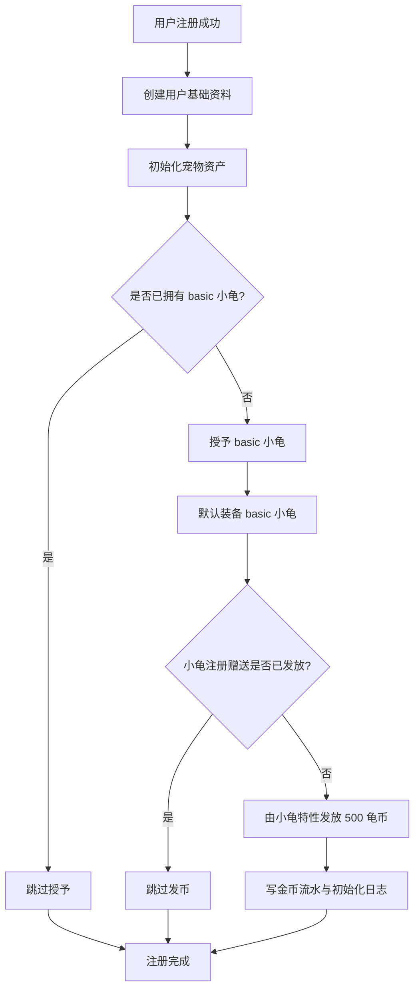
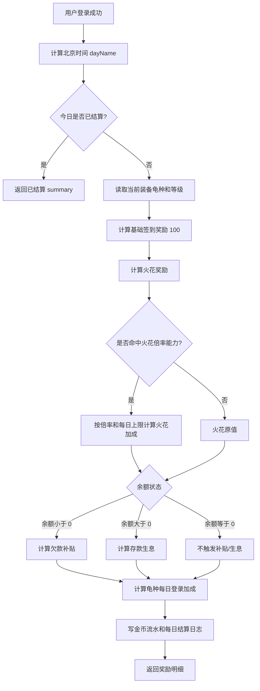
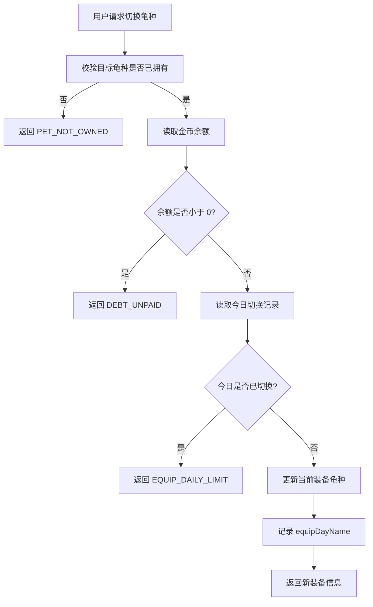
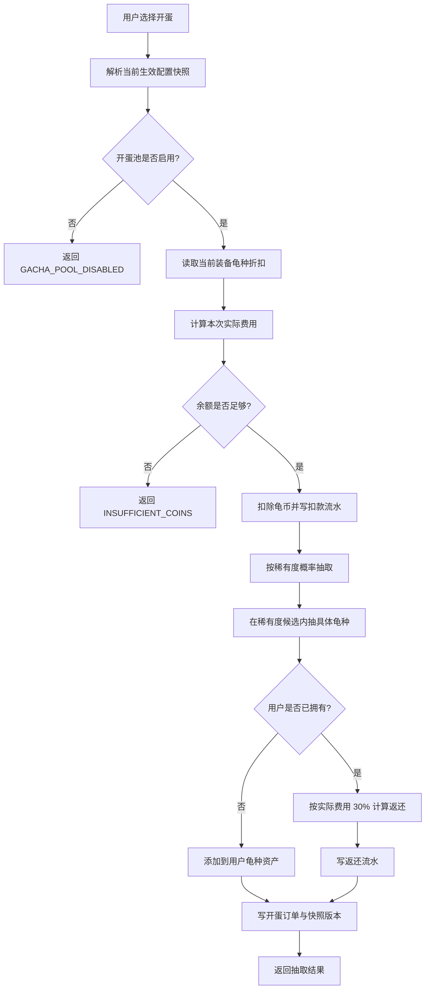
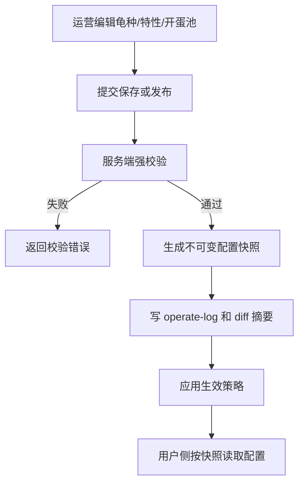
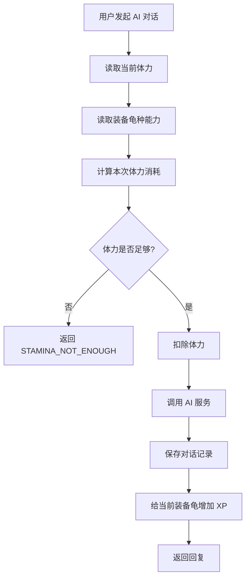
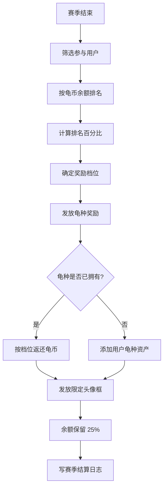

# 宠物系统流程图

## 新用户注册初始化

```mermaid
flowchart TD
	A[用户注册成功] --> B[创建用户基础资料]
	B --> C[初始化宠物资产]
	C --> D{是否已拥有 basic 小龟?}
	D -->|是| E[跳过授予]
	D -->|否| F[授予 basic 小龟]
	F --> G[默认装备 basic 小龟]
	G --> H{小龟注册赠送是否已发放?}
	H -->|是| I[跳过发币]
	H -->|否| J[由小龟特性发放 500 龟币]
	J --> K[写金币流水与初始化日志]
	E --> L[注册完成]
	I --> L
	K --> L
```

## 每日登录结算

```mermaid
flowchart TD
	A[用户登录成功] --> B[计算北京时间 dayName]
	B --> C{今日是否已结算?}
	C -->|是| D[返回已结算 summary]
	C -->|否| E[读取当前装备龟种和等级]
	E --> F[计算基础签到奖励 100]
	F --> G[计算火花奖励]
	G --> H{是否命中火花倍率能力?}
	H -->|是| I[按倍率和每日上限计算火花加成]
	H -->|否| J[火花原值]
	I --> K{余额状态}
	J --> K
	K -->|余额小于 0| L[计算欠款补贴]
	K -->|余额大于 0| M[计算存款生息]
	K -->|余额等于 0| N[不触发补贴/生息]
	L --> O[计算龟种每日登录加成]
	M --> O
	N --> O
	O --> P[写金币流水和每日结算日志]
	P --> Q[返回奖励明细]
```

## 切换龟种

```mermaid
flowchart TD
	A[用户请求切换龟种] --> B[校验目标龟种是否已拥有]
	B -->|否| C[返回 PET_NOT_OWNED]
	B -->|是| D[读取金币余额]
	D --> E{余额是否小于 0?}
	E -->|是| F[返回 DEBT_UNPAID]
	E -->|否| G[读取今日切换记录]
	G --> H{今日是否已切换?}
	H -->|是| I[返回 EQUIP_DAILY_LIMIT]
	H -->|否| J[更新当前装备龟种]
	J --> K[记录 equipDayName]
	K --> L[返回新装备信息]
```

## 开蛋

```mermaid
flowchart TD
	A[用户选择开蛋] --> B[解析当前生效配置快照]
	B --> C{开蛋池是否启用?}
	C -->|否| D[返回 GACHA_POOL_DISABLED]
	C -->|是| E[读取当前装备龟种折扣]
	E --> F[计算本次实际费用]
	F --> G{余额是否足够?}
	G -->|否| H[返回 INSUFFICIENT_COINS]
	G -->|是| I[扣除龟币并写扣款流水]
	I --> J[按稀有度概率抽取]
	J --> K[在稀有度候选内抽具体龟种]
	K --> L{用户是否已拥有?}
	L -->|否| M[添加到用户龟种资产]
	L -->|是| N[按实际费用 30% 计算返还]
	N --> O[写返还流水]
	M --> P[写开蛋订单与快照版本]
	O --> P
	P --> Q[返回抽取结果]
```

## 运营发布配置

```mermaid
flowchart TD
	A[运营编辑龟种/特性/开蛋池] --> B[提交保存或发布]
	B --> C[服务端强校验]
	C -->|失败| D[返回校验错误]
	C -->|通过| E[生成不可变配置快照]
	E --> F[写 operate-log 和 diff 摘要]
	F --> G[应用生效策略]
	G --> H[用户侧按快照读取配置]
```

## AI 对话体力

```mermaid
flowchart TD
	A[用户发起 AI 对话] --> B[读取当前体力]
	B --> C[读取装备龟种能力]
	C --> D[计算本次体力消耗]
	D --> E{体力是否足够?}
	E -->|否| F[返回 STAMINA_NOT_ENOUGH]
	E -->|是| G[扣除体力]
	G --> H[调用 AI 服务]
	H --> I[保存对话记录]
	I --> J[给当前装备龟增加 XP]
	J --> K[返回回复]
```

## 赛季结算

```mermaid
flowchart TD
	A[赛季结束] --> B[筛选参与用户]
	B --> C[按龟币余额排名]
	C --> D[计算排名百分比]
	D --> E[确定奖励档位]
	E --> F[发放龟种奖励]
	F --> G{龟种是否已拥有?}
	G -->|是| H[按档位返还龟币]
	G -->|否| I[添加用户龟种资产]
	H --> J[发放限定头像框]
	I --> J
	J --> K[余额保留 25%]
	K --> L[写赛季结算日志]
```
