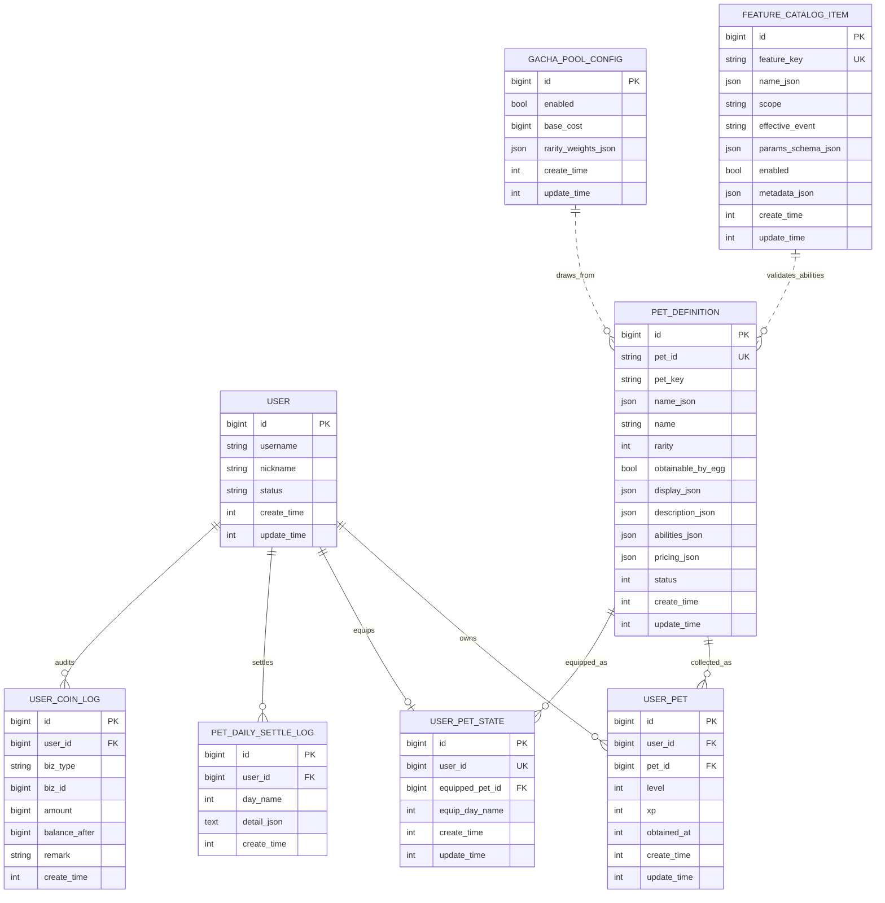
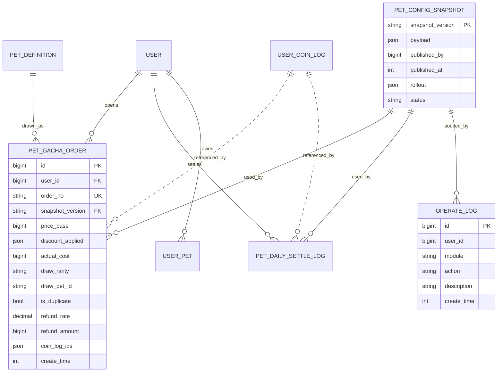

# 宠物系统 ER 关系图

> 本文补充宠物领域数据模型的 ER 关系图。字段口径仍以 [05-配置与数据模型.md](./05-配置与数据模型.md) 为准。

## 1. 当前核心 ER 图

## 2. 建议扩展 ER 图

## 3. 关系说明

| 关系 | 说明 |
| --- | --- |
| `USER 1:N USER_PET` | 一个用户可以拥有多只龟种。 |
| `PET_DEFINITION 1:N USER_PET` | 一个龟种定义可以被多个用户拥有。 |
| `USER 1:1 USER_PET_STATE` | 一个用户只有一份当前装备状态。 |
| `PET_DEFINITION 1:N USER_PET_STATE` | 一个龟种定义可以被多个用户装备。 |
| `USER 1:N PET_DAILY_SETTLE_LOG` | 一个用户每天最多一条宠物登录结算记录。 |
| `FEATURE_CATALOG_ITEM .. PET_DEFINITION` | `pet_definition.abilities_json` 通过 `feature_key` 弱关联到特征模板。 |
| `GACHA_POOL_CONFIG .. PET_DEFINITION` | 开蛋池按稀有度配置抽取 `obtainable_by_egg=true` 的龟种。 |
| `PET_CONFIG_SNAPSHOT 1:N PET_GACHA_ORDER` | 每次开蛋记录使用的配置快照版本。 |
| `USER_COIN_LOG .. PET_GACHA_ORDER` | 开蛋扣款和重复返还流水通过 `coin_log_ids` 或业务字段弱关联。 |

## 4. 建议唯一约束

| 表 | 唯一约束 | 用途 |
| --- | --- | --- |
| `pet_definition` | `pet_id` | 龟种业务标识不可重复。 |
| `user_pet` | `(user_id, pet_id)` | 用户不能重复拥有同一龟种资产。 |
| `user_pet_state` | `user_id` | 每个用户只有一份装备状态。 |
| `pet_daily_settle_log` | `(user_id, day_name)` | 每日登录结算幂等。 |
| `feature_catalog_item` | `feature_key` | 特性模板唯一。 |
| `pet_gacha_order` | `order_no` | 开蛋请求幂等。 |
| `pet_config_snapshot` | `snapshot_version` | 配置快照不可变。 |

## 5. 建议索引

| 表 | 索引 | 用途 |
| --- | --- | --- |
| `pet_definition` | `(status, rarity)` | 用户侧/运营侧按稀有度查询龟种。 |
| `pet_definition` | `(status, obtainable_by_egg, rarity)` | 开蛋时筛选候选龟种。 |
| `user_pet` | `(user_id, pet_id)` | 判断用户是否拥有某龟种。 |
| `user_pet` | `(user_id, obtained_at)` | 查询用户龟种列表。 |
| `user_pet_state` | `(user_id)` | 读取当前装备龟种。 |
| `user_pet_state` | `(equip_day_name)` | 排查每日切换限制问题。 |
| `pet_daily_settle_log` | `(user_id, day_name)` | 登录结算幂等与查询。 |
| `feature_catalog_item` | `(feature_key, enabled)` | 校验能力是否可用。 |
| `pet_gacha_order` | `(user_id, create_time)` | 查询用户开蛋历史。 |
| `user_coin_log` | `(user_id, create_time)` | 查询宠物相关金币流水。 |
| `user_coin_log` | `(biz_type, biz_id)` | 按业务事件追踪扣款/返还/奖励。 |

## 6. 设计注意事项

1. `pet_definition.abilities_json` 是 JSON 配置，不建议对每个 featureKey 建物理外键；运行时通过 FeatureCatalog 校验。
2. `user_pet_state.equipped_pet_id` 引用 `pet_definition.id`，接口层再转换为 `pet_id/petKey`。
3. `pet_daily_settle_log.detail_json` 是结算快照，适合存奖励明细、余额前后值、命中特性和错误信息。
4. 开蛋订单建议独立落表，避免只靠金币流水解释抽取结果。
5. 配置快照建议不可变；回滚应新写操作日志并切换生效版本，不直接修改历史快照。
6. 宠物金币奖励、开蛋扣款、重复返还都必须落到 `user_coin_log`，宠物表只保存业务上下文。
