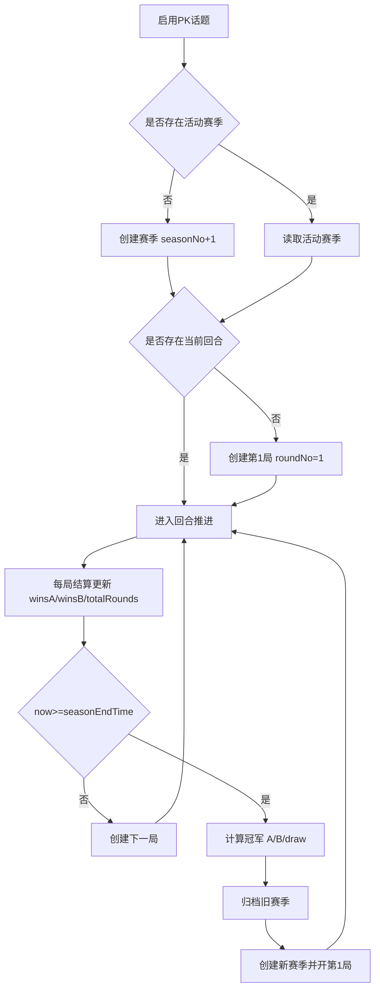
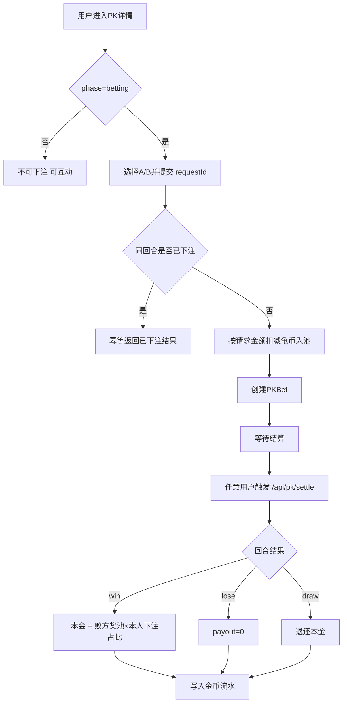
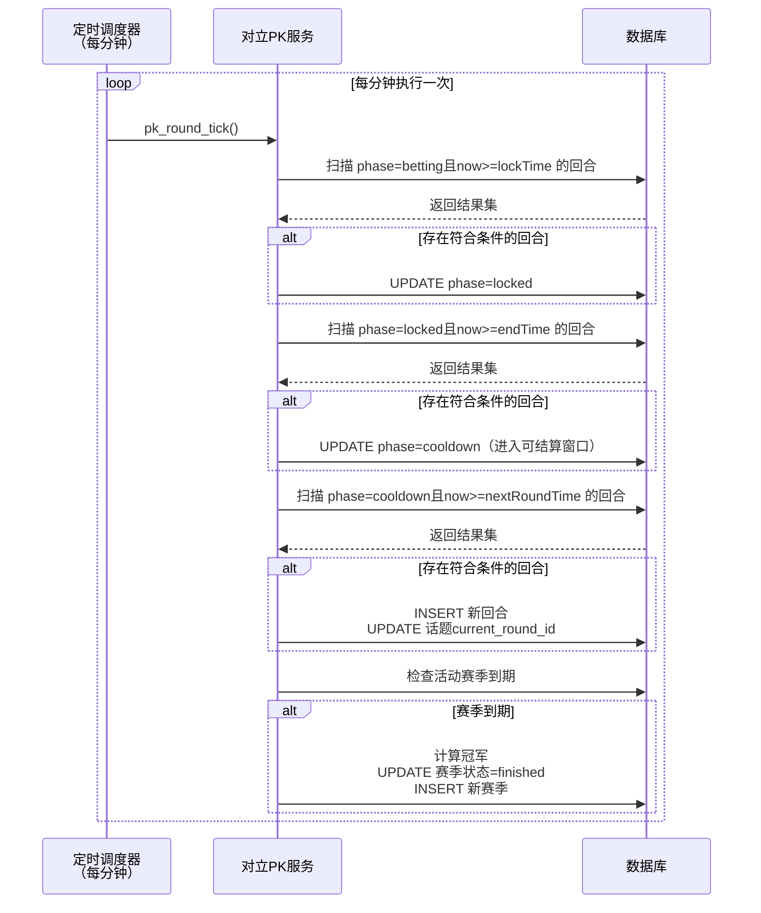
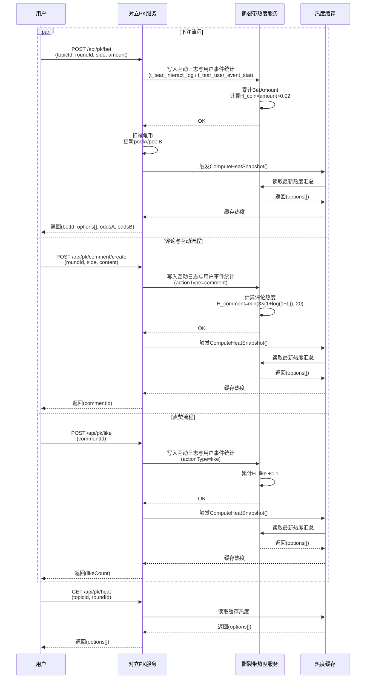
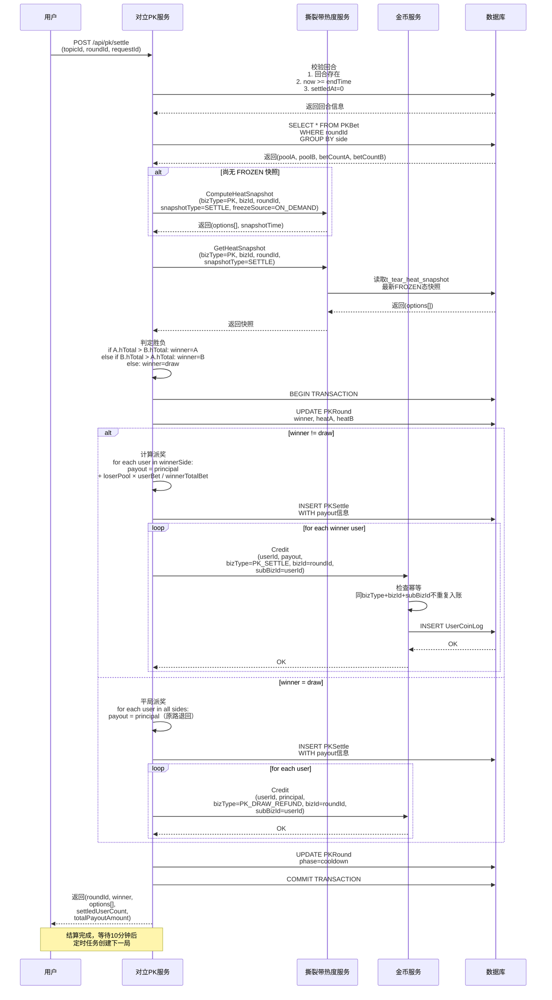

# 对立PK：流程图

## 赛季推进流程



## 单局回合流程

```mermaid
flowchart TD
  A[创建PKRound] --> B[phase=betting 0-48h]
  B --> C[下注: 每用户每局一次]
  B --> D[评论/点赞/回复]
  C --> E[更新 poolA/poolB betCountA/betCountB]
  D --> F[调用热度计算服务]
  E --> G[提交互动输入]
  F --> H[刷新 options[] 热度快照]
  G --> H
  H --> I{now>=lockTime}
  I -->|否| B
  I -->|是| J[phase=locked 48-72h]
  J --> K[禁止下注 仅允许互动]
  K --> L{now>=endTime}
  L -->|否| J
  L -->|是| M[进入可结算状态 等待用户触发]
  M --> N[用户调用 /api/pk/settle]
  N --> O[读取撕裂带热度快照]
  O --> P{A.hTotal vs B.hTotal}
  P -->|A高| Q[winner=A]
  P -->|B高| R[winner=B]
  P -->|相等| S[winner=draw]
  Q --> T[生成结算明细并派奖]
  R --> T
  S --> T
  T --> U[phase=cooldown 10m]
  U --> V{now>=nextRoundTime}
  V -->|否| U
  V -->|是| W[创建下一局]
```

## 用户收益流程



## 幂等与事务约束

- 下注幂等键：topicId + roundId + userId + requestId。
- 下注唯一键：roundId + userId。
- 回合结算唯一键：roundId。
- 派奖唯一键：roundId + userId。
- 下一局唯一键：topicId + roundNo。
- 下一赛季唯一键：topicId + seasonNo。

## 后端定时轮询时序



## 对立PK与撕裂带热度计算交互时序



## 用户触发结算时序

