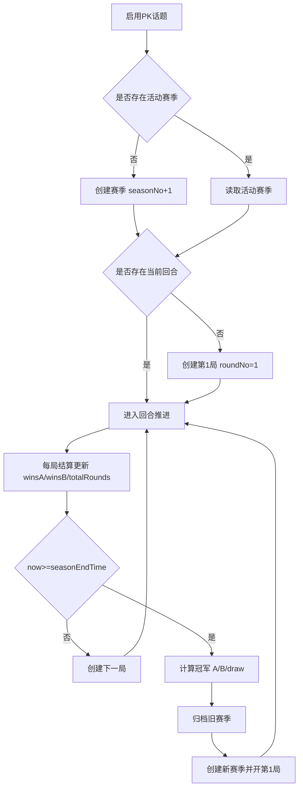
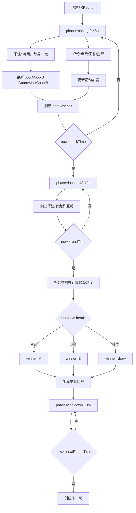
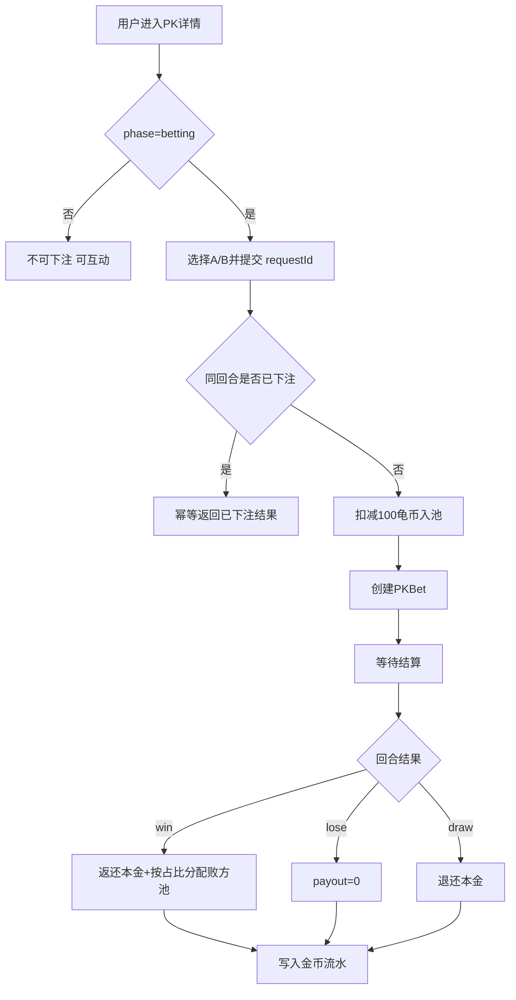

# 对立PK：流程图

## 赛季推进流程

## 单局回合流程

## 用户收益流程

## 幂等与事务约束

- 下注幂等键：topicId + roundId + userId + requestId。
- 下注唯一键：roundId + userId。
- 回合结算唯一键：roundId。
- 派奖唯一键：roundId + userId。
- 下一局唯一键：topicId + roundNo。
- 下一赛季唯一键：topicId + seasonNo。