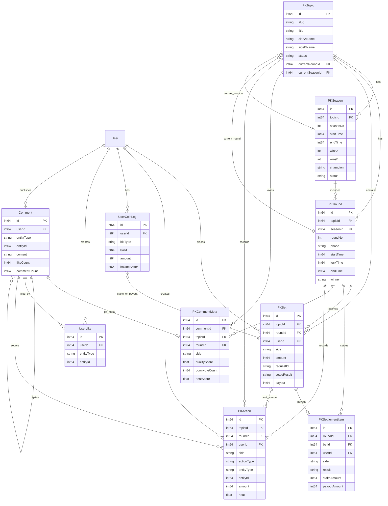

# 对立PK：数据模型与接口

## ER关系图

关系说明：

- `PKTopic` 是根实体，一个话题拥有多个赛季和多个回合。
- `PKRound` 是单局实体，承载阶段、热度、奖池、胜负结果。
- `PKBet` 是用户单局下注记录，唯一约束建议为 `roundId + userId`。
- `PKSettlementItem` 是回合结算明细，建议和 `PKBet` 一对一。
- `Comment`、`UserLike`、`UserCoinLog` 复用现有通用模型。
- `PKCommentMeta` 用于把通用评论绑定到 PK 话题、回合和阵营。
- `PKAction` 用于记录热度来源，支持回放、审计和重算。

## 新增数据模型建议

### PKTopic

PK 永恒话题。

| 字段 | 说明 |
|------|------|
| `id` | 主键 |
| `slug` | 业务标识，如 `pk-hero` |
| `title` | 话题标题 |
| `sideAName` / `sideBName` | A/B 阵营名称 |
| `status` | `enabled/disabled` |
| `currentRoundId` | 当前局 ID |
| `currentSeasonId` | 当前赛季 ID |
| `sort` | 排序 |
| `createTime/updateTime` | 时间 |

### PKRound

PK 单局。

| 字段 | 说明 |
|------|------|
| `topicId` | 所属话题 |
| `seasonId` | 所属赛季 |
| `roundNo` | 第几局 |
| `phase` | `betting/locked/cooldown/settled` |
| `startTime/lockTime/endTime/nextRoundTime` | 阶段时间 |
| `heatA/heatB` | 当前或最终热度 |
| `poolA/poolB` | A/B 本金池 |
| `betCountA/betCountB` | A/B 下注人数 |
| `winner` | `A/B/draw` |
| `settledAt` | 结算时间 |

### PKBet

用户每局下注。

| 字段 | 说明 |
|------|------|
| `topicId` | 话题 |
| `roundId` | 回合 |
| `userId` | 用户 |
| `side` | `A/B` |
| `amount` | 固定 100 |
| `requestId` | 幂等键 |
| `settleResult` | `win/lose/draw` |
| `payout` | 应得金额 |
| `settledAt` | 结算时间 |

约束：

- 唯一：`roundId + userId`。
- 幂等：`roundId + userId + requestId`。

### PKSeason

赛季记录。

| 字段 | 说明 |
|------|------|
| `topicId` | 所属话题 |
| `seasonNo` | 赛季编号 |
| `startTime/endTime` | 起止时间 |
| `winsA/winsB` | 胜场 |
| `totalRounds` | 总局数 |
| `champion` | `A/B/draw` |
| `status` | `active/finished` |

### PKCommentMeta

评论与 PK 阵营/回合的绑定。

| 字段 | 说明 |
|------|------|
| `commentId` | 评论 ID |
| `topicId` | PK 话题 |
| `roundId` | 当前局 |
| `side` | `A/B` |
| `qualityScore` | 内容质量分 |
| `downvoteCount` | 被拉踩数 |
| `heatScore` | 评论最终热度 |

### PKAction 或 PKHeatEvent

用于记录热度动作，便于审计和重算。

| 字段 | 说明 |
|------|------|
| `topicId/roundId` | 归属 |
| `userId` | 操作用户 |
| `side` | 贡献到哪方 |
| `actionType` | `like/comment/reply/downvote/bet` |
| `entityType/entityId` | 关联对象 |
| `amount` | 下注金额或动作数量 |
| `heat` | 本次贡献热度 |
| `antiSpam` | 风控系数 |
| `createTime` | 时间 |

## 复用模型说明

### UserCoin / UserCoinLog

继续作为唯一金币账户与流水来源。

建议新增 bizType：

- `PK_BET_STAKE_IN`
- `PK_PAYOUT`
- `PK_DRAW_REFUND`

### Comment

评论仍写入通用 `Comment` 表。

推荐挂载方式：

- 一级评论：`entityType = pk_topic`，`entityId = topicId`。
- 回复：继续使用 `entityType = comment`，`entityId = parentCommentId`。
- 阵营和回合信息写 `PKCommentMeta`。

### UserLike

点赞评论继续复用 `UserLike`：

- `entityType = comment`
- `entityId = commentId`

如果允许点赞 PK 话题或阵营，可新增实体类型：

- `pk_topic`
- `pk_round_side`

## 接口建议

### 用户接口 `/api/pk`

| 接口 | 方法 | 说明 |
|------|------|------|
| `/api/pk/topics` | GET | PK话题列表，含当前状态 |
| `/api/pk/topic` | GET | 单个话题详情，参数 `topicId/slug` |
| `/api/pk/bet` | POST | 当前局下注 |
| `/api/pk/heat` | GET | 当前局实时热度 |
| `/api/pk/history` | GET | 对局历史 |
| `/api/pk/seasons` | GET | 赛季历史 |
| `/api/pk/comment/create` | POST | 发布带阵营的PK评论 |
| `/api/pk/downvote` | POST | 拉踩评论 |

### 管理接口 `/api/admin/pk`

| 接口 | 方法 | 说明 |
|------|------|------|
| `/api/admin/pk/topic/list` | GET | 话题管理列表 |
| `/api/admin/pk/topic/save` | POST | 新增/编辑话题 |
| `/api/admin/pk/topic/enable` | POST | 启用话题 |
| `/api/admin/pk/topic/disable` | POST | 停用话题 |
| `/api/admin/pk/round/list` | GET | 回合记录 |
| `/api/admin/pk/season/list` | GET | 赛季记录 |
| `/api/admin/pk/recalc_heat` | POST | 管理员触发热度重算 |

## 定时任务

新增 `PKService.CronTick()`，建议每分钟执行一次。

任务内容：

1. 扫描 `phase=betting` 且 `now >= lockTime` 的回合，切到 `locked`。
2. 扫描 `phase=locked` 且 `now >= endTime` 的回合，执行结算并切到 `cooldown`。
3. 扫描 `phase=cooldown` 且 `now >= nextRoundTime` 的回合，创建下一局。
4. 扫描已到期赛季，归档冠军并创建下一赛季。

所有定时任务必须幂等：

- 结算以 `roundId` 唯一。
- 下一局创建以 `topicId + roundNo` 唯一。
- 赛季创建以 `topicId + seasonNo` 唯一。
