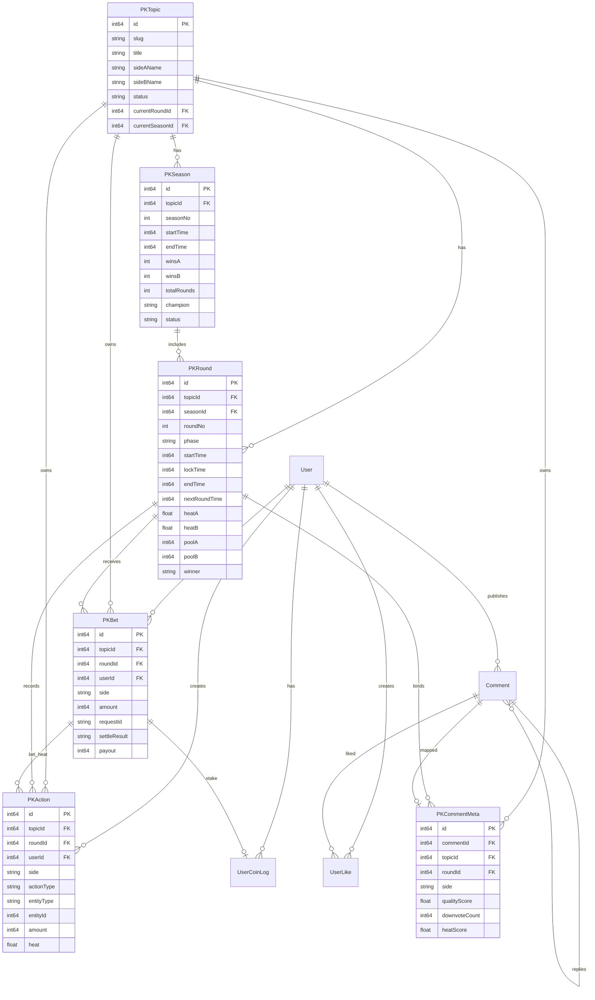

# 对立PK：ER关系图

```mermaid
erDiagram
  User ||--o{ PKBet : places
  User ||--o{ PKAction : creates
  User ||--o{ UserCoinLog : has
  User ||--o{ UserLike : creates
  User ||--o{ Comment : publishes

  PKTopic ||--o{ PKSeason : has
  PKTopic ||--o{ PKRound : has
  PKTopic ||--o{ PKBet : owns
  PKTopic ||--o{ PKCommentMeta : owns
  PKTopic ||--o{ PKAction : owns

  PKSeason ||--o{ PKRound : includes
  PKRound ||--o{ PKBet : receives
  PKRound ||--o{ PKCommentMeta : binds
  PKRound ||--o{ PKAction : records

  Comment ||--o| PKCommentMeta : mapped
  Comment ||--o{ Comment : replies
  Comment ||--o{ UserLike : liked

  PKBet ||--o| UserCoinLog : stake
  PKBet ||--o{ PKAction : bet_heat

  PKTopic {
    int64 id PK
    string slug
    string title
    string sideAName
    string sideBName
    string status
    int64 currentRoundId FK
    int64 currentSeasonId FK
  }

  PKSeason {
    int64 id PK
    int64 topicId FK
    int seasonNo
    int64 startTime
    int64 endTime
    int winsA
    int winsB
    int totalRounds
    string champion
    string status
  }

  PKRound {
    int64 id PK
    int64 topicId FK
    int64 seasonId FK
    int roundNo
    string phase
    int64 startTime
    int64 lockTime
    int64 endTime
    int64 nextRoundTime
    float heatA
    float heatB
    int64 poolA
    int64 poolB
    string winner
  }

  PKBet {
    int64 id PK
    int64 topicId FK
    int64 roundId FK
    int64 userId FK
    string side
    int64 amount
    string requestId
    string settleResult
    int64 payout
  }

  PKCommentMeta {
    int64 id PK
    int64 commentId FK
    int64 topicId FK
    int64 roundId FK
    string side
    float qualityScore
    int64 downvoteCount
    float heatScore
  }

  PKAction {
    int64 id PK
    int64 topicId FK
    int64 roundId FK
    int64 userId FK
    string side
    string actionType
    string entityType
    int64 entityId
    int64 amount
    float heat
  }
```

## 关键约束

- PKBet：唯一键 (roundId, userId)。
- PKRound：唯一键 (topicId, roundNo)。
- PKSeason：唯一键 (topicId, seasonNo)。
- PKCommentMeta：唯一键 (commentId)。