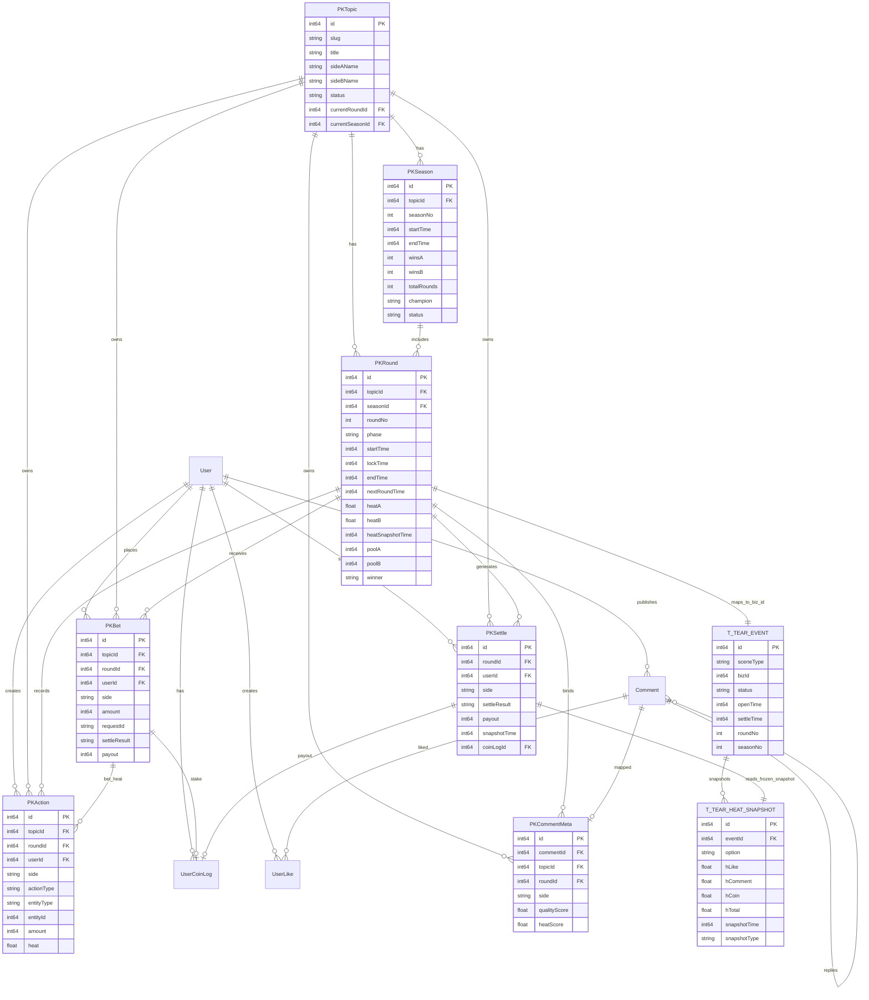

# 对立PK：ER关系图

## 关键约束

- PKBet：唯一键 (roundId, userId)。
- PKSettle：唯一键 (roundId, userId)。
- PKRound：唯一键 (topicId, roundNo)。
- PKSeason：唯一键 (topicId, seasonNo)。
- PKCommentMeta：唯一键 (commentId)。

## 跨域关系说明

- PKRound 通过 `id -> t_tear_event.biz_id` 映射到撕裂带事件，且 `scene_type=ARENA`。
- PKSettle 在结算时读取 `t_tear_heat_snapshot.snapshot_type=SETTLE` 的冻结快照，不直接修改撕裂带快照内容。
- 对立PK仅消费撕裂带快照结果；撕裂带事件与快照仍由撕裂带领域维护。