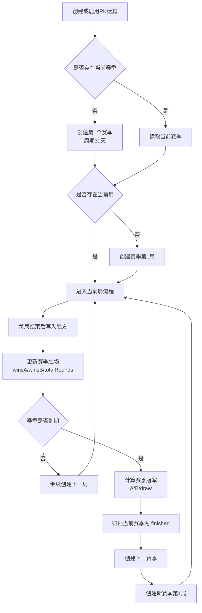
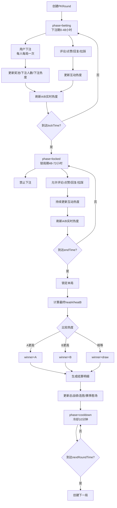
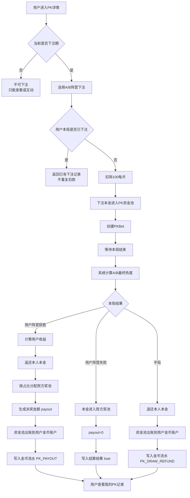

# 对立PK：流程图

## 赛季流程



关键落点：

- 赛季实体：`PKSeason`。
- 当前赛季引用：`PKTopic.currentSeasonId`。
- 赛季推进入口：`PKService.CronTick()`。
- 赛季冠军依据：赛季内 A/B 胜场。

## 每一局PK的流程



关键落点：

- 单局实体：`PKRound`。
- 用户下注：`PKBet`。
- 评论归属：`PKCommentMeta`。
- 热度来源：`PKAction`。
- 结算明细：`PKSettlementItem`。

## 用户获利的流程



收益口径：

```text
胜方用户收益 = 本人下注本金 + 败方奖池 * (本人下注额 / 胜方总下注额)
失败方用户收益 = 0
平局用户收益 = 本人下注本金
```

P0 固定每人每局下注 100 龟币时，胜方也可以理解为按胜方人数均分败方奖池。

## 事务与幂等要求

- 下注接口必须幂等：同一用户同一局重复请求不能重复扣款。
- 结算任务必须幂等：同一回合只能生成一次结算明细。
- 派奖必须幂等：同一用户同一局只能入账一次。
- 下一局创建必须幂等：同一话题的 `roundNo` 不能重复。
- 赛季创建必须幂等：同一话题的 `seasonNo` 不能重复。
