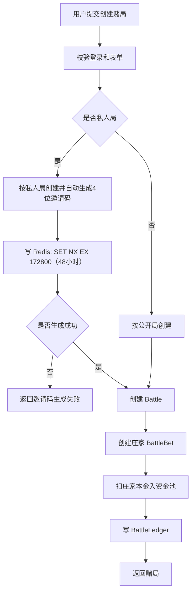
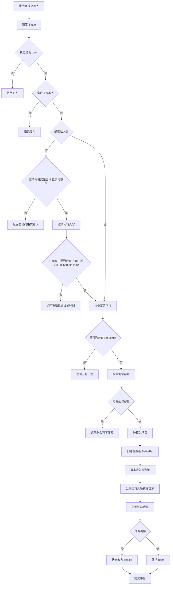
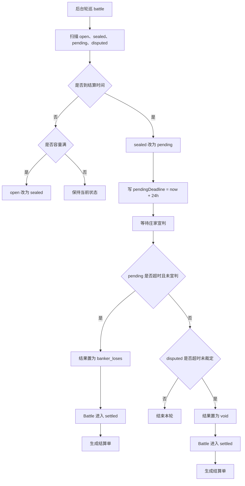
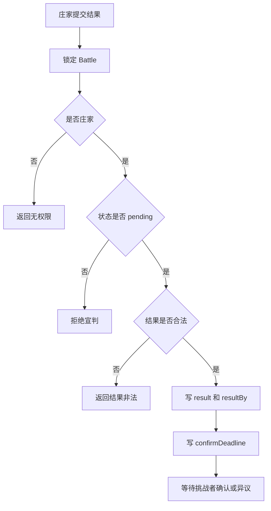
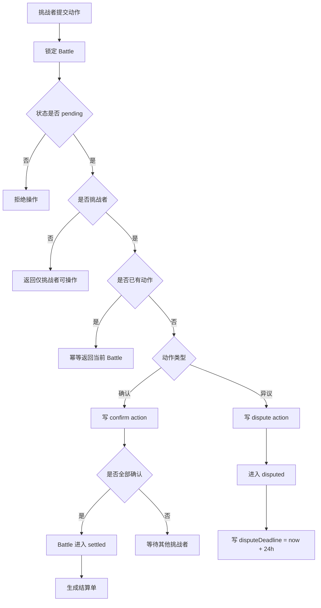
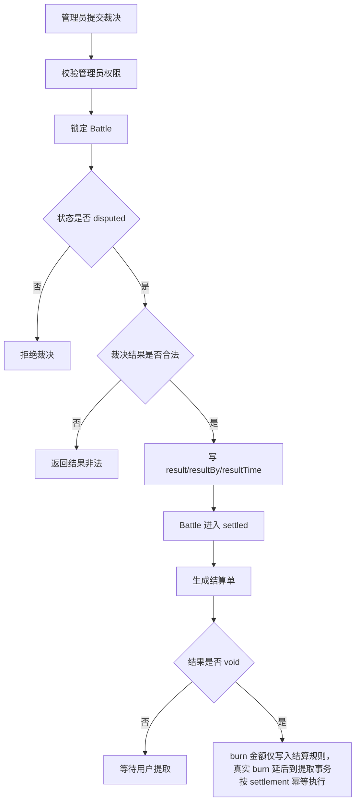
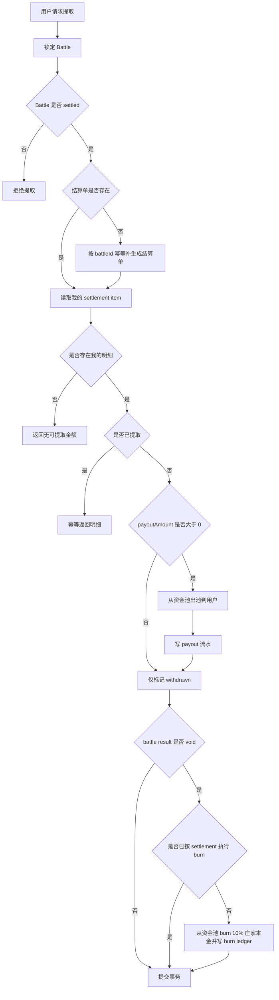
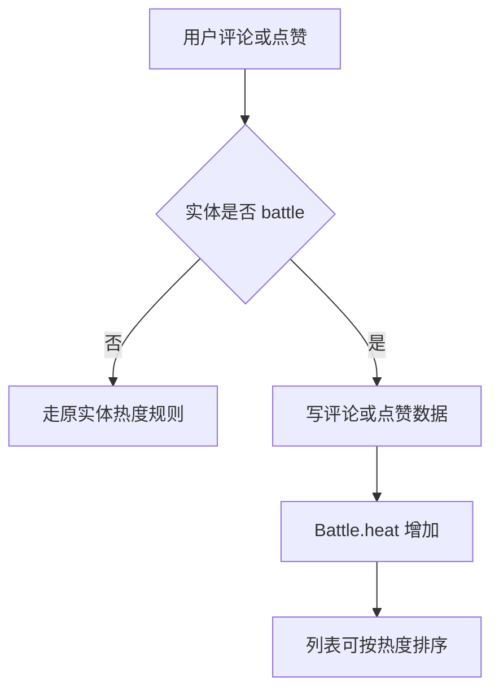
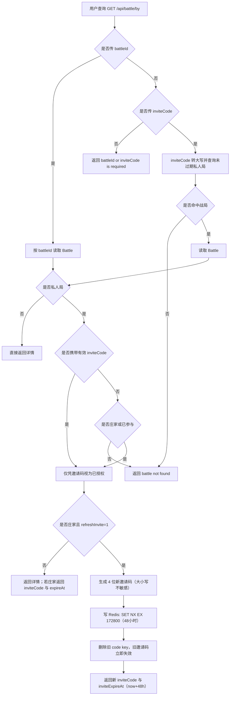

# 开战广场流程图

## 1. 创建赌局

```mermaid
flowchart TD
  A["用户提交创建赌局"] --> B["校验登录和表单"]
  B --> C{"是否私人局"}
  C -- "是" --> D["按私人局创建并自动生成4位邀请码"]
  C -- "否" --> E["按公开局创建"]
  D --> F["写 Redis: SET NX EX 172800（48小时）"]
  F --> G{"是否生成成功"}
  G -- "否" --> Z["返回邀请码生成失败"]
  G -- "是" --> H["创建 Battle"]
  E --> H
  H --> I["创建庄家 BattleBet"]
  I --> J["扣庄家本金入资金池"]
  J --> K["写 BattleLedger"]
  K --> L["返回赌局"]
```

## 2. 加入或追加下注

```mermaid
flowchart TD
  A["挑战者提交加入"] --> B["锁定 Battle"]
  B --> C{"状态是否 open"}
  C -- "否" --> D["拒绝加入"]
  C -- "是" --> E{"是否庄家本人"}
  E -- "是" --> F["拒绝加入"]
  E -- "否" --> G{"是否私人局"}
  G -- "是" --> H{"邀请码格式是否 4 位字母数字"}
  H -- "否" --> I["返回邀请码格式错误"]
  H -- "是" --> I1["邀请码转大写"]
  I1 --> I2{"Redis 中是否存在（48小时内）且 battleId 匹配"}
  I2 -- "否" --> I3["返回邀请码错误或过期"]
  I2 -- "是" --> J["检查幂等下注"]
  G -- "否" --> J
  J --> K{"是否已存在 requestId"}
  K -- "是" --> L["返回已有下注"]
  K -- "否" --> M["校验剩余容量"]
  M --> N{"是否超过容量"}
  N -- "是" --> O["返回剩余可下注额"]
  N -- "否" --> P["计算入场费"]
  P --> Q["创建挑战者 BattleBet"]
  Q --> R["扣本金入资金池"]
  R --> S["公开局转入场费给庄家"]
  S --> T["更新汇总金额"]
  T --> U{"是否满额"}
  U -- "是" --> V["状态改为 sealed"]
  U -- "否" --> W["保持 open"]
  V --> X["提交事务"]
  W --> X
```

## 3. 状态轮巡

```mermaid
flowchart TD
  A["后台轮巡 battle"] --> B["扫描 open、sealed、pending、disputed"]
  B --> C{"是否到结算时间"}
  C -- "否" --> D{"是否容量满"}
  D -- "是" --> E["open 改为 sealed"]
  D -- "否" --> F["保持当前状态"]
  C -- "是" --> G["sealed 改为 pending"]
  G --> H["写 pendingDeadline = now + 24h"]
  H --> I["等待庄家宣判"]
  I --> J{"pending 是否超时且未宣判"}
  J -- "否" --> K{"disputed 是否超时未裁定"}
  J -- "是" --> L["结果置为 banker_loses"]
  L --> M["Battle 进入 settled"]
  M --> N["生成结算单"]
  K -- "否" --> O["结束本轮"]
  K -- "是" --> P["结果置为 void"]
  P --> Q["Battle 进入 settled"]
  Q --> R["生成结算单"]
```

## 4. 庄家宣判

```mermaid
flowchart TD
  A["庄家提交结果"] --> B["锁定 Battle"]
  B --> C{"是否庄家"}
  C -- "否" --> D["返回无权限"]
  C -- "是" --> E{"状态是否 pending"}
  E -- "否" --> F["拒绝宣判"]
  E -- "是" --> G{"结果是否合法"}
  G -- "否" --> H["返回结果非法"]
  G -- "是" --> I["写 result 和 resultBy"]
  I --> J["写 confirmDeadline"]
  J --> K["等待挑战者确认或异议"]
```

## 5. 挑战者确认与异议

```mermaid
flowchart TD
  A["挑战者提交动作"] --> B["锁定 Battle"]
  B --> C{"状态是否 pending"}
  C -- "否" --> D["拒绝操作"]
  C -- "是" --> E{"是否挑战者"}
  E -- "否" --> F["返回仅挑战者可操作"]
  E -- "是" --> G{"是否已有动作"}
  G -- "是" --> H["幂等返回当前 Battle"]
  G -- "否" --> I{"动作类型"}
  I -- "确认" --> J["写 confirm action"]
  I -- "异议" --> K["写 dispute action"]
  J --> L{"是否全部确认"}
  L -- "是" --> M["Battle 进入 settled"]
  M --> N["生成结算单"]
  L -- "否" --> O["等待其他挑战者"]
  K --> P["进入 disputed"]
  P --> Q["写 disputeDeadline = now + 24h"]
```

## 6. 管理员裁决

```mermaid
flowchart TD
  A["管理员提交裁决"] --> B["校验管理员权限"]
  B --> C["锁定 Battle"]
  C --> D{"状态是否 disputed"}
  D -- "否" --> E["拒绝裁决"]
  D -- "是" --> F{"裁决结果是否合法"}
  F -- "否" --> G["返回结果非法"]
  F -- "是" --> H["写 result/resultBy/resultTime"]
  H --> I["Battle 进入 settled"]
  I --> J["生成结算单"]
  J --> K{"结果是否 void"}
  K -- "否" --> L["等待用户提取"]
  K -- "是" --> M["burn 金额仅写入结算规则，真实 burn 延后到提取事务按 settlement 幂等执行"]
```

## 7. 提取

```mermaid
flowchart TD
  A["用户请求提取"] --> B["锁定 Battle"]
  B --> C{"Battle 是否 settled"}
  C -- "否" --> D["拒绝提取"]
  C -- "是" --> E{"结算单是否存在"}
  E -- "否" --> F["按 battleId 幂等补生成结算单"]
  E -- "是" --> G["读取我的 settlement item"]
  F --> G
  G --> H{"是否存在我的明细"}
  H -- "否" --> I["返回无可提取金额"]
  H -- "是" --> J{"是否已提取"}
  J -- "是" --> K["幂等返回明细"]
  J -- "否" --> L{"payoutAmount 是否大于 0"}
  L -- "否" --> M["仅标记 withdrawn"]
  L -- "是" --> N["从资金池出池到用户"]
  N --> O["写 payout 流水"]
  O --> M
  M --> P{"battle result 是否 void"}
  P -- "否" --> Q["提交事务"]
  P -- "是" --> R{"是否已按 settlement 执行 burn"}
  R -- "是" --> Q
  R -- "否" --> S["从资金池 burn 10% 庄家本金并写 burn ledger"]
  S --> Q
```

## 8. 互动热度

```mermaid
flowchart TD
  A["用户评论或点赞"] --> B{"实体是否 battle"}
  B -- "否" --> C["走原实体热度规则"]
  B -- "是" --> D["写评论或点赞数据"]
  D --> E["Battle.heat 增加"]
  E --> F["列表可按热度排序"]
```

## 9. 按 ID 或邀请码查询与邀请码刷新

```mermaid
flowchart TD
  A["用户查询 GET /api/battle/by"] --> B{"是否传 battleId"}
  B -- "是" --> C["按 battleId 读取 Battle"]
  B -- "否" --> D{"是否传 inviteCode"}
  D -- "否" --> Z["返回 battleId or inviteCode is required"]
  D -- "是" --> E["inviteCode 转大写并查询未过期私人局"]
  E --> F{"是否命中战局"}
  F -- "否" --> Y["返回 battle not found"]
  F -- "是" --> G["读取 Battle"]
  C --> H{"是否私人局"}
  G --> H
  H -- "否" --> I["直接返回详情"]
  H -- "是" --> J{"是否携带有效 inviteCode"}
  J -- "是" --> K["仅凭邀请码视为已授权"]
  J -- "否" --> L{"是否庄家或已参与"}
  L -- "否" --> Y
  L -- "是" --> K
  K --> M{"是否庄家且 refreshInvite=1"}
  M -- "否" --> N["返回详情；若庄家返回 inviteCode 与 expireAt"]
  M -- "是" --> O["生成 4 位新邀请码（大小写不敏感）"]
  O --> P["写 Redis: SET NX EX 172800（48小时）"]
  P --> Q["删除旧 code key，旧邀请码立即失效"]
  Q --> R["返回新 inviteCode 与 inviteExpireAt（now+48h）"]
```
