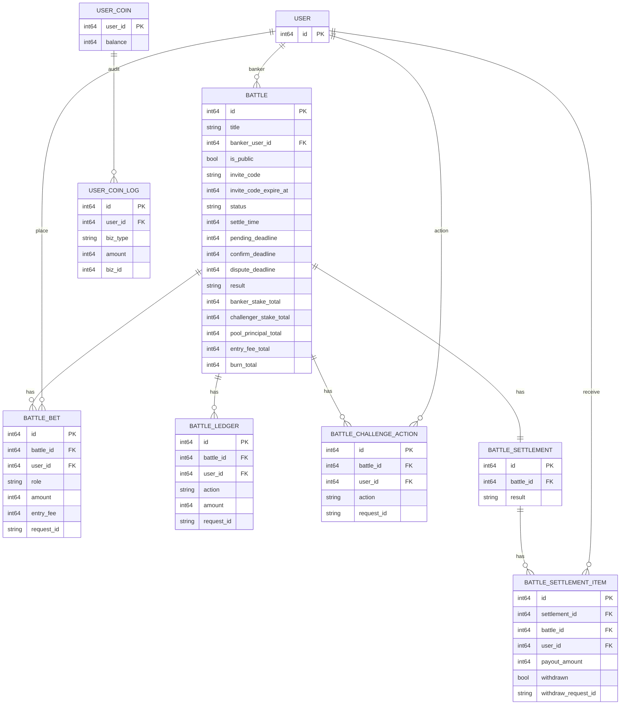

# 开战广场 ER 关系图

## 1. 核心 ER

## 2. 关键约束

- `battle_settlement` 对 `battle_id` 唯一，一局只生成一张结算单。
- `battle_settlement_item` 对 `battle_id + user_id` 唯一，每人每局一条提取记录。
- `battle_bet` 对 `battle_id + user_id + request_id` 唯一，保证加入/追加幂等。
- `battle_ledger` 对 `battle_id + user_id + action + request_id` 唯一，保证流水幂等。
- `battle_challenge_action` 对 `battle_id + user_id` 唯一，挑战者确认和异议二选一。
- 私人局邀请码有效性以 Redis 为准，`invite_code` 与 `invite_code_expire_at` 用于展示和审计。
