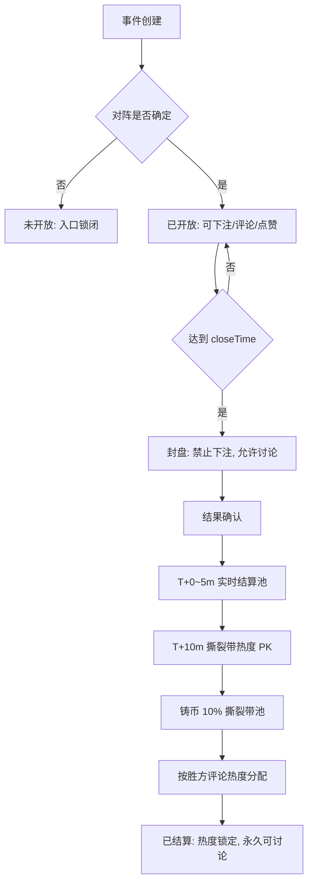
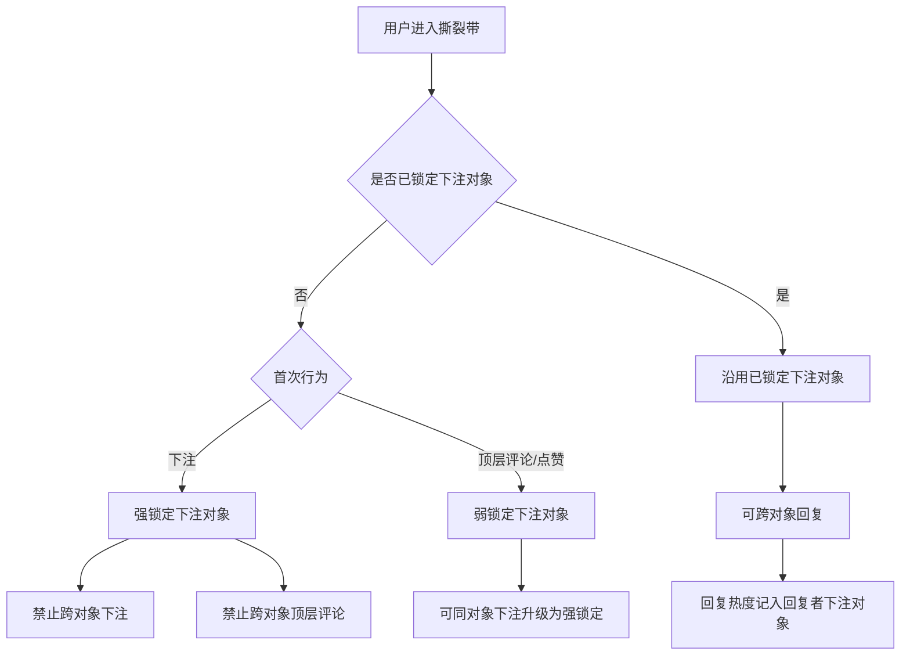
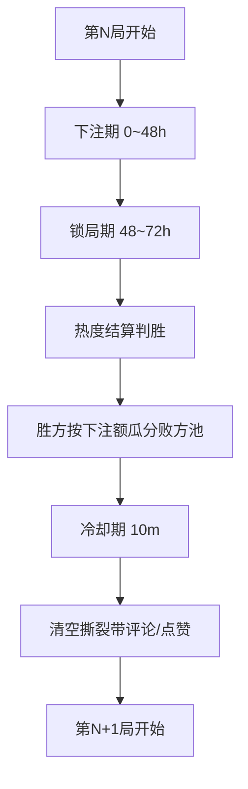

# 撕裂带流程图

## 1. 暗盘事件全链路

说明: 暗盘基础状态机复用预测市场状态机，见 [预测市场状态机](../预测市场公共部分/01-流程图.md#1-通用市场创建到下注)。本图仅展示撕裂带增量链路。

```mermaid
flowchart TD
    A["事件创建"] --> B{"对阵是否确定"}
    B -- "否" --> C["未开放: 入口锁闭"]
    B -- "是" --> D["已开放: 可下注/评论/点赞"]
    D --> E{"达到 closeTime"}
    E -- "否" --> D
    E -- "是" --> F["封盘: 禁止下注, 允许讨论"]
    F --> G["结果确认"]
    G --> H["T+0~5m 实时结算池"]
    H --> I["T+10m 撕裂带热度 PK"]
    I --> J["铸币 10% 撕裂带池"]
    J --> K["按胜方评论热度分配"]
    K --> L["已结算: 热度锁定, 永久可讨论"]
```

## 2. 站队与行为限制

```mermaid
flowchart TD
    A["用户进入撕裂带"] --> B{"是否已锁定下注对象"}
    B -- "否" --> C{"首次行为"}
    C -- "下注" --> D["强锁定下注对象"]
    C -- "顶层评论/点赞" --> E["弱锁定下注对象"]
    B -- "是" --> F["沿用已锁定下注对象"]
    D --> G["禁止跨对象下注"]
    D --> H["禁止跨对象顶层评论"]
    E --> I["可同对象下注升级为强锁定"]
    F --> J["可跨对象回复"]
    J --> K["回复热度记入回复者下注对象"]
```

## 3. 开撕台回合制

```mermaid
flowchart TD
    A["第N局开始"] --> B["下注期 0~48h"]
    B --> C["锁局期 48~72h"]
    C --> D["热度结算判胜"]
    D --> E["胜方按下注额瓜分败方池"]
    E --> F["冷却期 10m"]
    F --> G["清空撕裂带评论/点赞"]
    G --> H["第N+1局开始"]
```

## 4. 热度计算流程

```mermaid
flowchart LR
    A["点赞事件"] --> B["累计 H_like = Σ(1 × U)"]
    C["评论/回复"] --> D["Base = 3"]
    D --> E["计算对数增益：log&#40;1 + L&#41;"]
    E --> F["累计 H_comment = Σ Comment"]
    G["下注金额"] --> H["累计 BetAmount"]
    H --> I["计算 H_coin = BetAmount × 0.02 × U"]
    B --> J["汇总 Heat_total = H_like + H_comment + H_coin"]
    F --> J
    I --> J
```
