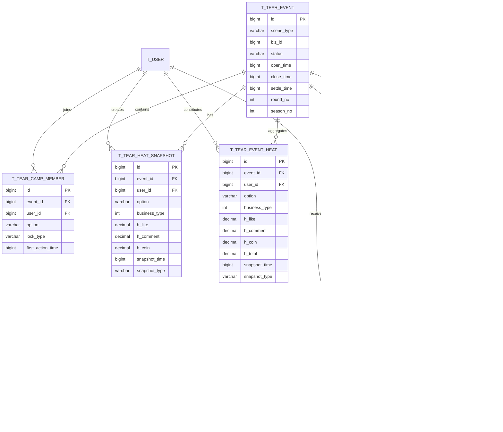

# 撕裂带ER关系图

```mermaid
erDiagram
    T_TEAR_EVENT ||--o{ T_TEAR_CAMP_MEMBER : contains
    T_TEAR_EVENT ||--o{ T_TEAR_HEAT_SNAPSHOT : has
    T_TEAR_EVENT ||--o{ T_TEAR_EVENT_HEAT : aggregates
    T_TEAR_EVENT ||--o{ T_TEAR_SETTLE_BATCH : settles
    T_TEAR_SETTLE_BATCH ||--o{ T_TEAR_REWARD_LOG : generates
    T_TEAR_EVENT ||--o{ T_PREDICT_BET : links
    T_USER ||--o{ T_TEAR_CAMP_MEMBER : joins
    T_USER ||--o{ T_TEAR_HEAT_SNAPSHOT : creates
    T_USER ||--o{ T_TEAR_EVENT_HEAT : contributes
    T_USER ||--o{ T_TEAR_REWARD_LOG : receives

    T_TEAR_EVENT {
      bigint id PK
      varchar scene_type
      bigint biz_id
      varchar status
      bigint open_time
      bigint close_time
      bigint settle_time
      int round_no
      int season_no
    }

    T_TEAR_CAMP_MEMBER {
      bigint id PK
      bigint event_id FK
      bigint user_id FK
      varchar option
      varchar lock_type
      bigint first_action_time
    }

    T_TEAR_HEAT_SNAPSHOT {
      bigint id PK
      bigint event_id FK
      bigint user_id FK
      varchar option
      int business_type
      decimal h_like
      decimal h_comment
      decimal h_coin
      bigint snapshot_time
      varchar snapshot_type
    }

    T_TEAR_EVENT_HEAT {
      bigint id PK
      bigint event_id FK
      bigint user_id FK
      varchar option
      int business_type
      decimal h_like
      decimal h_comment
      decimal h_coin
      decimal h_total
      bigint snapshot_time
      varchar snapshot_type
    }

    T_TEAR_SETTLE_BATCH {
      bigint id PK
      bigint event_id FK
      varchar settle_type
      int settle_version
      varchar winner_option
      bigint pool_amount
      varchar status
      int retry_count
    }

    T_TEAR_REWARD_LOG {
      bigint id PK
      bigint settle_batch_id FK
      bigint event_id FK
      bigint user_id FK
      varchar option
      varchar reward_type
      bigint reward_amount
      decimal heat_snapshot
      bigint tx_id
    }
```

## 关系说明

- `t_tear_event` 是聚合根。
- `t_tear_event_heat` 统计用户对开撕台对立PK事件某个阵营的累计热度。
- `t_tear_settle_batch` 与 `t_tear_reward_log` 构成可审计结算链。
- `t_tear_heat_snapshot` 用于复算和争议排查。
