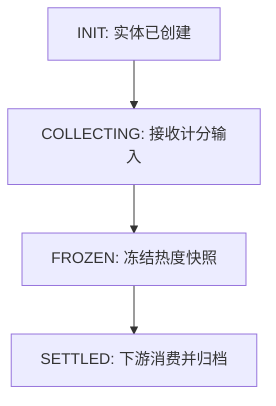
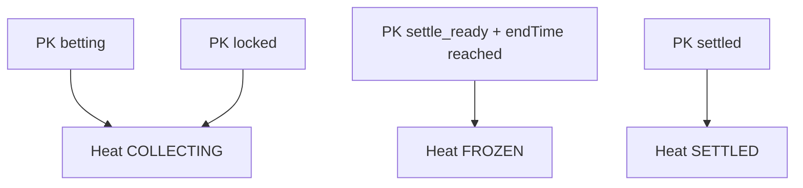
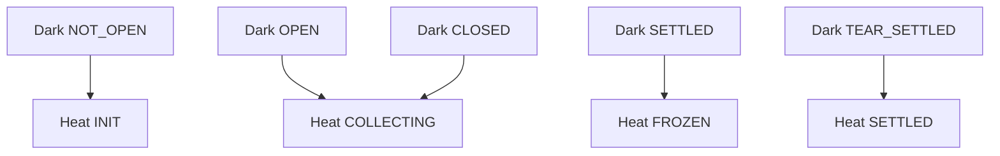

# 撕裂带流程图

## 1. 热度计算主状态机

说明: 热度计算状态机独立设计，不复用其他模块状态机实现。

```mermaid
flowchart TD
    A["INIT: 实体已创建"] --> B["COLLECTING: 接收计分输入"]
    B --> C["FROZEN: 冻结热度快照"]
    C --> D["SETTLED: 下游消费并归档"]
```

## 2. 热度计算状态机与对立PK映射

```mermaid
flowchart TD
    A["PK betting"] --> B["Heat COLLECTING"]
    C["PK locked"] --> B
    D["PK settle_ready + endTime reached"] --> E["Heat FROZEN"]
    F["PK settled"] --> G["Heat SETTLED"]
```

## 3. 热度计算状态机与暗盘映射

```mermaid
flowchart TD
    A["Dark NOT_OPEN"] --> B["Heat INIT"]
    C["Dark OPEN"] --> D["Heat COLLECTING"]
    E["Dark CLOSED"] --> D
    F["Dark SETTLED"] --> G["Heat FROZEN"]
    H["Dark TEAR_SETTLED"] --> I["Heat SETTLED"]
```

## 4. 热度计算流程

```mermaid
flowchart LR
    A["点赞事件"] --> B["累计 H_like = Σ1"]
    C["评论/回复"] --> D["固定参数：A/U/T/C = 1"]
    D --> E["计算 Base：Base = 3"]
    E --> F["计算对数增益：log&#40;1 + L&#41;"]
    F --> G["累计 H_comment = Σ min&#40;Base × &#40;1 + log&#40;1 + L&#41;&#41;, 20&#41;"]
    H["下注金额"] --> I["累计 BetAmount"]
    I --> J["计算 H_coin = BetAmount × 0.02"]
    B --> K["汇总 Heat_total = H_like + H_comment + H_coin"]
    G --> K
    J --> K
```
