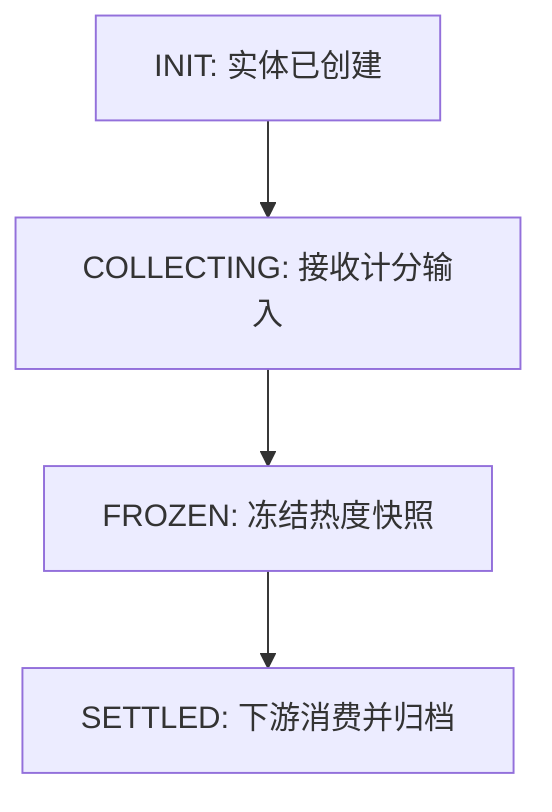
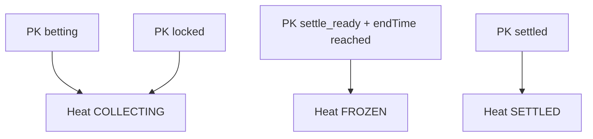
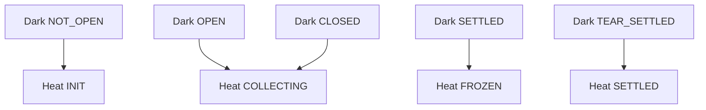
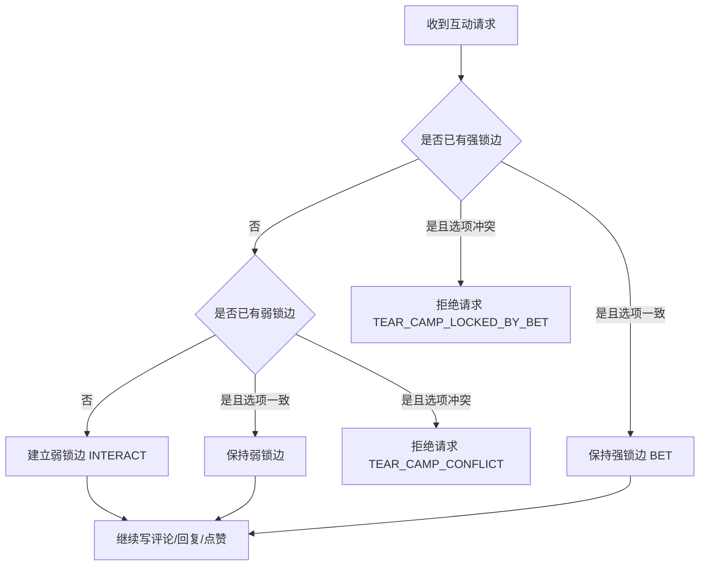
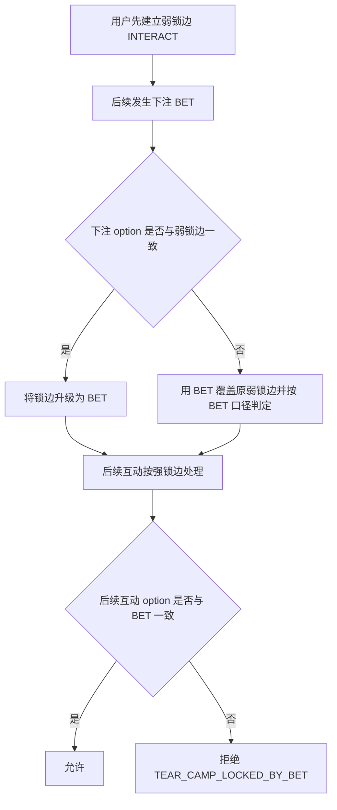

```mermaid
flowchart LR
    A["点赞事件"] --> B["累计 H_like = Σ1"]
    C["评论/回复"] --> D["固定参数：A/U/T/C = 1"]
    D --> E["计算 Base：Base = 3"]
    E --> F["计算对数增益：log&#40;1 + L&#41;"]
    F --> G["累计 H_comment = Σ min&#40;Base × &#40;1 + log&#40;1 + L&#41;&#41;, 20&#41;"]
    H["下注金额"] --> I["累计 BetAmount"]
    I --> J["计算 H_coin = BetAmount × 0.02"]
    B --> K["汇总 Heat_total = H_like + H_comment + H_coin"]
    G --> K
    J --> K
```

# 撕裂带流程图

## 1. 热度计算主状态机

说明: 热度计算状态机独立设计，不复用其他模块状态机实现。

## 2. 热度计算状态机与对立PK映射

## 3. 热度计算状态机与暗盘映射

## 4. 锁边建立与覆盖

说明: 锁边分为强锁边和弱锁边，强锁边优先级高于弱锁边，且强锁边可以覆盖同一用户同一目标上的弱锁边。

## 5. 强锁边覆盖弱锁边

## 6. 热度计算流程

