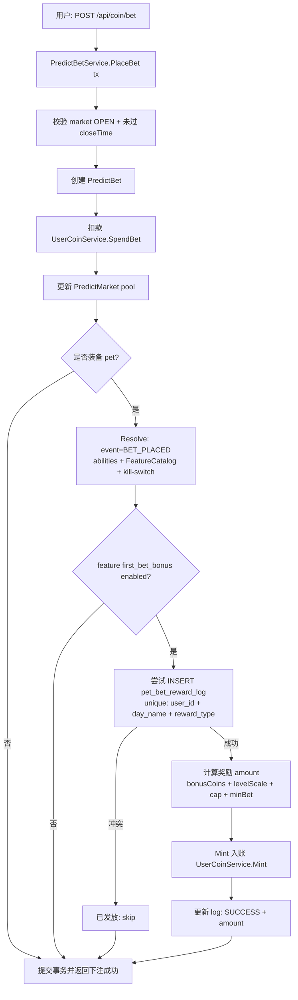
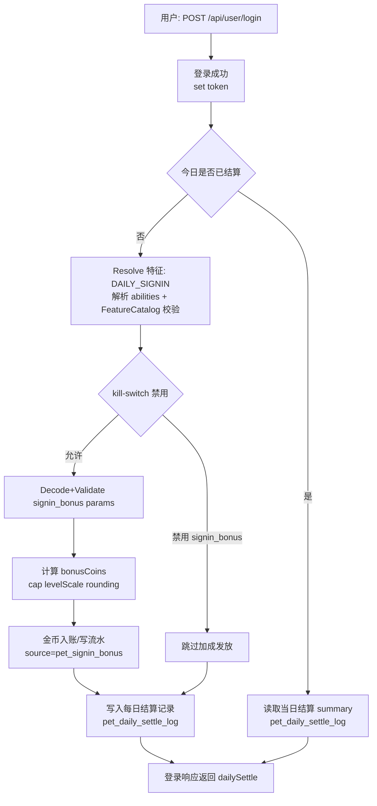

# 特征（Feature）能力：实现方案（P0）

> 目标：给“宠物系统”落地一套 **可配置、可强校验、可执行、可止血** 的特征能力实现方案。
>
> 范围：
>
> - **仅 P0 特征**（先跑通闭环）：
>   - `signin_bonus`
>   - `spark_multiplier`
>   - `debt`
>   - `debt_subsidy`
>   - `deposit_interest`
>   - `equip_daily_limit`
> - 运营侧配置入口已通过 `docs/api/pet.md` 的 `/api/admin/pet/features` + `/api/admin/pet/defs/:id/abilities` 实现（当前 abilities 参数 schema 强校验可按本文继续增强）。
>
> 非目标（本期不做）：
>
> - 不引入“版本/快照/发布/回滚”的对外 API（内部若要做快照可后续补）。
> - 不做全量 Feature 平台化（P1/P2 后续再迭代）。

---

## 快速术语对齐

- **FeatureCatalogItem**：运营侧“特征模板库”的一条记录（`featureKey` / `scope` / `effectiveEvent` / `paramsSchemaJSON` / `enabled`）。
- **PetDefinition.AbilitiesJSON**：某个龟种挂载的 abilities 配置，存成 JSON 文本：`map[featureKey]any`。
- **特征执行（Resolve）**：在某个结算点，读取“用户当前装备龟种 + 该龟种 abilities + 全局规则 abilities（可选）”，得到本次结算要应用的参数，再参与计算。

---

## 最小“合同”（建议坚持的工程边界）

### 输入

- `userId`
- `petId`（用户当前装备龟种）
- `event`（生效时机枚举，例如：`DAILY_SIGNIN`、`EQUIP_VALIDATE`）
- `context`（结算上下文，包含：当前金币余额、当日已切龟次数、登录奖励基数等）

### 输出

- `resolved`（解析后的特征集合，按 event 维度输出，供结算逻辑使用）
- `errors`（校验不通过时输出明确错误码，便于前后端展示/埋点）

### 错误模式

- 配置层错误（运营配置不合法）：应该在 **保存/发布** 阶段就拦截；线上运行时尽量不崩。
- 运行时错误（用户态不满足规则）：例如欠账到达下限、当日切龟超限，应返回业务错误码。

---

## 数据模型与存储建议（与现有实现兼容）

现状（已实现）：

- `models.FeatureCatalogItem`：参数 schema 与 metadata 存 JSON 文本字段。
- `models.PetDefinition`：abilities 存 JSON 文本字段 `AbilitiesJSON`。

建议保持：

- **不在 DB 强约束参数结构**，而是在 service 层做解释与校验。
- abilities 的值结构统一为：

```json
{
  "featureKey": {
    "enabled": true,
    "params": { "k": "v" }
  }
}
```

说明：当前代码里 `abilities` 是 `map[string]any`，并不强制该 shape；建议在下一步迭代把 shape 统一起来，便于：

- 能力开关更清晰
- 参数与开关分离
- schema 校验更简单

---

## 运行时执行架构（建议实现路径）

### 1) Feature Registry（特征注册表）

目标：把 **featureKey -> 一组 Go 代码能力** 固定下来：

- 参数结构体（typed params）
- 解析（decode/normalize）
- 校验（validate）
- 执行（apply/resolve）

建议目录：`internal/pet/feature/*`（仅建议；若项目已有模块目录可就近放）。

接口草案：

- `Feature`（每个 feature 需要实现）
  - `Key() string`
  - `Scope() FeatureScope`（PET/GLOBAL）
  - `EffectiveEvent() EffectiveEvent`（DAILY_SIGNIN / EQUIP_VALIDATE ...）
  - `DefaultParams() any`（可选）
  - `DecodeParams(any) (typed any, err error)`
  - `Validate(typed) error`
  - `Apply(ctx, typed) (ctx, err)` 或返回一个 `ResolvedFeature` 结构

> 重点：**执行逻辑不要直接依赖 HTTP / DB**，只依赖 ctx + params，便于单测。

### 2) Ability Resolver（能力解析器）

入口（伪代码）：

- `ResolveForEvent(userId, petId, event, context)`
  1. 取 PetDefinition（含 AbilitiesJSON）
  2. 解析 abilities JSON
  3. 对每个 featureKey：
     - 校验 featureKey 是否在 FeatureCatalog 且 enabled
     - 校验 params 是否符合 schema（可选：JSONSchema 或 typed Validate）
     - 构造 ResolvedFeature 列表
  4. 只输出与该 event 匹配的 ResolvedFeature

建议实现策略（P0）：

- **先走 typed Validate**（每个 feature 的 Validate 写死规则，能覆盖 P0），不强依赖 JSONSchema。
- JSONSchema 可以作为“运营侧表单渲染与轻校验”，但最终强校验用 typed 更稳。

### 3) Kill Switch（止血）

现状：`/api/admin/pet/kill-switch` 落到 `SysConfig`（key: `pet.killSwitch`）。

建议约定 kill-switch JSON shape：

```json
{
  "disableAll": false,
  "disabledFeatureKeys": ["debt_subsidy", "deposit_interest"],
  "reason": "emergency",
  "updatedAt": 1710000000
}
```

运行时：Resolver 在输出 resolved features 前，应用 kill-switch。

---

## P0 特征清单：参数与校验（建议落地的 typed 结构）

> 下述是“实现建议”，字段命名以 Go 层为准；运营侧仍可用 `params` JSON 接入。

### 1) signin_bonus（每日登录加成）

- event：`DAILY_SIGNIN`
- scope：`PET`
- params：
  - `bonusCoins` (int64, >=0)
  - `levelScale` (float64, >=0, optional) // 随等级额外比例
  - `capPerDay` (int64, >=0, optional)
- apply：增加每日登录结算的奖励金币。

### 2) spark_multiplier（火花倍率）

- event：`DAILY_SIGNIN`
- scope：`PET`
- params：
  - `baseMultiplier` (float64, >=1)
  - `levelScale` (float64, >=0, optional)
  - `extraCapPerDay` (int64, >=0, optional)
  - `rounding` (enum: floor/round/ceil; default floor)
- apply：影响“火花计算”倍率，并按 cap 做额外上限。

### 3) debt（欠账/余额可为负）

- event：`EQUIP_VALIDATE` + `BALANCE_CHANGE`
- scope：`PET` 或 `GLOBAL`（建议 GLOBAL 规则，避免切龟绕过）
- params：
  - `debtFloor` (int64, <=0) // 最低余额，例如 -300
  - `forbidEquipWhenDebt` (bool)
  - `errorCode` (string, default "DEBT_UNPAID")
- apply：
  - balance 变动后不得低于 debtFloor
  - 切龟/装备时若 forbidEquipWhenDebt=true 且 balance<0 则拒绝

### 4) debt_subsidy（欠款补贴）

- event：`DAILY_SIGNIN`
- scope：`PET`
- params：
  - `subsidyRate` (float64, 0..1)
  - `capPerDay` (int64, >=0, optional)
  - `rounding` (enum: floor/round/ceil; default floor)
- apply：当 balance<0 时，给与补贴（通常是减少欠款或增加金币），并受 cap 控制。

### 5) deposit_interest（存款生息）

- event：`DAILY_SIGNIN`
- scope：`PET`
- params：
  - `interestRate` (float64, 0..1)
  - `capPerDay` (int64, >=0, optional)
  - `rounding` (enum: floor/round/ceil; default floor)
- apply：当 balance>0 时，按利率加金币，并受 cap 控制。

### 6) equip_daily_limit（每日切换限制）

- event：`EQUIP_VALIDATE`
- scope：`GLOBAL`
- params：
  - `maxEquipsPerDay` (int, >=0)
  - `timezone` (string, default "UTC+8")
  - `errorCode` (string, default "EQUIP_DAILY_LIMIT")
- apply：切龟入口校验：当日切龟次数超过限制则拒绝。

---

## P1 特征：首次下注奖励（first_bet_bonus）

> 目标：让某些龟种（例如 `fortune` 财神龟）在“每日首次下注成功”时额外发放金币。
>
> 关键点：
>
> - 触发点必须在“下注成功并扣款落库”之后（避免发了钱但下注失败/回滚）。
> - 必须幂等（并发下注、重试下单都不能重复发）。
> - 需要 kill-switch 可止血。

### 业务口径（建议）

- “首次下注”口径：**北京时间自然日**，用户在任意预测市场成功下注（`POST /api/coin/bet` 成功创建 `PredictBet` 并完成扣款）的第一笔。
- 奖励口径：同一天最多发放 1 次；可选支持封顶（cap）。
- 若下注接口失败（事务回滚）：不得发放奖励。
- 若奖励发放失败：
  - 不影响下注成功返回（下注是主链路）
  - 但必须可重试发放（依赖幂等日志）

### feature 定义（typed 结构建议）

- event：`BET_PLACED`（新增）
- scope：`PET`
- params：
  - `bonusCoins` (int64, >=0)
  - `levelScale` (float64, >=0, optional) // 随等级额外比例
  - `capPerDay` (int64, >=0, optional) // 单日封顶
  - `minBetAmount` (int64, >=0, optional) // 下注金额门槛（例如 >=100）
  - `errorMode` (enum: "skip"|"fail", default "skip")
    - skip：不满足条件直接跳过，不报错
    - fail：不满足条件返回业务错误（一般不推荐，会影响下注主流程）

### 需要哪些接口（对外契约）

> 说明：用户侧不需要新增“领取奖励”接口，奖励应在下注成功后自动触发。

#### 1) 下注接口（已有）：`POST /api/coin/bet`

- 现状：`CoinController.PostBet` → `PredictBetService.PlaceBet`（事务内：创建 bet、扣款、更新池）。
- 需要增强：在下注成功返回中，**可选**附带 `firstBetReward` 字段，便于前端做 toast/埋点。

建议返回字段（可选增强，不强制）：

- `firstBetReward`：
  - `granted`：bool（本次是否发放首次下注奖励）
  - `amount`：int64（实际发放金额；未发放为 0）
  - `reason`：string（例如：`ALREADY_GRANTED` / `FEATURE_DISABLED` / `NOT_EQUIPPED` / `BELOW_MIN_BET` / `ERROR`）

#### 2) 查询当日奖励状态（可选）：`GET /api/pet/status`

> 若你们希望“宠物状态页”展示「今日首次下注奖励是否已领」，可以把这个状态聚合在宠物 status 接口里。

建议新增字段（聚合口径）：

- `bet.firstBetRewardDayName` / `bet.firstBetRewardGranted` / `bet.firstBetRewardAmount`

#### 3) 管理员止血（已有）：`POST /api/admin/pet/kill-switch`

- 约定：kill-switch 的 `disabledFeatureKeys` 支持配置 `first_bet_bonus`。

### 需要哪些表（幂等与审计）

> 当前项目已有 `pet_daily_settle_log` 用于“每日登录结算”的幂等；但“首次下注奖励”发生在下注链路，建议独立一张轻量幂等表，避免语义混淆。

建议新增：`pet_bet_reward_log`（或 `pet_first_bet_reward_log`）

- 唯一键：`(user_id, day_name, reward_type)`
  - `reward_type` 固定为：`first_bet_bonus`
- 必要字段：
  - `id`
  - `user_id`
  - `day_name`（北京日）
  - `market_id`（触发的市场）
  - `bet_id`（触发的下注单）
  - `pet_id`（当时装备龟种）
  - `amount`（实际发放金额）
  - `status`（SUCCESS/FAILED，可选）
  - `detail_json`（解析后的 params / 失败原因等，可选）
  - `created_at` / `updated_at`

> 若希望“严格幂等 + 可追溯”，不建议只靠 `UserCoinLog` 去做去重（因为目前 `UserCoinLog` 没有天然幂等键字段）。

### 实现方案（落地到现有代码的最短路径）

#### 触发点选择

推荐：在 `PredictBetService.PlaceBet` 的事务函数里，**在 bet 创建 + 扣款成功之后** 执行奖励逻辑：

1) 查询用户当前装备龟 `UserPetState.EquippedPetId`
2) Resolver：`ResolveForEvent(userId, petId, BET_PLACED, ctx)`
3) 校验“是否当日首次下注”：尝试插入 `pet_bet_reward_log`，用唯一键做并发去重
4) Mint 发放金币：`UserCoinService.Mint(0, userId, amount, "pet first bet bonus | ...")`
5) 更新 log 为 SUCCESS 并记录 amount

#### 幂等策略（强烈建议）

- 把“是否已发放”这件事变成一次 `INSERT`：
  - 成功插入：说明首次，允许发放
  - 唯一键冲突：说明已发放，直接跳过

这样能同时解决：

- 并发下注（两个请求同时成功下单）
- 客户端重试（网络抖动导致重复提交）
- 服务内部重试（比如发奖失败可补偿重试）

#### 失败不阻断下注

建议：奖励逻辑失败时记录 slog + 把 log 标记 FAILED，PlaceBet 仍返回下注成功。

> 下注主链路不能被“宠物加成”拉跨；止血开关可以临时关闭该特性。

### 流程图：下注成功触发首次下注奖励



### 运营侧配置建议（复用现有接口）

- FeatureCatalogItem：新增 `featureKey=first_bet_bonus`，scope=PET，event=BET_PLACED。
- 对财神龟（`fortune`）在 `PetDefinition.AbilitiesJSON` 中挂载：
  - `first_bet_bonus.params.bonusCoins = 50`
  - 可选：`minBetAmount=100`（让小额下注不触发，控制成本）


---

## 与现有代码的对接点（落地步骤）

1) **运营侧配置**（已具备基础能力）

- FeatureCatalog：`/api/admin/pet/features`
- Abilities 挂载：`/api/admin/pet/defs/:id/abilities`

2) **缺口（建议优先补齐）**

- FeatureCatalog 仅 P0 白名单（避免运营误配 P1/P2 key 造成不可控）
- Abilities shape 统一（建议 `enabled + params`）
- Resolver 在运行时对 kill-switch 生效
- 审计日志：对 features/abilities 的写操作写 operate-log（后续单独实现）

3) **执行入口（用户侧/结算侧）**

- 在每日登录结算、切龟校验、余额变动等入口调用 Resolver。

---

## P0 落地清单：每日登录加成（signin_bonus）需要改/新增哪些文件

> 目标：让 `signin_bonus` 不只是“被保存”，而是在用户签到（或每日登录结算点）能实际计算并发放金币。

### 已有文件（现状承接，不是这次必须改）

- 运营侧配置入口：
  - `internal/controllers/admin/pet_controller.go`
    - `GET/POST/DELETE /api/admin/pet/features`（FeatureCatalog）
    - `PUT/PATCH/DELETE /api/admin/pet/defs/:id/abilities`（abilities 挂载）

### 必改/必新增（最小闭环）

#### 1) 登录入口（用户侧触发点，作为每日结算主入口）

> 目标：把 DAILY_SIGNIN 的触发点改为“登录成功”，并把结算结果挂在登录响应里返回（前端不再额外调结算接口）。
> 原则：**登录不能被结算失败阻断**。

- `internal/controllers/render/misc_render.go`（或实际登录成功写 token 的位置，按项目实际为准）
  - 位置：登录成功并 set token 之后
  - 变更点：触发一次 `DAILY_SIGNIN` 的特征结算，并把结果写入登录响应（或通过扩展字段返回）。
  - 需要做的事：
    1) 读取用户当前装备龟种（petId）
    2) Resolve 出 `signin_bonus` 的参数
    3) 计算 `bonusCoins`
    4) 调用金币入账服务写流水
    5) 幂等：同一天不能重复发放（以 `pet_daily_settle_log` 为准；或 `userId+dayName+sourceType` 兜底）

（兼容策略，可选）

- `internal/controllers/api/checkin_controller.go`
  - 若仍保留 `POST /api/checkin/checkin`：建议其内部**复用同一套** DAILY_SIGNIN 结算服务，避免发两次钱。

#### 2) 特征执行（运行时解析与强校验）

> 说明：当前代码层只有“abilities 挂载的弱校验（feature 存在且 enabled）”，缺少“把 params 变成可执行输入”的运行时层。

建议新增一套最小模块（目录名可按你们习惯调整）：

- `internal/pet/feature/types.go`（新增）
  - 定义：FeatureScope / EffectiveEvent / ResolvedFeature / 统一错误码。

- `internal/pet/feature/registry.go`（新增）
  - 定义：`Register(f Feature)` / `Get(key)`。

- `internal/pet/feature/signin_bonus.go`（新增）
  - 定义：`SigninBonusParams`（typed）
  - 实现：Decode / Validate / Apply（只返回“应发放金币”，不直接写 DB）

- `internal/pet/resolver.go`（新增）
  - 定义：`ResolveForEvent(userId, petId, event, ctx)`
  - 行为：
    - 解析 `PetDefinition.AbilitiesJSON`
    - 校验 featureKey 在 FeatureCatalog 且 enabled
    - 校验 params（typed validate；可选再叠加 JSONSchema）
    - 应用 kill-switch（读取 `SysConfigService` 的 `pet.killSwitch`）
    - 输出只属于该 event 的 ResolvedFeature

#### 3) 金币入账（强依赖项目现有资金流水体系）

- `internal/services/*coin*` 或 `internal/services/*score*`（**需要接入/修改**）
  - 新增一个“来源类型/业务类型”：例如 `pet_signin_bonus`
  - 写入资金流水（便于审计/客服解释/反作弊）
  - 幂等键建议：`userId + dayName + sourceType`

- `internal/models/constants/constants.go`（可选，建议）
  - 放置上面的 sourceType 常量，避免散落魔法字符串。

### 可选增强（运营侧强约束，降低误配置风险）

- `internal/controllers/admin/pet_controller.go`
  - FeatureCatalog：限制 `featureKey` 只能是 P0 白名单（本期只做 P0 时很重要）
  - abilities：针对 `signin_bonus` 做 params 校验，避免写入无效值

---

## 每日登录加成（signin_bonus）端到端流程图

> 以“登录成功”作为 DAILY_SIGNIN 触发点；同一天重复登录只返回当日 summary，不重复发放。



---

## 单测建议（P0 最小集合）

- debtFloor 边界：balance 低于 floor 必须拒绝
- equip_daily_limit：当天超次数必须拒绝
- deposit_interest：0/正/负 balance 分支 + cap + rounding
- kill-switch：disabledFeatureKeys 生效

---

## 后续扩展（P1/P2）

- 接入 JSONSchema 做 params 强校验（运营侧无需跟 Go typed 重复，但建议两者一致）
- 引入版本快照（内部实现）用于开蛋订单解释与回滚
- 支持互斥/依赖编排（例如 debt_subsidy vs deposit_interest）
