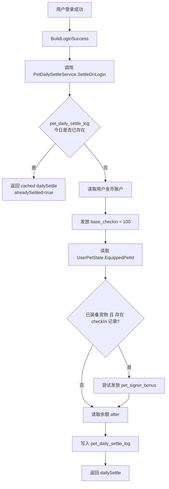
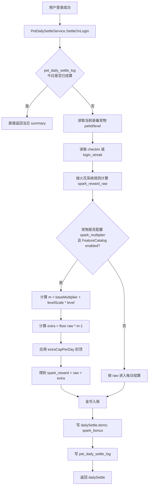

# P0 特征清单：参数与校验

> 下述是“实现建议”，字段命名以 Go 层为准；运营侧仍可用 `params` JSON 接入。

## 1) signin_bonus（每日登录加成）

- event：`DAILY_SIGNIN`
- scope：`PET`
- params：
  - `bonusCoins` (int64, >=0)
  - `levelScale` (float64, >=0, optional) // 随等级额外比例
  - `capPerDay` (int64, >=0, optional)
- apply：增加每日登录结算的奖励金币。

## 2) spark_multiplier（火花倍率）

- event：`DAILY_SIGNIN`
- scope：`PET`
- params：
  - `baseMultiplier` (float64, >=1)
  - `levelScale` (float64, >=0, optional)
  - `extraCapPerDay` (int64, >=0, optional)
  - `rounding` (enum: floor/round/ceil; default floor)
- apply：影响“火花计算”倍率，并按 cap 做额外上限。

### 火花系统基础规则

#### 触发条件

- 用户连续两天及以上完成每日首次登录即可累积火花。
- 火花累计与当前装备龟种无关，切换龟种不影响火花计数。

#### 火花计数规则

- 每满足一天连续登录，`login_streak +1`。
- 中断连续登录（跳过一天），`login_streak` 归零。

#### 奖励计算

- 当日登录总奖励 = `100`（基础）+ `y`（火花加成，向下取整）
- `y = 100 * (1 - e^(-0.1x))`
- 其中 `x` 为当前连续登录天数（`login_streak`）
- 口径说明：
  - `y` 初期增长快，后期趋近 `100`
  - 总奖励长期趋近 `200` 龟币

示例：

- `x=0` -> 总奖励 `100` 龟币
- `x=3` -> 总奖励 `125` 龟币
- `x=7` -> 总奖励 `150` 龟币
- `x=14` -> 总奖励 `175` 龟币
- `x=30` -> 总奖励 `195` 龟币

### 火花系统与 spark_multiplier 的关系

- `spark_multiplier` 不是独立奖励源，而是在火花系统先算出 `spark_reward_raw` 后，对火花部分做倍率放大。
- 建议拆分为：
  - `base_checkin = 100`
  - `spark_reward_raw = floor(100 * (1 - e^(-0.1x)))`
  - `spark_bonus_extra = floor(spark_reward_raw * (m - 1))`
  - `spark_reward_final = spark_reward_raw + spark_bonus_extra`
- 因此，当龟种未配置 `spark_multiplier` 时，用户只拿基础火花奖励；
  当龟种配置了 `spark_multiplier` 时，额外放大的部分才记为 `spark_bonus`。

### 涉及场景梳理

- 运营配置场景：`FeatureCatalogItem(featureKey=spark_multiplier)` 作为正式特征模板存在，可挂到宠物 `abilities` 上，由运营侧维护 `base/per_level/cap` 参数。
- 宠物能力场景：某个龟种配置了 `spark_multiplier` 后，理论上只应在 `DAILY_SIGNIN` 事件下生效，不影响切龟、开蛋、下注等链路。
- 每日登录结算场景：火花倍率本质上属于“每日登录结算”中的火花奖励放大项，应依附 `spark_reward_raw` 计算，而不是独立凭空发钱。
- 用户返回结构场景：`dailySettle.items[]` 已预留 `spark_bonus` 类型，说明接口层对“火花额外奖励明细”已有承载位。
- 幂等与审计场景：火花倍率应和每日结算共用同一份 `pet_daily_settle_log`，避免重复登录重复发放。

### 当前实现现状

- 当前仓库里，`spark_multiplier` 已完成“特征定义 + 宠物 abilities 配置入口 + 文档口径”这部分闭环。
- 但业务执行层尚未真正消费 `spark_multiplier`：
  - `PetDailySettleService.SettleOnLogin` 目前只稳定发放 `base_checkin=100`，并尝试发 `pet_signin_bonus`。
  - `CheckInService.CheckIn` 走的是另一条老签到链路，也只会触发 `signin_bonus`。
  - 目前没有任何代码真正计算 `spark_reward_raw / extra / spark_reward`，也没有向 `dailySettle.items` 写入 `spark_bonus`。
- 因此，现阶段更准确的判断是：
  - `spark_multiplier`：配置闭环，业务未闭环。
  - 每日登录结算主链路：已闭环，但只闭环到 `base_checkin`，部分闭环到 `pet_signin_bonus`。

### 当前已闭环流程图

> 这张图描述的是“当前仓库已经跑通”的每日结算主链路，不代表火花倍率已接入。

### 火花倍率目标闭环

- 目标是把 `spark_multiplier` 并入 `DAILY_SIGNIN` 主链路，而不是额外再开一条发奖链路。
- 推荐落点：`PetDailySettleService.SettleOnLogin`
- 推荐顺序：
  1. 先按火花系统规则计算 `spark_reward_raw`
  2. 再解析当前装备龟的 `spark_multiplier`
  3. 计算额外增量 `extra`
  4. 与每日结算一起入账、记明细、写幂等日志

### 火花倍率目标流程图

### 补充约束

- `spark_multiplier` 不应直接修改基础签到 `base_checkin`，只影响火花部分。
- `extraCapPerDay` 建议只作用于“额外增量 extra”，不要把 raw 一起截断。
- `spark_bonus` 明细建议写入 `dailySettle.items[]`，便于前端展示“基础奖励”和“火花额外奖励”。
- 若后续保留 `POST /api/checkin/checkin` 旧入口，建议内部复用同一套 `DAILY_SIGNIN` 结算服务，避免登录链路和签到链路分别发钱。

## 3) debt（欠账/余额可为负）

- event：`EQUIP_VALIDATE` + `BALANCE_CHANGE`
- scope：`PET` 或 `GLOBAL`（建议 GLOBAL 规则，避免切龟绕过）
- params：
  - `debtFloor` (int64, <=0) // 最低余额，例如 -300
  - `forbidEquipWhenDebt` (bool)
  - `errorCode` (string, default "DEBT_UNPAID")
- apply：
  - balance 变动后不得低于 debtFloor
  - 切龟/装备时若 forbidEquipWhenDebt=true 且 balance<0 则拒绝

## 4) debt_subsidy（欠款补贴）

- event：`DAILY_SIGNIN`
- scope：`PET`
- params：
  - `subsidyRate` (float64, 0..1)
  - `capPerDay` (int64, >=0, optional)
  - `rounding` (enum: floor/round/ceil; default floor)
- apply：当 balance<0 时，给与补贴（通常是减少欠款或增加金币），并受 cap 控制。

## 5) deposit_interest（存款生息）

- event：`DAILY_SIGNIN`
- scope：`PET`
- params：
  - `interestRate` (float64, 0..1)
  - `capPerDay` (int64, >=0, optional)
  - `rounding` (enum: floor/round/ceil; default floor)
- apply：当 balance>0 时，按利率加金币，并受 cap 控制。

## 6) equip_daily_limit（每日切换限制）

- event：`EQUIP_VALIDATE`
- scope：`GLOBAL`
- params：
  - `maxEquipsPerDay` (int, >=0)
  - `timezone` (string, default "UTC+8")
  - `errorCode` (string, default "EQUIP_DAILY_LIMIT")
- apply：切龟入口校验：当日切龟次数超过限制则拒绝。

### 龟种每日切换限制业务规则

- 每位用户每天（北京时间）仅可切换龟种一次。
- 后端以 `last_equip_date` 语义字段记录上次切换日期；当前实现等价落在用户宠物状态表的日维度字段上。
- 切换前需要校验“上次切换日期是否与当日相同”：
  - 相同：拒绝切换，返回错误码 `EQUIP_DAILY_LIMIT`
  - 不同：允许切换，并更新当日切换日期
- 头像框和场景的切换不受此限制，该限制只针对“龟种切换”本身。
