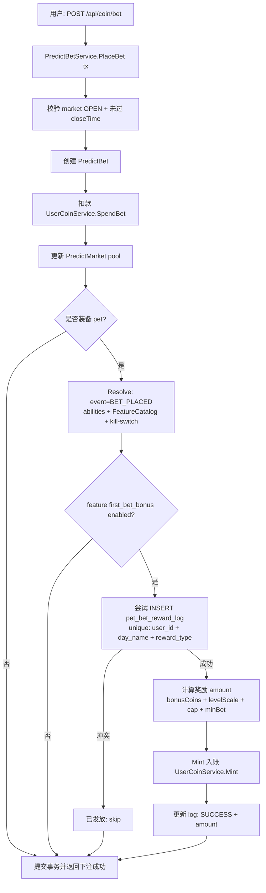

# 首次下注奖励方案

> 目标：让某些龟种（例如 `fortune` 财神龟）在“每日首次下注成功”时额外发放金币。
>
> 关键点：
>
> - 触发点必须在“下注成功并扣款落库”之后（避免发了钱但下注失败/回滚）。
> - 必须幂等（并发下注、重试下单都不能重复发）。
> - 需要 kill-switch 可止血。

## 业务口径（建议）

- “首次下注”口径：**北京时间自然日**，用户在任意预测市场成功下注（`POST /api/coin/bet` 成功创建 `PredictBet` 并完成扣款）的第一笔。
- 奖励口径：同一天最多发放 1 次；可选支持封顶（cap）。
- 若下注接口失败（事务回滚）：不得发放奖励。
- 若奖励发放失败：
  - 不影响下注成功返回（下注是主链路）
  - 但必须可重试发放（依赖幂等日志）

## feature 定义（typed 结构建议）

- event：`BET_PLACED`（新增）
- scope：`PET`
- params：
  - `bonusCoins` (int64, >=0)
  - `levelScale` (float64, >=0, optional) // 随等级额外比例
  - `capPerDay` (int64, >=0, optional) // 单日封顶
  - `minBetAmount` (int64, >=0, optional) // 下注金额门槛（例如 >=100）
  - `errorMode` (enum: "skip"|"fail", default "skip")
    - skip：不满足条件直接跳过，不报错
    - fail：不满足条件返回业务错误（一般不推荐，会影响下注主流程）

## 需要哪些接口（对外契约）

> 说明：用户侧不需要新增“领取奖励”接口，奖励应在下注成功后自动触发。

### 1) 下注接口（已有）：`POST /api/coin/bet`

- 现状：`CoinController.PostBet` → `PredictBetService.PlaceBet`（事务内：创建 bet、扣款、更新池）。
- 需要增强：在下注成功返回中，**可选**附带 `firstBetReward` 字段，便于前端做 toast/埋点。

建议返回字段（可选增强，不强制）：

- `firstBetReward`：
  - `granted`：bool（本次是否发放首次下注奖励）
  - `amount`：int64（实际发放金额；未发放为 0）
  - `reason`：string（例如：`ALREADY_GRANTED` / `FEATURE_DISABLED` / `NOT_EQUIPPED` / `BELOW_MIN_BET` / `ERROR`）

### 2) 查询当日奖励状态（可选）：`GET /api/pet/status`

> 若你们希望“宠物状态页”展示「今日首次下注奖励是否已领」，可以把这个状态聚合在宠物 status 接口里。

建议新增字段（聚合口径）：

- `bet.firstBetRewardDayName` / `bet.firstBetRewardGranted` / `bet.firstBetRewardAmount`

### 3) 管理员止血（已有）：`POST /api/admin/pet/kill-switch`

- 约定：kill-switch 的 `disabledFeatureKeys` 支持配置 `first_bet_bonus`。

## 需要哪些表（幂等与审计）

> 当前项目已有 `pet_daily_settle_log` 用于“每日登录结算”的幂等；但“首次下注奖励”发生在下注链路，建议独立一张轻量幂等表，避免语义混淆。

建议新增：`pet_bet_reward_log`（或 `pet_first_bet_reward_log`）

- 唯一键：`(user_id, day_name, reward_type)`
  - `reward_type` 固定为：`first_bet_bonus`
- 必要字段：
  - `id`
  - `user_id`
  - `day_name`（北京日）
  - `market_id`（触发的市场）
  - `bet_id`（触发的下注单）
  - `pet_id`（当时装备龟种）
  - `amount`（实际发放金额）
  - `status`（SUCCESS/FAILED，可选）
  - `detail_json`（解析后的 params / 失败原因等，可选）
  - `created_at` / `updated_at`

> 若希望“严格幂等 + 可追溯”，不建议只靠 `UserCoinLog` 去做去重（因为目前 `UserCoinLog` 没有天然幂等键字段）。

## 实现方案（落地到现有代码的最短路径）

### 触发点选择

推荐：在 `PredictBetService.PlaceBet` 的事务函数里，**在 bet 创建 + 扣款成功之后** 执行奖励逻辑：

1) 查询用户当前装备龟 `UserPetState.EquippedPetId`
2) Resolver：`ResolveForEvent(userId, petId, BET_PLACED, ctx)`
3) 校验“是否当日首次下注”：尝试插入 `pet_bet_reward_log`，用唯一键做并发去重
4) Mint 发放金币：`UserCoinService.Mint(0, userId, amount, "pet first bet bonus | ...")`
5) 更新 log 为 SUCCESS 并记录 amount

### 幂等策略（强烈建议）

- 把“是否已发放”这件事变成一次 `INSERT`：
  - 成功插入：说明首次，允许发放
  - 唯一键冲突：说明已发放，直接跳过

这样能同时解决：

- 并发下注（两个请求同时成功下单）
- 客户端重试（网络抖动导致重复提交）
- 服务内部重试（比如发奖失败可补偿重试）

### 失败不阻断下注

建议：奖励逻辑失败时记录 slog + 把 log 标记 FAILED，PlaceBet 仍返回下注成功。

> 下注主链路不能被“宠物加成”拉跨；止血开关可以临时关闭该特性。

## 流程图：下注成功触发首次下注奖励

## 运营侧配置建议（复用现有接口）

- FeatureCatalogItem：新增 `featureKey=first_bet_bonus`，scope=PET，event=BET_PLACED。
- 对财神龟（`fortune`）在 `PetDefinition.AbilitiesJSON` 中挂载：
  - `first_bet_bonus.params.bonusCoins = 50`
  - 可选：`minBetAmount=100`（让小额下注不触发，控制成本）
