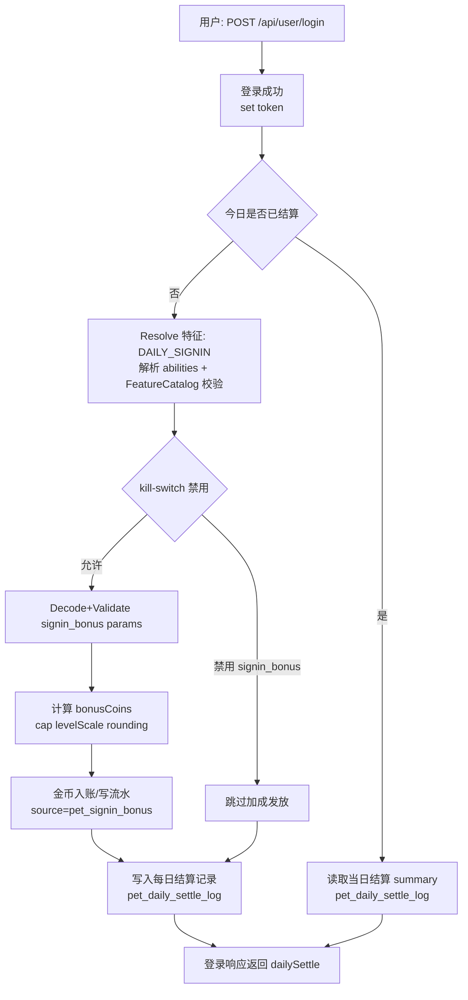

# 每日登录加成落地

## 与现有代码的对接点（落地步骤）

1) **运营侧配置**（已具备基础能力）

- FeatureCatalog：`/api/admin/pet/features`
- Abilities 挂载：`/api/admin/pet/defs/:id/abilities`

2) **缺口（建议优先补齐）**

- FeatureCatalog 仅 P0 白名单（避免运营误配 P1/P2 key 造成不可控）
- Abilities shape 统一（建议 `enabled + params`）
- Resolver 在运行时对 kill-switch 生效
- 审计日志：对 features/abilities 的写操作写 operate-log（后续单独实现）

3) **执行入口（用户侧/结算侧）**

- 在每日登录结算、切龟校验、余额变动等入口调用 Resolver。

---

## P0 落地清单：每日登录加成（signin_bonus）需要改/新增哪些文件

> 目标：让 `signin_bonus` 不只是“被保存”，而是在用户签到（或每日登录结算点）能实际计算并发放金币。

### 已有文件（现状承接，不是这次必须改）

- 运营侧配置入口：
  - `internal/controllers/admin/pet_controller.go`
    - `GET/POST/DELETE /api/admin/pet/features`（FeatureCatalog）
    - `PUT/PATCH/DELETE /api/admin/pet/defs/:id/abilities`（abilities 挂载）

### 必改/必新增（最小闭环）

#### 1) 登录入口（用户侧触发点，作为每日结算主入口）

> 目标：把 DAILY_SIGNIN 的触发点改为“登录成功”，并把结算结果挂在登录响应里返回（前端不再额外调结算接口）。
> 原则：**登录不能被结算失败阻断**。

- `internal/controllers/render/misc_render.go`（或实际登录成功写 token 的位置，按项目实际为准）
  - 位置：登录成功并 set token 之后
  - 变更点：触发一次 `DAILY_SIGNIN` 的特征结算，并把结果写入登录响应（或通过扩展字段返回）。
  - 需要做的事：
    1) 读取用户当前装备龟种（petId）
    2) Resolve 出 `signin_bonus` 的参数
    3) 计算 `bonusCoins`
    4) 调用金币入账服务写流水
    5) 幂等：同一天不能重复发放（以 `pet_daily_settle_log` 为准；或 `userId+dayName+sourceType` 兜底）

（兼容策略，可选）

- `internal/controllers/api/checkin_controller.go`
  - 若仍保留 `POST /api/checkin/checkin`：建议其内部**复用同一套** DAILY_SIGNIN 结算服务，避免发两次钱。

#### 2) 特征执行（运行时解析与强校验）

> 说明：当前代码层只有“abilities 挂载的弱校验（feature 存在且 enabled）”，缺少“把 params 变成可执行输入”的运行时层。

建议新增一套最小模块（目录名可按你们习惯调整）：

- `internal/pet/feature/types.go`（新增）
  - 定义：FeatureScope / EffectiveEvent / ResolvedFeature / 统一错误码。

- `internal/pet/feature/registry.go`（新增）
  - 定义：`Register(f Feature)` / `Get(key)`。

- `internal/pet/feature/signin_bonus.go`（新增）
  - 定义：`SigninBonusParams`（typed）
  - 实现：Decode / Validate / Apply（只返回“应发放金币”，不直接写 DB）

- `internal/pet/resolver.go`（新增）
  - 定义：`ResolveForEvent(userId, petId, event, ctx)`
  - 行为：
    - 解析 `PetDefinition.AbilitiesJSON`
    - 校验 featureKey 在 FeatureCatalog 且 enabled
    - 校验 params（typed validate；可选再叠加 JSONSchema）
    - 应用 kill-switch（读取 `SysConfigService` 的 `pet.killSwitch`）
    - 输出只属于该 event 的 ResolvedFeature

#### 3) 金币入账（强依赖项目现有资金流水体系）

- `internal/services/*coin*` 或 `internal/services/*score*`（**需要接入/修改**）
  - 新增一个“来源类型/业务类型”：例如 `pet_signin_bonus`
  - 写入资金流水（便于审计/客服解释/反作弊）
  - 幂等键建议：`userId + dayName + sourceType`

- `internal/models/constants/constants.go`（可选，建议）
  - 放置上面的 sourceType 常量，避免散落魔法字符串。

### 可选增强（运营侧强约束，降低误配置风险）

- `internal/controllers/admin/pet_controller.go`
  - FeatureCatalog：限制 `featureKey` 只能是 P0 白名单（本期只做 P0 时很重要）
  - abilities：针对 `signin_bonus` 做 params 校验，避免写入无效值

---

## 每日登录加成（signin_bonus）端到端流程图

> 以“登录成功”作为 DAILY_SIGNIN 触发点；同一天重复登录只返回当日 summary，不重复发放。

