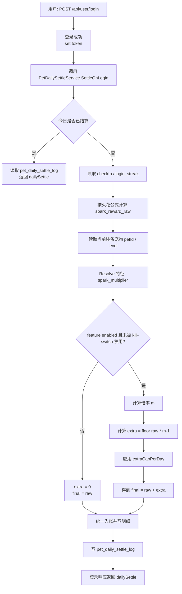

# 火花倍率落地

## P0 落地清单：火花倍率（spark_multiplier）需要改/新增哪些文件

> 目标：让 `spark_multiplier` 从“可配置参数”变成“每日登录结算里真实生效的火花奖励放大规则”。
>
> 原则：
>
> - `spark_multiplier` 只作用于火花奖励，不改基础签到 `base_checkin=100`
> - 先按火花系统计算 `spark_reward_raw`，再按特性放大
> - 和每日结算共用同一套幂等与审计，不额外开第二条发奖链路

### 已有文件（现状承接，不是这次必须改）

- 特征定义与运营配置入口：
  - `internal/services/feature_catalog_service.go`
    - 已存在 `featureKey=spark_multiplier` 的默认种子
  - `internal/controllers/admin/pet_controller.go`
    - 已支持 abilities 挂载到宠物定义

### 必改/必新增（最小闭环）

#### 1) 每日结算主入口（火花倍率的唯一推荐落点）

- `internal/services/pet_daily_settle_service.go`
  - 这是 `spark_multiplier` 最应该接入的位置。
  - 需要补的逻辑：
    1) 读取/计算 `login_streak`
    2) 按火花公式计算 `spark_reward_raw`
    3) 读取当前装备龟种 `petId` 与等级 `level`
    4) Resolve `spark_multiplier`
    5) 计算：
       - `m = baseMultiplier + levelScale * level`
       - `extra = floor(spark_reward_raw * (m - 1))`
       - `extra = min(extra, extraCapPerDay)`
       - `spark_reward_final = spark_reward_raw + extra`
    6) 入账并写入 `dailySettle.items`
    7) 与 `base_checkin` 一起写 `pet_daily_settle_log`
  - 同时建议把当前“先直接发 bonus、后再查余额”的写法收拢成“统一计算 -> 统一入账 -> 统一写 items”，避免明细与余额不一致。

#### 2) 火花基础计算（建议抽成独立小模块）

建议新增：

- `internal/services/pet_spark_service.go`（新增）
  - 职责：
    - 纯计算 `login_streak`
    - 纯计算 `spark_reward_raw`
    - 纯计算 `spark_multiplier` 放大后的 `extra/final`
  - 设计目标：
    - 不直接写 DB
    - 不直接发金币
    - 只负责公式与取整，便于单测

建议最少提供的方法：

- `ComputeLoginStreak(checkIn *models.CheckIn, now time.Time) int`
- `ComputeSparkRaw(loginStreak int) int64`
- `ApplySparkMultiplier(raw int64, level int, params SparkMultiplierParams) (extra int64, final int64)`

这样可以避免把数学公式和入账逻辑混在 `pet_daily_settle_service.go` 里。

#### 3) 特征执行（运行时解析与参数强校验）

如果沿用上一节 `signin_bonus` 的运行时方案，则 `spark_multiplier` 直接复用同一套路由：

- `internal/pet/feature/spark_multiplier.go`（新增）
  - 定义：`SparkMultiplierParams`
  - 实现：Decode / Validate / Apply
  - Apply 阶段不直接 Mint，只返回计算结果：
    - `baseMultiplier`
    - `levelScale`
    - `extraCapPerDay`
    - `rounding`

- `internal/pet/resolver.go`（新增或扩展）
  - 支持在 `event=DAILY_SIGNIN` 时解析出 `spark_multiplier`
  - 运行时校验：
    - featureKey 在 FeatureCatalog 且 enabled
    - abilities 参数结构合法
    - kill-switch 未禁用 `spark_multiplier`

#### 4) 登录/签到入口统一口径

- `internal/controllers/render/misc_render.go`
  - 保持“登录成功触发每日结算”的主入口不变
  - 只需要承接 `dailySettle` 返回结构的增强结果

- `internal/controllers/api/checkin_controller.go`
  - 若保留旧签到入口，建议不要再单独发火花奖励
  - 推荐方案：复用 `PetDailySettleService` 或只更新签到状态，不直接发奖

- `internal/services/check_in_service.go`
  - 当前这条链路应只负责签到状态维护：
    - `LatestDayName`
    - `ConsecutiveDays`
  - 不建议继续在这里直接发放任何与 `spark_multiplier` 相关奖励
  - 目标是让“签到状态”和“每日结算发钱”解耦

#### 5) 返回结构与明细展示

- `internal/services/pet_daily_settle_service.go`
  - 建议给 `dailySettle.items[]` 至少增加两类明细：
    - `spark_raw` 或 `spark_reward`
    - `spark_bonus`
  - 如果想最小改动，也可以先只新增：
    - `type = spark_bonus`
    - `amount = extra`
    - `meta.raw = spark_reward_raw`
    - `meta.final = spark_reward_final`

- `docs/api/user_pet.md`
  - 建议同步补充 `dailySettle.items[].meta` 在火花场景下的结构示例，方便前端展示“基础火花”和“倍率额外加成”。

### 可选增强（建议但不是 P0 必须）

- `internal/models/constants/constants.go`
  - 增加统一明细类型或资金来源常量：
    - `spark_reward`
    - `spark_bonus`
    - `pet_daily_settle`

- `internal/controllers/admin/pet_controller.go`
  - 对 `spark_multiplier` 做参数边界校验：
    - `baseMultiplier >= 1`
    - `levelScale >= 0`
    - `extraCapPerDay >= 0`
    - `rounding in [floor round ceil]`

### 最短落地路径（建议实现顺序）

1. `check_in_service.go`
   - 只维护签到状态与 `login_streak`
2. `pet_spark_service.go`
   - 独立实现火花公式与倍率放大
3. `pet_daily_settle_service.go`
   - 把火花 raw / extra / final 接进每日结算
4. `docs/api/user_pet.md`
   - 更新 `dailySettle.items` 的说明
5. `internal/pet/feature/spark_multiplier.go`
   - 把运行时解析补规范化

这样能先把业务闭环跑通，再补 feature runtime 的工程化抽象。

---

## 火花倍率（spark_multiplier）端到端流程图

> 以“登录成功 -> 每日结算”为唯一主入口；火花先按基础公式计算，再按特性放大。

