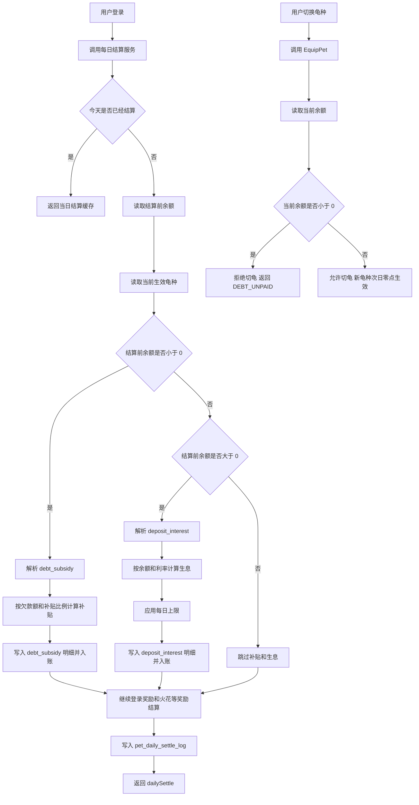

# 欠账补贴与生息落地

## P0 落地清单：欠账系统、欠款补贴、存款生息需要改/新增哪些文件

> 目标：把 `debt`、`debt_subsidy`、`deposit_interest` 三个特性从“规则文档”落成“每日结算 + 切龟校验”里真实生效的后端方案。
>
> 原则：
>
> - 欠账能力负责定义“最低余额下限”和“欠款锁龟”
> - 欠款补贴与存款生息只在每日结算中触发，不额外开独立发奖入口
> - 欠款补贴与存款生息互斥：同一日只能命中一个
> - 切换龟种当日不再结算原龟种补贴/生息；新龟种从次日北京时间 0 点起生效
> - 补贴/生息与登录奖励、火花奖励共用同一份 `pet_daily_settle_log`

### 业务口径整理

#### 1) 欠账系统（debt）

- 龟壳（SSS）：欠账上限 `-1000`
- 闪电龟（A）：欠账上限 `-300`
- 账户余额允许正常显示负数，例如 `-320`
- 欠款期间不产生额外利息
- 欠款未还清（`balance < 0`）时，禁止切换龟种
- 切龟接口校验失败时返回错误码：`DEBT_UNPAID`

#### 2) 每日欠款补贴（debt_subsidy）

- 触发条件：每日结算时 `balance < 0`
- 龟壳补贴：`floor(abs(balance) * 0.22)`
- 闪电龟补贴：`floor(abs(balance) * 0.25)`
- 补贴直接记入当前余额，用于减少欠款，不转到其他账户
- 示例：
  - 龟壳：`-500 -> +110 -> -390`
  - 闪电龟：`-200 -> +50 -> -150`

#### 3) 存款生息（deposit_interest）

- 触发条件：每日结算时 `balance > 0`
- 龟壳利率：`floor(balance * 0.05)`，每日上限 `1000`
- 星际龟利率：`floor(balance * 0.03)`，每日上限 `1000`
- 所有正余额自动参与生息，无需手动操作
- 示例：
  - 龟壳：`10000 -> +500`，`25000 -> +1000`
  - 星际龟：`10000 -> +300`，`34000 -> +1000`

#### 4) 生效时机与切龟规则

- 补贴与生息都属于“每日结算”项，和登录奖励同批次结算
- 装备龟壳或闪电龟后，从次日北京时间 `00:00` 起开始触发欠款补贴
- 装备星际龟或龟壳后，从次日北京时间 `00:00` 起开始触发存款生息
- 切换龟种后当日不再结算原龟种补贴/生息
- 新龟种的补贴/生息从次日 `00:00` 起生效
- 同一天余额 `< 0` 时只触发补贴；余额 `> 0` 时只触发生息；余额 `= 0` 时两者都不触发

### 已有文件（现状承接，不是这次必须改）

- `internal/services/user_pet_service.go`
  - 已有用户当前装备龟种与当日切换限制的基础状态
- `internal/services/pet_daily_settle_service.go`
  - 已有登录成功触发每日结算与 `pet_daily_settle_log` 幂等
- `internal/services/user_coin_service.go`
  - 已有统一金币入账与余额查询能力
- `internal/services/feature_catalog_service.go`
  - 已有 `debt` / `debt_subsidy` / `deposit_interest` 的特征位规划语义
- `internal/controllers/admin/pet_controller.go`
  - 已支持运营侧挂载 abilities

### 必改/必新增（最小闭环）

#### 1) 切龟校验入口

- `internal/services/user_pet_service.go`
  - 在 `EquipPet` 里补一层“欠款锁龟”校验
  - 需要做的事：
    1) 读取用户当前余额
    2) 若 `balance < 0`，直接拒绝切换
    3) 返回 `DEBT_UNPAID`
  - 说明：
    - 当前业务口径已经固定为“只要有欠款就锁龟”，因此这里不建议等运行时 resolver 全量做完后再接
    - 这是高优先级兜底校验，避免用户通过切龟绕过欠账规则

#### 2) 装备生效日口径

- `internal/models/models/user_pet_models.go`
  - 建议新增一个“当前装备生效日”字段，例如 `EquippedEffectDayName`
  - 作用：明确区分“今天切了龟”和“今天开始按哪只龟结算”
- `internal/services/user_pet_service.go`
  - 在切龟成功时：
    - `EquippedPetId` 立即切换为新龟
    - `EquippedEffectDayName` 设置为“次日北京时间 dayName”
  - 在每日结算时：
    - 若当前日 `< EquippedEffectDayName`，则补贴/生息仍按旧生效龟计算

> 如果不想立即改表，也可以先在 `pet_daily_settle_service.go` 用 `EquipDayName == today` 做临时规则：
> 当天刚切龟时，跳过补贴/生息，不给旧龟也不给新龟；但这会弱化“旧龟当日仍可结算到 0 点之前”的精细口径。
> 因此更推荐引入“次日生效日”字段，一次把规则做稳。

#### 3) 每日结算主入口

- `internal/services/pet_daily_settle_service.go`
  - 这是 `debt_subsidy` / `deposit_interest` 的唯一推荐落点
  - 需要补的逻辑：
    1) 在发放 `base_checkin` / `spark_reward` 之前，先读取 `balanceBefore`
    2) 确定“本次参与补贴/生息计算的生效龟种”
    3) 若 `balanceBefore < 0`，尝试解析 `debt_subsidy`
    4) 若 `balanceBefore > 0`，尝试解析 `deposit_interest`
    5) 计算补贴或生息金额（向下取整，应用封顶）
    6) 统一入账并写入 `dailySettle.items`
    7) 与 `base_checkin` / `spark_reward` 一起写入 `pet_daily_settle_log`
  - 推荐口径：
    - 补贴/生息判断使用“结算开始时余额 `balanceBefore`”
    - 不要使用已经加上登录奖励后的余额再去二次判断，否则会把负债用户错误切成生息分支

#### 4) 纯计算模块

建议新增：

- `internal/services/pet_balance_feature_service.go`（新增）
  - 职责：
    - 纯计算欠款补贴金额
    - 纯计算存款生息金额
    - 纯判断 debtFloor / lock 规则
  - 设计目标：
    - 不写 DB
    - 不直接发金币
    - 只负责参数解释、数学计算和边界判断，便于单测

建议最少提供的方法：

- `ApplyDebtRule(balance int64, params DebtParams) error`
- `ComputeDebtSubsidy(balance int64, params DebtSubsidyParams) int64`
- `ComputeDepositInterest(balance int64, params DepositInterestParams) int64`

#### 5) 特征执行与参数解析

如果沿用当前 `spark_multiplier` 的轻量模式，建议继续按 featureKey 解码：

- `internal/services/pet_balance_feature_service.go`（新增）
  - 定义：
    - `DebtParams`
    - `DebtSubsidyParams`
    - `DepositInterestParams`
  - 兼容两类字段：
    - 通用 typed 字段：`debtFloor` / `subsidyRate` / `interestRate` / `capPerDay`
    - 运营实际字段：例如 `min_balance` / `rate_base` / `daily_cap_amount`

- `internal/services/feature_catalog_service.go`
  - 建议把这三类 feature 的默认 seed 补齐到和现行业务口径一致
  - 示例：
    - `debt`：支持 `debtFloor`、`forbidEquipWhenDebt`
    - `debt_subsidy`：支持 `subsidyRate`、`capPerDay`
    - `deposit_interest`：支持 `interestRate`、`capPerDay`

#### 6) 返回结构与明细展示

- `internal/services/pet_daily_settle_service.go`
  - 建议增加以下明细类型：
    - `debt_subsidy`
    - `deposit_interest`
  - 建议 `meta` 最少包含：
    - `balanceBefore`
    - `rate`
    - `cap`
    - `petId`
    - `featureKey`

- `docs/api/user_pet.md`
  - 建议同步补充：
    - `debt_subsidy.meta.balanceBefore/rate`
    - `deposit_interest.meta.balanceBefore/rate/cap`

### 参数建议（按当前业务口径落地）

#### 1) debt

- 龟壳：
  - `debtFloor = -1000`
  - `forbidEquipWhenDebt = true`
  - `errorCode = "DEBT_UNPAID"`
- 闪电龟：
  - `debtFloor = -300`
  - `forbidEquipWhenDebt = true`
  - `errorCode = "DEBT_UNPAID"`

#### 2) debt_subsidy

- 龟壳：
  - `subsidyRate = 0.22`
- 闪电龟：
  - `subsidyRate = 0.25`

#### 3) deposit_interest

- 龟壳：
  - `interestRate = 0.05`
  - `capPerDay = 1000`
- 星际龟：
  - `interestRate = 0.03`
  - `capPerDay = 1000`

### 推荐实现顺序

1. `user_pet_service.go`
   - 先补“欠款锁龟”校验，尽快止住规则绕过风险
2. `pet_balance_feature_service.go`
   - 抽纯计算逻辑，补欠账/补贴/生息的边界规则
3. `pet_daily_settle_service.go`
   - 把补贴/生息收口到每日结算主链路
4. `docs/api/user_pet.md`
   - 更新 `dailySettle.items` 的补贴/生息明细说明
5. `feature_catalog_service.go`
   - 统一默认种子与参数 schema

这样能先把关键业务规则闭环，再补 feature runtime 的统一抽象。

---

## 欠账、补贴、生息端到端流程图

> 以“登录成功 -> 每日结算”为结算主入口，以“切龟接口 -> 欠款锁龟校验”为防绕过入口。

