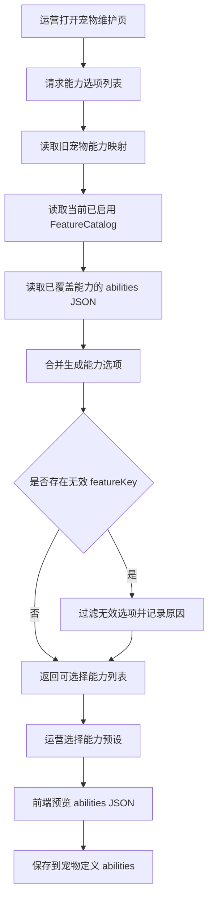

# 运营能力列表设计

## 01-流程图



## 02-总览与边界

### 目标

- 给运营侧提供一个“能力列表”，在维护宠物时可以直接选择已有能力预设。
- 能力列表的数据来自旧宠物各个稀有度中已经沉淀的特殊能力，并且只暴露当前系统已覆盖、可落地校验的能力。
- 每个能力选项必须返回可直接写入 `PetDefinition.abilities` 的 JSON 片段。
- 示例：凤凰龟的“每日登录额外奖励 +100 龟币”应在能力列表中返回 `signin_bonus` 对应的 `abilities` JSON。

### 边界

- 本设计只解决“运营选择能力预设”的数据与接口设计，不改变能力实际结算逻辑。
- `FeatureCatalog` 仍是特征模板白名单，负责 `featureKey`、生效事件、schema 与启停。
- 能力列表是可选预设，不替代 `PUT/PATCH /api/admin/pet/defs/:id/abilities` 的保存能力。
- 旧宠物中尚未被当前系统覆盖的特殊能力不进入 P0 列表，后续等 featureKey 与执行逻辑补齐后再开放。

## 03-特性清单总览

| 分类 | 特性 | 状态 | 优先级 | 详情 |
| --- | --- | --- | --- | --- |
| 能力列表 | 能力预设来源聚合 | 待实现 | P0 | [04-1](#1-能力预设来源聚合) |
| 能力列表 | 已覆盖能力过滤 | 待实现 | P0 | [04-2](#2-已覆盖能力过滤) |
| 能力列表 | 返回 abilities JSON | 待实现 | P0 | [04-3](#3-返回-abilities-json) |
| 能力列表 | 运营选择与保存衔接 | 待实现 | P0 | [04-4](#4-运营选择与保存衔接) |

## 04-特性详情介绍

### 1. 能力预设来源聚合

能力预设应从两类来源聚合：

- 旧宠物设计文档：用于确定“某个旧宠物的特殊能力语义”，例如凤凰龟等价于“每日登录额外奖励 +100 龟币”。
- 当前后端已覆盖能力：用于确定“可执行的 `abilities` JSON 形态”，以当前种子与服务消费字段为准。

P0 只收录当前已覆盖的能力类型：

| featureKey | 能力名称 | 来源旧宠物示例 | 当前覆盖口径 |
| --- | --- | --- | --- |
| `signin_bonus` | 每日登录额外奖励 | 石头龟、竹叶龟、天使龟、寒冰龟、彩虹龟、凤凰龟、无头龟 | 已有登录加成执行链路 |
| `spark_multiplier` | 火花倍率 | 熔岩龟 | 已有火花倍率参数与每日结算接入口 |
| `debt` | 欠账额度 | 闪电龟、龟壳 | 已有余额下限与切龟校验能力 |
| `debt_subsidy` | 欠款补贴 | 闪电龟、龟壳 | 已有每日结算补贴能力 |
| `deposit_interest` | 存款生息 | 星际龟、龟壳 | 已有每日结算生息能力 |
| `first_bet_bonus` | 首次下注奖励 | 财神龟 | 已有特征模板设计，执行链路按首次下注方案落地 |

### 2. 已覆盖能力过滤

能力列表返回前必须做过滤：

- `featureKey` 必须存在于 `FeatureCatalog`。
- `FeatureCatalog.enabled=true` 时才允许返回为可选择状态。
- 能力预设中的 `abilities` key 必须全部能在 `FeatureCatalog` 中找到。
- 对于组合能力，例如“欠账 + 欠款补贴”，任一 key 被禁用时，该预设应返回 `selectable=false` 并携带 `disabledReason`，或在默认列表中隐藏。

### 3. 返回 abilities JSON

能力选项必须返回完整 `abilities` 对象，而不是只返回参数片段。

凤凰龟示例：

```json
{
  "optionKey": "phoenix_signin_bonus_100",
  "name": "每日登录额外奖励100",
  "sourcePet": {
    "petKey": "phoenix",
    "name": "凤凰龟",
    "rarity": "S"
  },
  "featureKeys": ["signin_bonus"],
  "effectiveEvents": ["DAILY_SIGNIN"],
  "abilities": {
    "signin_bonus": {
      "enabled": true,
      "bonusCoins": 100,
      "capPerDay": 500
    }
  },
  "selectable": true
}
```

说明：

- `abilities` 的字段名以当前后端实际消费为准。
- 当前登录加成实现读取 `bonusCoins` 与 `capPerDay`，因此能力列表 P0 使用该字段形态。
- 如果后续统一 schema 为 `base_amount`、`level_step`、`daily_cap`，应先做兼容迁移，再调整能力列表返回。

### 4. 运营选择与保存衔接

运营维护宠物时的推荐流程：

1. 前端读取能力选项列表。
2. 运营选择一个能力预设。
3. 前端把选项中的 `abilities` 合并到当前宠物编辑表单。
4. 运营确认后，继续调用现有保存接口：
   - 整体保存：`PUT /api/admin/pet/defs/:petId/abilities`
   - 单项保存：`PATCH /api/admin/pet/defs/:petId/abilities/:featureKey`
5. 后端保存时仍按 `FeatureCatalog` 校验 key，不因来自预设就跳过校验。

## 05-配置与数据模型

### AbilityOption

```json
{
  "optionKey": "string",
  "name": "string",
  "description": "string",
  "sourcePet": {
    "petKey": "string",
    "name": "string",
    "rarity": "string"
  },
  "featureKeys": ["string"],
  "effectiveEvents": ["string"],
  "abilities": {},
  "selectable": true,
  "disabledReason": ""
}
```

字段说明：

- `optionKey`：能力预设唯一键，不等同于 `featureKey`。
- `name`：运营侧展示名，例如“每日登录额外奖励100”。
- `sourcePet`：能力来自哪个旧宠物，用于解释来源与审计。
- `featureKeys`：该预设会写入哪些 `abilities` key。
- `effectiveEvents`：聚合自 `FeatureCatalog.effective_event`。
- `abilities`：可直接合并到 `PetDefinition.abilities` 的 JSON。
- `selectable`：是否允许选择。
- `disabledReason`：不可选原因。

### P0 能力预设

| optionKey | 展示名 | 来源 | abilities |
| --- | --- | --- | --- |
| `signin_bonus_15` | 每日登录额外奖励15 | 忍者龟 | `{ "signin_bonus": { "enabled": true, "bonusCoins": 15, "capPerDay": 500 } }` |
| `signin_bonus_25` | 每日登录额外奖励25 | 石头龟、竹叶龟 | `{ "signin_bonus": { "enabled": true, "bonusCoins": 25, "capPerDay": 500 } }` |
| `signin_bonus_40` | 每日登录额外奖励40 | 天使龟、寒冰龟 | `{ "signin_bonus": { "enabled": true, "bonusCoins": 40, "capPerDay": 500 } }` |
| `signin_bonus_50` | 每日登录额外奖励50 | 无头龟 | `{ "signin_bonus": { "enabled": true, "bonusCoins": 50, "capPerDay": 500 } }` |
| `signin_bonus_60` | 每日登录额外奖励60 | 彩虹龟 | `{ "signin_bonus": { "enabled": true, "bonusCoins": 60, "capPerDay": 500 } }` |
| `signin_bonus_100` | 每日登录额外奖励100 | 凤凰龟 | `{ "signin_bonus": { "enabled": true, "bonusCoins": 100, "capPerDay": 500 } }` |
| `spark_multiplier_lava` | 火花倍率1.3加等级成长 | 熔岩龟 | `{ "spark_multiplier": { "enabled": true, "base": 1.3, "per_level": 0.03, "cap": 400 } }` |
| `debt_300` | 欠账上限300 | 闪电龟 | `{ "debt": { "enabled": true, "debtFloor": -300, "forbidEquipWhenDebt": true, "errorCode": "DEBT_UNPAID" } }` |
| `debt_1000` | 欠账上限1000 | 龟壳 | `{ "debt": { "enabled": true, "debtFloor": -1000, "forbidEquipWhenDebt": true, "errorCode": "DEBT_UNPAID" } }` |
| `debt_subsidy_300` | 欠账300加欠款补贴 | 闪电龟 | `{ "debt": { "enabled": true, "debtFloor": -300, "forbidEquipWhenDebt": true, "errorCode": "DEBT_UNPAID" }, "debt_subsidy": { "enabled": true, "subsidyRate": 0.20 } }` |
| `debt_subsidy_1000` | 欠账1000加欠款补贴 | 龟壳 | `{ "debt": { "enabled": true, "debtFloor": -1000, "forbidEquipWhenDebt": true, "errorCode": "DEBT_UNPAID" }, "debt_subsidy": { "enabled": true, "subsidyRate": 0.18 } }` |
| `deposit_interest_space` | 存款生息3% | 星际龟 | `{ "deposit_interest": { "enabled": true, "interestRate": 0.03, "capPerDay": 1000 } }` |

## 06-接口

### GET /api/admin/pet/ability-options

描述：返回运营维护宠物时可选的能力预设列表。

查询参数：

| 参数 | 类型 | 必填 | 说明 |
| --- | --- | --- | --- |
| `featureKey` | string | 否 | 只返回某类特征，例如 `signin_bonus` |
| `rarity` | string | 否 | 按来源宠物稀有度过滤，例如 `S` |
| `selectableOnly` | bool | 否 | 默认 `true`，只返回可选择预设 |

响应示例：

```json
{
  "results": [
    {
      "optionKey": "signin_bonus_100",
      "name": "每日登录额外奖励100",
      "description": "来自凤凰龟的每日登录额外奖励能力",
      "sourcePet": {
        "petKey": "phoenix",
        "name": "凤凰龟",
        "rarity": "S"
      },
      "featureKeys": ["signin_bonus"],
      "effectiveEvents": ["DAILY_SIGNIN"],
      "abilities": {
        "signin_bonus": {
          "enabled": true,
          "bonusCoins": 100,
          "capPerDay": 500
        }
      },
      "selectable": true,
      "disabledReason": ""
    }
  ]
}
```

### 与现有接口关系

- `GET /api/admin/pet/features`：继续返回特征模板，用于运营理解 featureKey、schema 与生效事件。
- `GET /api/admin/pet/ability-options`：返回可直接选择的能力预设，用于快速填充宠物 `abilities`。
- `PUT/PATCH /api/admin/pet/defs/:petId/abilities`：继续负责保存能力配置。
