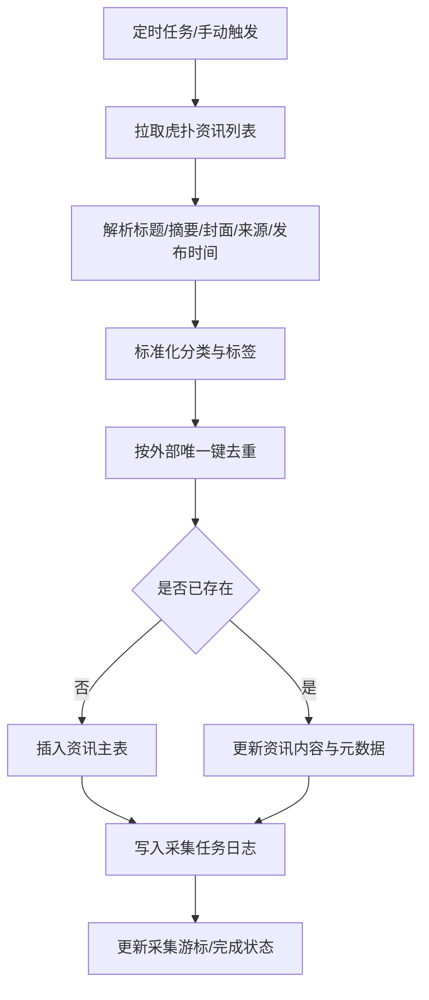
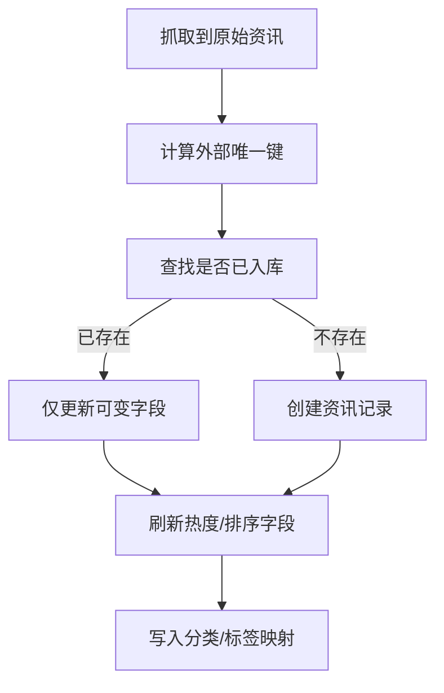
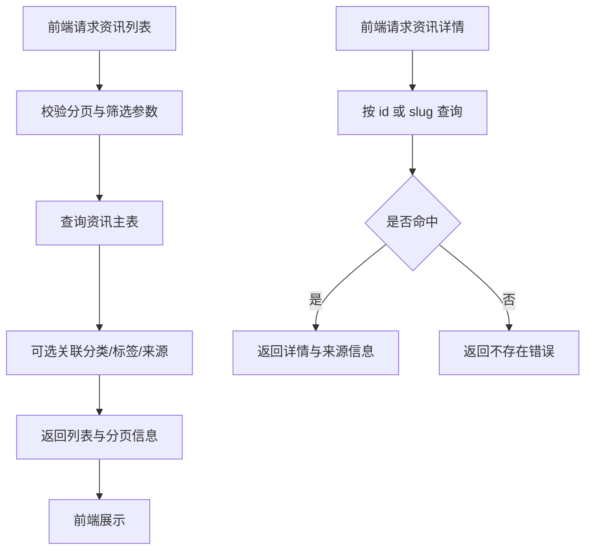
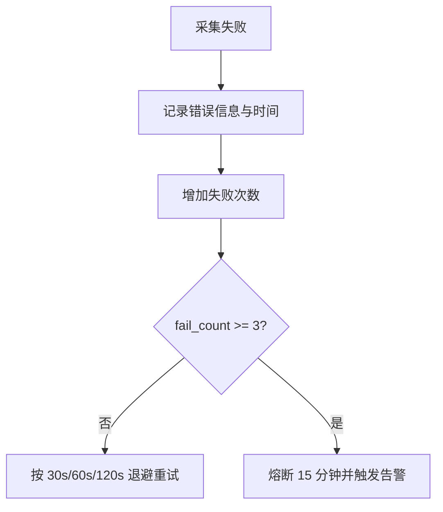

# 流程图

## 1. 采集总流程

```mermaid
flowchart TD
  A[定时任务/手动触发] --> B[拉取虎扑资讯列表]
  B --> C[解析标题/摘要/封面/来源/发布时间]
  C --> D[标准化分类与标签]
  D --> E[按外部唯一键去重]
  E --> F{是否已存在}
  F -->|否| G[插入资讯主表]
  F -->|是| H[更新资讯内容与元数据]
  G --> I[写入采集任务日志]
  H --> I
  I --> J[更新采集游标/完成状态]
```

## 2. 资讯入库流程

```mermaid
flowchart TD
  A[抓取到原始资讯] --> B[计算外部唯一键]
  B --> C[查找是否已入库]
  C -->|已存在| D[仅更新可变字段]
  C -->|不存在| E[创建资讯记录]
  D --> F[刷新热度/排序字段]
  E --> F
  F --> G[写入分类/标签映射]
```

## 3. 查看接口流程

```mermaid
flowchart TD
  A[前端请求资讯列表] --> B[校验分页与筛选参数]
  B --> C[查询资讯主表]
  C --> D[可选关联分类/标签/来源]
  D --> E[返回列表与分页信息]
  E --> F[前端展示]

  G[前端请求资讯详情] --> H[按 id 或 slug 查询]
  H --> I{是否命中}
  I -->|是| J[返回详情与来源信息]
  I -->|否| K[返回不存在错误]
```

## 4. 采集失败重试流程

```mermaid
flowchart TD
  A[采集失败] --> B[记录错误信息与时间]
  B --> C[增加失败次数]
  C --> D{fail_count >= 3?}
  D -->|否| E[按 30s/60s/120s 退避重试]
  D -->|是| F[熔断 15 分钟并触发告警]
```
