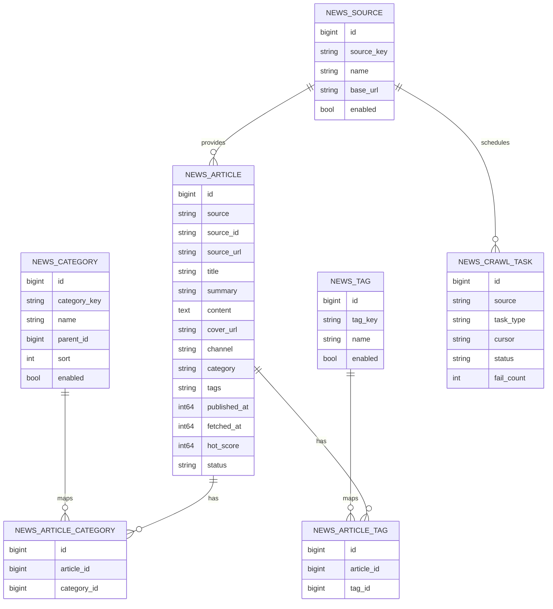

# ER 关系图

## 1. 实体关系

## 2. 关系说明

- `NEWS_SOURCE`：来源维表，当前主要是虎扑资讯。
- `NEWS_ARTICLE`：资讯主表，所有列表与详情接口都基于它查询。
- `NEWS_CATEGORY`：站内统一分类，用于前台筛选。
- `NEWS_TAG`：标签维表，用于热词、专题、聚合展示。
- `NEWS_ARTICLE_CATEGORY` / `NEWS_ARTICLE_TAG`：多对多映射，便于扩展。
- `NEWS_CRAWL_TASK`：采集任务表，记录每次抓取状态和游标。

## 3. 设计约束

- 一条外部资讯只应对应一条 `NEWS_ARTICLE` 主记录。
- 分类和标签都应能从外部字段映射到站内归一化维表。
- 采集任务与资讯数据分离，避免任务异常影响阅读接口。
