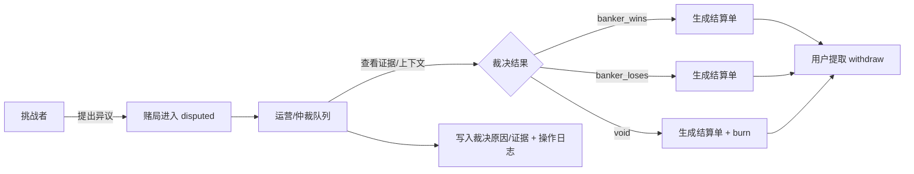
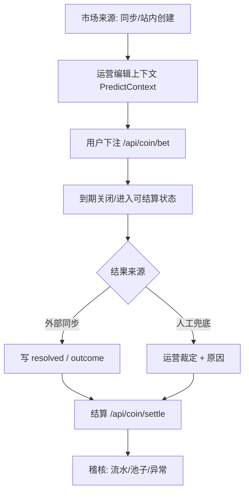

# 运营侧（预测市场 & 开战广场）说明文档

> 背景：当前“预测市场（/api/football + /api/coin）”与“开战广场（/api/battle + /api/admin/battle）”已有一定后端能力，但缺少专门面向运营/审核/仲裁/活动配置的页面与配套接口。
>
> 本文目标：
> 1) 说明运营侧的作用与职责边界；
> 2) 基于当前仓库真实接口/模块，指出哪些能力可复用到运营侧；
> 3) 给出“最急需补充”的运营功能清单（按优先级）。

---

## 0. 一句话定义：运营侧是什么？

运营侧 = **用来“保障内容与资金玩法可持续运行”的后台**。

- 对外：保证用户看到的市场/赌局**可理解、可参与、可结算、可仲裁、可追溯**。
- 对内：让运营/风控/客服用**低成本**完成：上线、巡检、处理争议、控风险、产出报表。

---

## 1. 为什么预测市场/开战广场必须有运营侧？

这两块模块的共同特点：

1) **强时效**：到期封盘/结算窗口/超时策略需要兜底。
2) **强争议**：结果判定、规则边界、文案歧义会引发用户纠纷。
3) **强资金属性**：任何扣款/入池/出池/燃烧都需要可审计与可追踪。
4) **强风控依赖**：刷热度/刷投注/恶意异议/庄家作恶，需要运营工具快速介入。

没有运营侧，最终会变成：

- 研发被动介入（手改 DB / 手跑脚本）
- 决策不可追溯（谁裁决的、为何裁决、证据是什么）
- 用户体验差（纠纷处理慢、错误难解释）
- 财务/账务风险（对不上账、重复结算、资金池异常）

---

## 2. 运营侧角色与权限边界（建议）

### 2.1 角色划分

| 角色 | 主要职责 | 是否接触“资金动作” | 典型动作 |
|---|---|---:|---|
| 运营（内容） | 上架/下架、编辑文案、设置置顶/推荐、标签维护 | 否 | 维护 PredictContext、活动运营 |
| 仲裁/客服 | 处理争议、裁定结果、记录证据 | 间接（触发结算/处罚） | battle dispute 仲裁、市场作废 |
| 风控 | 限额、黑名单、异常检测、冻结/封禁 | 是（高风险） | 限制下注、封禁用户、处理刷量 |
| 财务/审计 | 对账、流水核查、导出报表 | 只读/审批 | 查流水、查资金池余额、导出月报 |
| 超级管理员 | 配置系统级开关 | 是 | 系统参数、全局开关、策略配置 |

### 2.2 权限原则（建议）

1) **操作留痕**：所有运营操作必须进操作日志（你们已有：`/api/admin/operate-log` 相关模块能复用）。
2) **双人复核**（可选）：涉及资金的大动作（人工结算、铸币/扣回、批量作废）建议“提交-审核-执行”。
3) **最小权限**：内容运营不直接拥有仲裁权限；仲裁不直接拥有铸币权限。

---

## 3. 系统现状速览（基于仓库真实代码）

### 3.1 开战广场（Battle Square）现状

已存在：

- 用户接口（需登录）：`/api/battle/**`
  - 列表：`GET /api/battle/list`
  - 详情：`GET /api/battle/by?battleId=...`
  - 创建：`POST /api/battle/create`
  - 加入/追加：`POST /api/battle/join`
  - 庄家加注：`POST /api/battle/banker_add_stake`
  - 庄家宣判：`POST /api/battle/declare`
  - 挑战者确认：`POST /api/battle/challenger_confirm`
  - 挑战者异议：`POST /api/battle/challenger_dispute`
  - 提取：`POST /api/battle/withdraw`

- 管理员仲裁接口（需管理员）：`/api/admin/battle/**`
  - 裁决：`POST /api/admin/battle/resolve`

代码位置：

- 路由注册：`internal/server/router.go`
- 控制器：`internal/controllers/api/battle_controller.go`
- 详细接口文档（已整理）：`docs/api/battle.md`

### 3.2 预测市场（PredictMarket / PredictContext）现状

已存在：

- 市场查询与上下文：`/api/football/**`（当前挂在 `/api` 下默认要登录）
  - 市场列表：`GET /api/football/markets`
  - 热度榜：`GET /api/football/predict_context/hot`
  - 标签TOP：`GET /api/football/predict_tags/hot`
  - 按标签：`GET /api/football/markets/by_tag`
  - 按名称：`GET /api/football/markets/by_name`
	- 查询用户在某个市场的下注结算结果：`GET /api/football/bet_settle_result`
  - Upsert 上下文：`POST /api/football/predict_context/update`
	- 同步入口（手动触发）：`POST /api/football/sync_polymarket`

- 下注/结算（需登录）：`/api/coin/**`
  - 我的金币：`GET /api/coin/me`
  - 下注：`POST /api/coin/bet`
  - 结算：`POST /api/coin/settle`

- 标签物化：`/api/predict-tag/**`
  - 标签列表：`GET /api/predict-tag/list`
  - 刷新物化：`POST /api/predict-tag/refresh`

文档：

- 预测市场接口：`docs/api/predict.md`
- 金币/下注：`docs/api/coin.md`
- 预测市场运营后台（看板/盘口统计/人工结算）：`docs/api/admin_predict.md`
- “产品 → 开发上下文”：`prompt/project/预测.md`

---

## 4. 运营侧的“工作台”应该长什么样（信息架构）

下面给一份最小可落地的信息架构（IA），先满足“能用”，再逐步完善。

### 4.1 总体 IA（建议）

```text
运营后台
├─ 总览看板
│  ├─ 全站概览
│  │  ├─ 总用户
│  │  ├─ 总评论
│  │  └─ 总帖子数
│  ├─ 预测市场
│  │  ├─ 今日新增市场/赌局
│  │  ├─ 进行中市场统计
│  │  ├─ 已结算市场统计
│  │  ├─ 今日下注额/入场费/燃烧
│  │  ├─ 待处理争议（battle）
│  │  ├─ 7日内下注趋势柱状图
│  │  ├─ 7日内活跃用户柱状图
│  │  └─ 最近操作
│  └─ 开战广场
│     ├─ 今日新增市场/赌局
│     ├─ 进行中赌局统计
│     ├─ 已结算赌局统计
│     ├─ 今日下注额/入场费/燃烧
│     ├─ 待处理争议（battle）
│     ├─ 7日内下注趋势柱状图
│     ├─ 7日内活跃用户柱状图
│     └─ 最近操作
├─ 预测市场运营
│  ├─ 市场列表（可筛选 OPEN/CLOSED/SETTLED）
│  ├─ 市场编辑（标题、上下文、封面、标签、置顶/推荐）
│  ├─ 结算与作废（人工兜底 + 记录原因）
│  │  ├─ 管理员可对 CLOSED 状态的市场进行结算
│  │  ├─ 结算时必须选择一个结果：正方胜 / 反方胜（作为该市场最终 outcome）
│  │  └─ 结算前可查看盘口统计
│  │     ├─ 押注正方的用户数量
│  │     ├─ 押注反方的用户数量
│  │     ├─ 正方投注金额
│  │     └─ 反方投注金额
│  └─ 标签运营（refresh、合并、禁用、SEO别名）
├─ 开战广场运营
│  ├─ 赌局巡检列表（open/sealed/pending/disputed/settled）
│  ├─ 争议仲裁队列（disputed + 超时提醒）
│  ├─ 赌局强制流转（封盘/作废/异常关闭，需权限）
│  └─ 结算单与提取异常（对账）
├─ 风控与治理
│  ├─ 用户风险（黑名单、封禁、限额）
│  ├─ 异常下注/刷量检测
│  └─ 关键词/敏感词（你们已有 forbidden-word）
├─ 用户管理
│  ├─ 用户列表/搜索（按ID/昵称/手机号/邮箱等）
│  ├─ 用户详情（基础信息、封禁状态、近7日活跃等）
│  └─ 权限管理
│     ├─ 授权为管理员
│     ├─ 取消管理员授权
│     └─ 操作留痕（写入 operate-log，必要时支持二次确认）
├─ 社区管理
│  ├─ 帖子管理
│  │  ├─ 删除帖子
│  │  ├─ 置顶/取消置顶
│  │  └─ 推荐/取消推荐
│  ├─ 用户侧举报
│  │  └─ 用户举报帖子（原因/补充说明/证据）
│  └─ 举报审核
│     ├─ 运营侧查看举报帖子队列
│     ├─ 查看帖子详情与举报信息
│     └─ 删除帖子（并记录处理结果/原因）
└─ 审计
	├─ 操作日志（你们已有 operate-log）
	└─ 资金流水导出（coin log / battle ledger 等）
```

### 4.2 页面用“图”讲清楚流程（建议在 PRD/原型里体现）

#### 图 1：开战广场争议处理闭环



#### 图 2：预测市场运营的“上架-维护-结算”闭环



---

## 5. 运营侧能“直接复用”的现有能力（不用等研发做新接口）

### 5.1 直接可用（已存在且符合运营需求）

1) **开战广场仲裁**（最关键）
	- `POST /api/admin/battle/resolve`
	- 文档：`docs/api/battle.md`

2) **赌局列表/详情用于巡检**（目前在用户侧接口，需要管理员身份调用也可以）
	- `GET /api/battle/list`
	- `GET /api/battle/by`

3) **预测市场列表/热度/按标签**（可用作运营看板的数据源）
	- `GET /api/football/markets`
	- `GET /api/football/predict_context/hot`
	- `GET /api/football/markets/by_tag`

4) **预测上下文维护（编辑封面/详情/标签/热度）**
	- `POST /api/football/predict_context/update`
	- 运营可以先用它做“内容补全”，但需要注意：目前该接口挂在 `/api` 下，默认需要登录，并没有显式管理员鉴权。

5) **标签物化刷新**
	- `POST /api/predict-tag/refresh`
	- 风险：现在也在 `/api` 下，默认需要登录，不区分管理员。

6) **后台基础能力**（你们已有 admin 模块）
	- 菜单/角色/字典/系统配置/操作日志/敏感词/用户举报等（路由见 `internal/server/router.go`）

### 5.2 “能用但不够安全”的点（需要补齐权限/审计）

- `/api/football/predict_context/update`、`/api/predict-tag/refresh` 更像运营能力，但目前不在 `/api/admin` 下。
- 建议新增：`/api/admin/predict/**` 或把关键运营写接口迁入 admin party，并强制 `AdminMiddleware`。

---

## 6. 目前最急需补充的运营功能（按优先级）

下面列出的“急需”遵循一个原则：**先解决资金风险与纠纷成本，再做增长与精细化运营**。

### P0（立刻要有，否则风险不可控）

1) **争议仲裁工作台（Battle）**
	- 目标：让仲裁人员在 1 个页面完成「队列 → 详情 → 证据 → 裁决 → 留痕」。
	- 依赖接口：
	  - 已有：`GET /api/battle/list?status=disputed`（用来做队列）
	  - 已有：`GET /api/battle/by`（详情）
	  - 已有：`POST /api/admin/battle/resolve`（裁决）
	- 急缺：
	  - 裁决原因字段（目前 resolve 可能只传 result/requestId；建议补充 reason/evidenceUrls）
	  - 仲裁超时提醒（待办/告警）

2) **资金与流水稽核页面（Battle + Predict）**
	- 目标：能回答“这笔钱从哪来、到哪去、为什么 burn”。
	- 急缺：
	  - battle ledger / settlement 的运营查询接口（目前更多在 service/repo 层，运营后台缺查询面）
	  - predict 的下注流水和结算流水聚合报表

3) **预测市场的“作废/人工结算兜底”**
	- 目标：外部结果缺失/异常时，不靠研发手工改库。
	- 急缺：
	  - admin 级“设定结果/作废/重算策略”接口 + 页面
	  - 操作日志

4) **社区举报处理闭环（帖子）**
	- 目标：把内容治理从“研发介入/手工删库”变成“用户举报 → 运营审核 → 动作留痕”的标准流程。
	- 用户侧：用户可对帖子发起举报（原因/补充说明/证据）。
	- 运营侧：查看举报队列，进入帖子详情核实，一键删除/置顶，并记录处理结果与原因。
	- 必须：所有删除/置顶/驳回等操作进入操作日志，便于追溯。

### P1（需要尽快补齐，提升运营效率与内容质量）

4) **预测市场内容运营（上下文增强）**
	- 市场标题规范化、封面图、详情/规则提示、标签体系维护。
	- 复用：`POST /api/football/predict_context/update`
	- 急缺：权限迁移到 admin + 审计 + 批量编辑能力。

5) **列表筛选与巡检能力**
	- Battle：按 `pendingDeadline/confirmDeadline/disputeDeadline` 近到期排序，快速发现“要爆雷”的局。
	- Predict：按 closeTime、OPEN/CLOSED/SETTLED 筛选，发现“该结算但没结算”的市场。
	- 急缺：接口支持更多筛选条件（时间范围、状态、关键词、创建者等）。

6) **风控工具（最小集）**
	- 下注限额（用户/市场维度）、异常下注告警、黑名单/封禁快捷入口。
	- 你们已有：`/api/admin/forbidden-word`、`/api/admin/user-report` 可作为治理体系的一部分。

### P2（增长&精细化运营：可排后）

7) **活动配置与运营位**
	- 首页运营位：推荐市场/推荐赌局、banner、置顶、专题页。
	- 热度干预策略：例如某些市场初期冷启动加权（需谨慎，避免影响公平性）。

8) **数据看板**
	- DAU、下注人数、下注额、结算率、争议率、仲裁耗时、负反馈等。

---

## 7. 建议补齐的“运营侧接口”清单（落地导向）

> 说明：这里列的是“运营侧急需，但当前代码接口不够”的部分。命名仅建议，最终以你们路由风格为准。

### 7.1 Battle（开战广场）运营接口

1) disputed 队列增强查询
	- `GET /api/admin/battle/list?status=disputed&order=deadline_asc`
	- 目的：无需走用户侧接口，且能拿到更多仲裁字段（deadline、disputedBy、最近动作等）。

2) 裁决原因与证据入库
	- `POST /api/admin/battle/resolve`
	- 建议新增字段：
	  - `reason`：文本
	  - `evidenceUrls`：数组（截图/链接）
	  - `penalty`：可选（是否启用额外处罚，若你们规则允许）

3) 账务对账查询
	- `GET /api/admin/battle/ledger?battleId=...`
	- `GET /api/admin/battle/settlement?battleId=...`
	- 目的：运营可直接对账与导出。

### 7.2 Predict（预测市场）运营接口

1) admin 版市场列表（更丰富筛选）
	- （建议新增）`GET /api/admin/predict/markets?...`

2) 运营编辑上下文（迁移到 admin）
	- （建议新增）`POST /api/admin/predict/context/update`
	- 将现有 `/api/football/predict_context/update` 逻辑迁移/复用。

3) 人工结算 / 作废
	- `POST /api/admin/predict/market/settle`（已实现：指定结果 A/B；可选 allowReset 用于纠错）
	- （建议新增）`POST /api/admin/predict/market/void`
	- 必须：幂等 + 操作日志 + 二次确认。

4) 同步任务监控
	- （建议新增）`POST /api/admin/predict/sync_polymarket`
	- （建议新增）`GET /api/admin/predict/sync_status`

---

## 8. 建议的“先做页面，后补接口”的最小落地顺序（两周版本）

### 第 1 周：把纠纷成本降下来（P0）

1) 仲裁队列页（disputed 列表 + deadline + 快捷进入详情）
2) 仲裁详情页（battle 详情 + 挑战者动作 + 结算信息 + 一键裁决）
3) 操作留痕（operate-log 里可查到 resolve 行为）

### 第 2 周：把市场“可运营”起来（P1）

4) 预测市场列表页（按状态/closeTime）
5) 预测上下文编辑页（封面/详情/标签）
6) 标签刷新/管理页（先做 refresh + list）

---

## 9. 附录：与代码/文档的对照（方便研发联动）

- 路由注册总览：`internal/server/router.go`
- 开战广场接口文档：`docs/api/battle.md`
- 预测市场接口文档：`docs/api/predict.md`
- 预测市场产品/开发上下文：`prompt/project/预测.md`
- 开战广场产品/接口上下文：`prompt/project/开战广场.md`

---

## 需求覆盖

- “整理一份 md 文档”：已写入本文件。
- “图文并茂阐述作用职能”：提供了两张流程图（mermaid）+ IA 结构图。
- “说明目前急需补充的功能”：按 P0/P1/P2 给出清单，并补充了接口/页面落地顺序。

