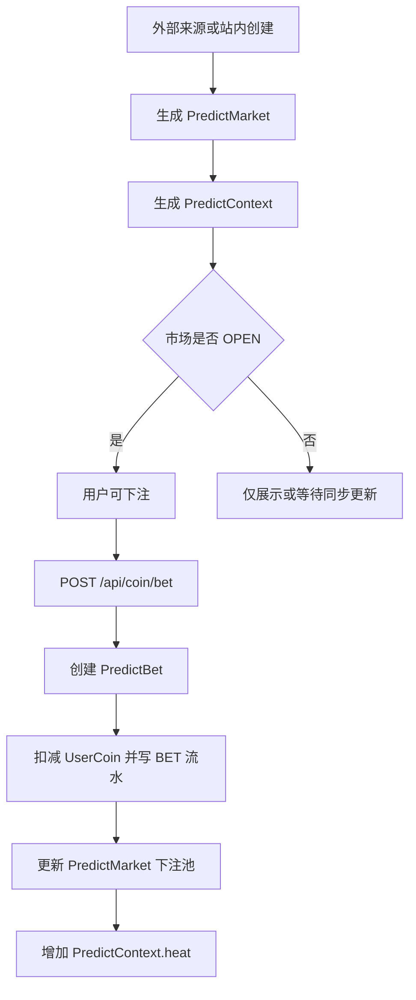
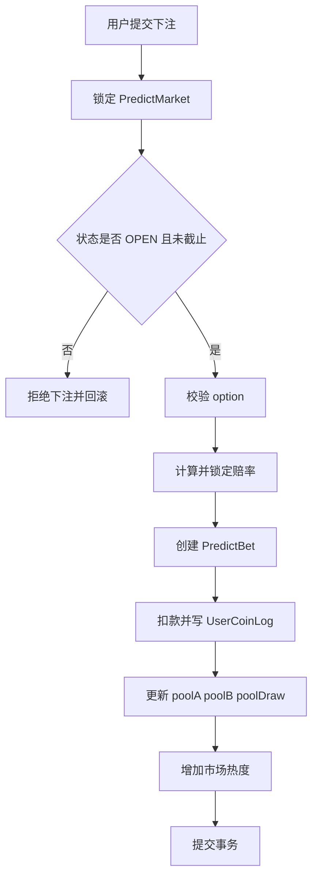
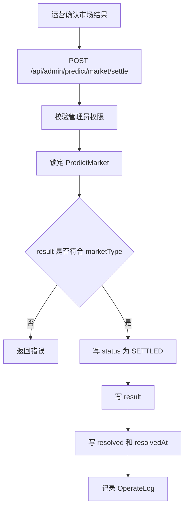
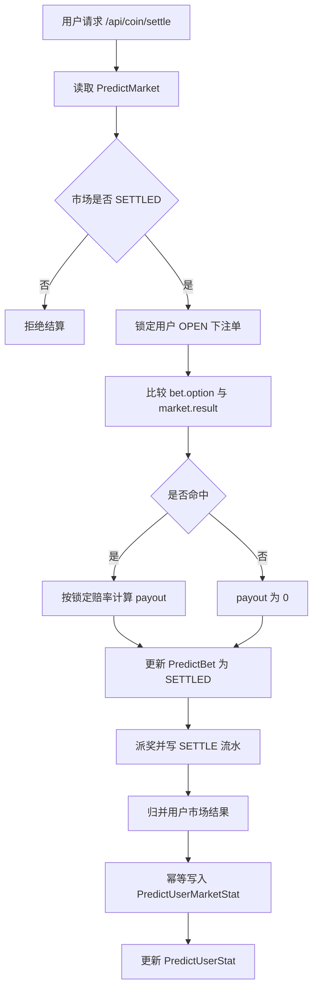
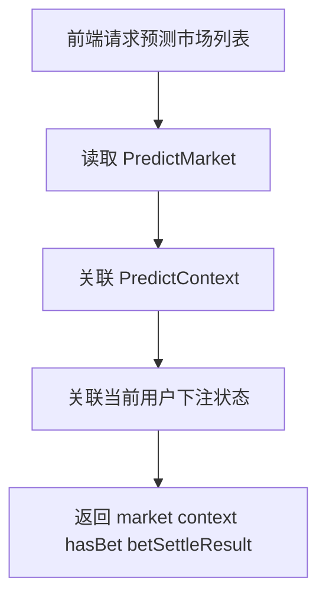
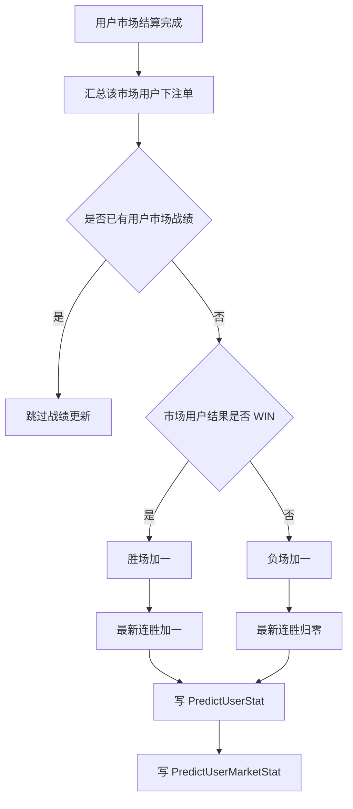
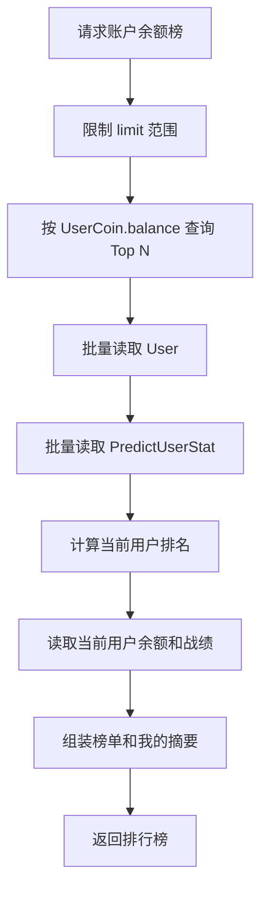
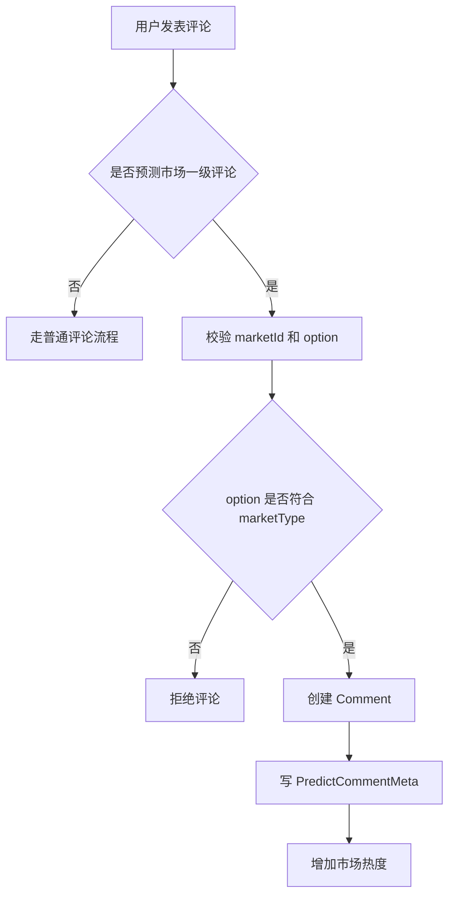
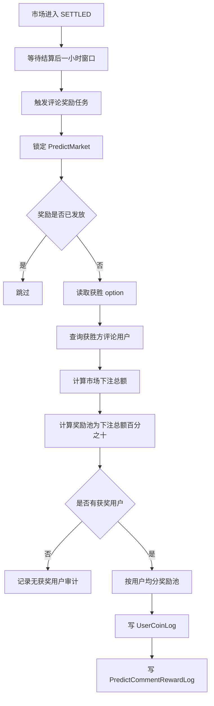

# 预测市场公共部分流程图

## 1. 通用市场创建到下注

```mermaid
flowchart TD
  A["外部来源或站内创建"] --> B["生成 PredictMarket"]
  B --> C["生成 PredictContext"]
  C --> D{"市场是否 OPEN"}
  D -- "是" --> E["用户可下注"]
  D -- "否" --> F["仅展示或等待同步更新"]
  E --> G["POST /api/coin/bet"]
  G --> H["创建 PredictBet"]
  H --> I["扣减 UserCoin 并写 BET 流水"]
  I --> J["更新 PredictMarket 下注池"]
  J --> K["增加 PredictContext.heat"]
```

## 2. 通用下注事务

```mermaid
flowchart TD
  A["用户提交下注"] --> B["锁定 PredictMarket"]
  B --> C{"状态是否 OPEN 且未截止"}
  C -- "否" --> D["拒绝下注并回滚"]
  C -- "是" --> E["校验 option"]
  E --> F["计算并锁定赔率"]
  F --> G["创建 PredictBet"]
  G --> H["扣款并写 UserCoinLog"]
  H --> I["更新 poolA poolB poolDraw"]
  I --> J["增加市场热度"]
  J --> K["提交事务"]
```

## 3. 运营人工结算

```mermaid
flowchart TD
  A["运营确认市场结果"] --> B["POST /api/admin/predict/market/settle"]
  B --> C["校验管理员权限"]
  C --> D["锁定 PredictMarket"]
  D --> E{"result 是否符合 marketType"}
  E -- "否" --> F["返回错误"]
  E -- "是" --> G["写 status 为 SETTLED"]
  G --> H["写 result"]
  H --> I["写 resolved 和 resolvedAt"]
  I --> J["记录 OperateLog"]
```

## 4. 用户领取结算

```mermaid
flowchart TD
  A["用户请求 /api/coin/settle"] --> B["读取 PredictMarket"]
  B --> C{"市场是否 SETTLED"}
  C -- "否" --> D["拒绝结算"]
  C -- "是" --> E["锁定用户 OPEN 下注单"]
  E --> F["比较 bet.option 与 market.result"]
  F --> G{"是否命中"}
  G -- "是" --> H["按锁定赔率计算 payout"]
  G -- "否" --> I["payout 为 0"]
  H --> J["更新 PredictBet 为 SETTLED"]
  I --> J
  J --> K["派奖并写 SETTLE 流水"]
  K --> L["归并用户市场结果"]
  L --> M["幂等写入 PredictUserMarketStat"]
  M --> N["更新 PredictUserStat"]
```

## 5. 公共查询

```mermaid
flowchart TD
  A["前端请求预测市场列表"] --> B["读取 PredictMarket"]
  B --> C["关联 PredictContext"]
  C --> D["关联当前用户下注状态"]
  D --> E["返回 market context hasBet betSettleResult"]
```

## 6. 用户战绩更新

```mermaid
flowchart TD
  A["用户市场结算完成"] --> B["汇总该市场用户下注单"]
  B --> C{"是否已有用户市场战绩"}
  C -- "是" --> D["跳过战绩更新"]
  C -- "否" --> E{"市场用户结果是否 WIN"}
  E -- "是" --> F["胜场加一"]
  E -- "否" --> G["负场加一"]
  F --> H["最新连胜加一"]
  G --> I["最新连胜归零"]
  H --> J["写 PredictUserStat"]
  I --> J
  J --> K["写 PredictUserMarketStat"]
```

## 7. 账户余额榜

```mermaid
flowchart TD
  A["请求账户余额榜"] --> B["限制 limit 范围"]
  B --> C["按 UserCoin.balance 查询 Top N"]
  C --> D["批量读取 User"]
  D --> E["批量读取 PredictUserStat"]
  E --> F["计算当前用户排名"]
  F --> G["读取当前用户余额和战绩"]
  G --> H["组装榜单和我的摘要"]
  H --> I["返回排行榜"]
```

## 8. 预测市场评论绑定选项

```mermaid
flowchart TD
  A["用户发表评论"] --> B{"是否预测市场一级评论"}
  B -- "否" --> C["走普通评论流程"]
  B -- "是" --> D["校验 marketId 和 option"]
  D --> E{"option 是否符合 marketType"}
  E -- "否" --> F["拒绝评论"]
  E -- "是" --> G["创建 Comment"]
  G --> H["写 PredictCommentMeta"]
  H --> I["增加市场热度"]
```

## 9. 获胜方评论奖励

```mermaid
flowchart TD
  A["市场进入 SETTLED"] --> B["等待结算后一小时窗口"]
  B --> C["触发评论奖励任务"]
  C --> D["锁定 PredictMarket"]
  D --> E{"奖励是否已发放"}
  E -- "是" --> F["跳过"]
  E -- "否" --> G["读取获胜 option"]
  G --> H["查询获胜方评论用户"]
  H --> I["计算市场下注总额"]
  I --> J["计算奖励池为下注总额百分之十"]
  J --> K{"是否有获奖用户"}
  K -- "否" --> L["记录无获奖用户审计"]
  K -- "是" --> M["按用户均分奖励池"]
  M --> N["写 UserCoinLog"]
  N --> O["写 PredictCommentRewardLog"]
```
