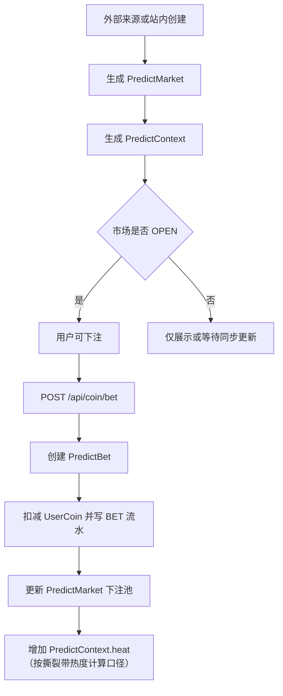
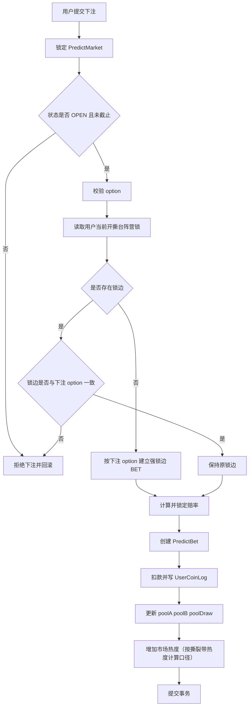
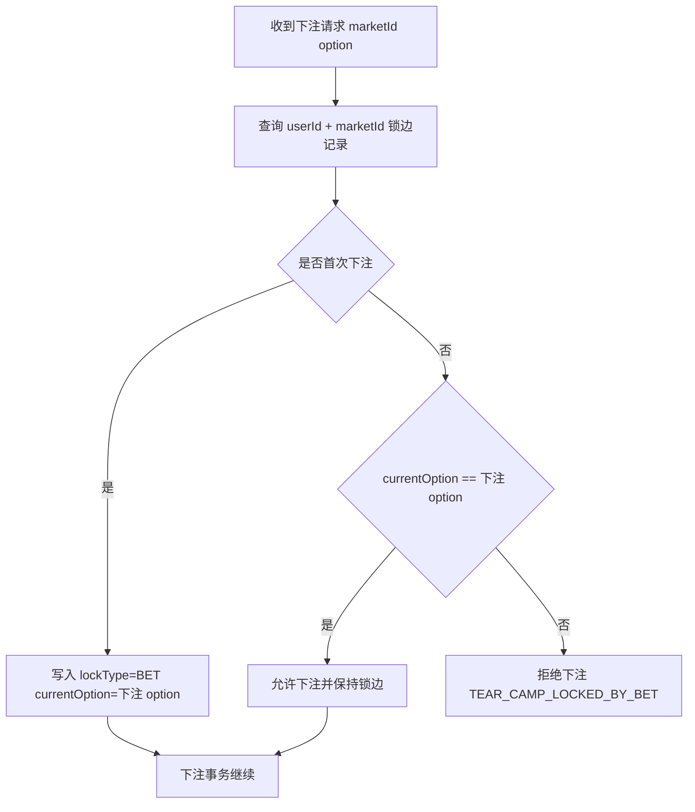
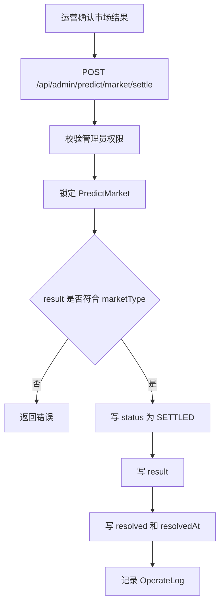
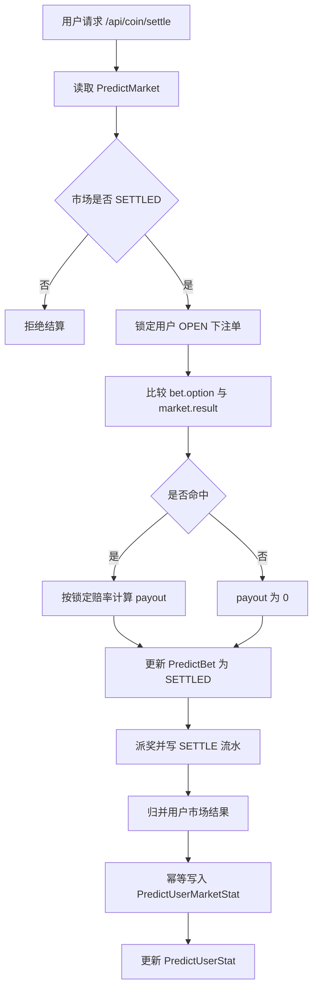
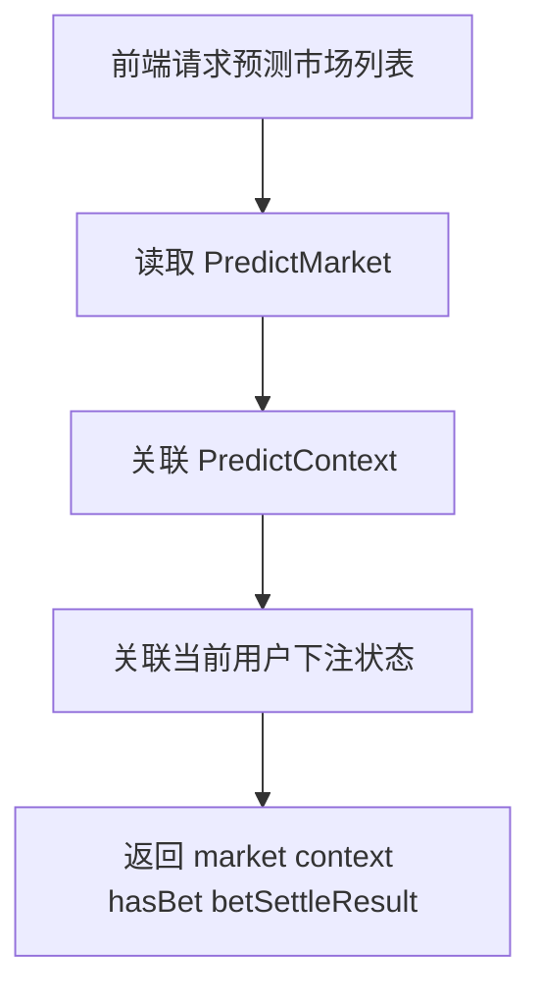
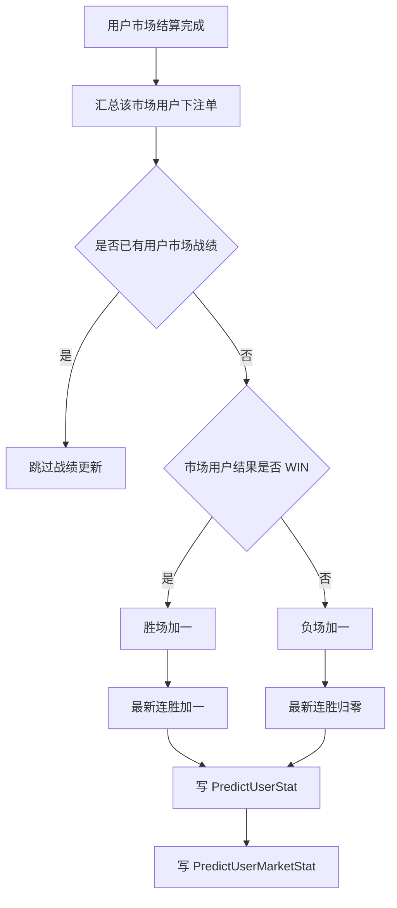
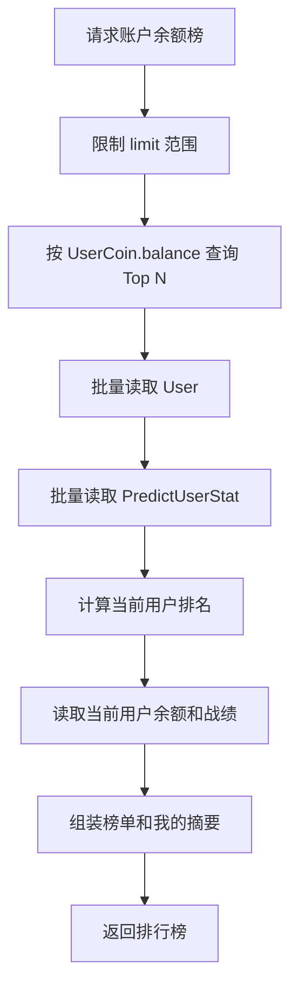
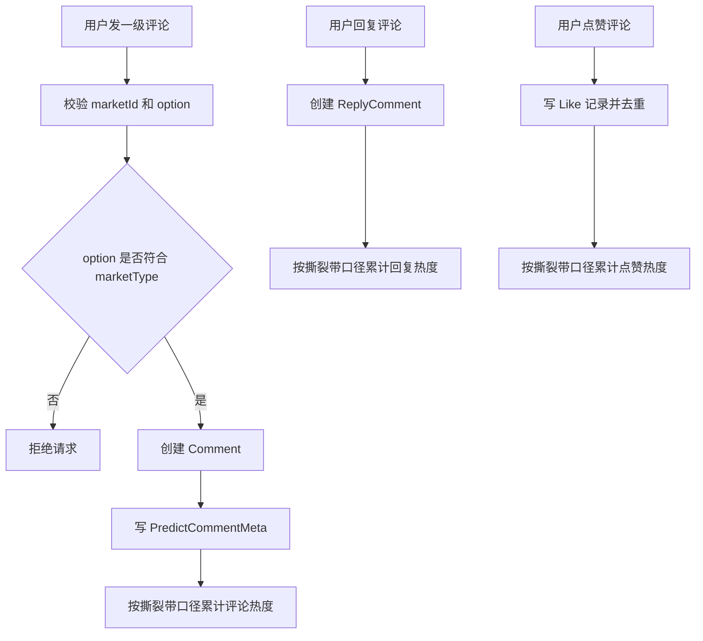
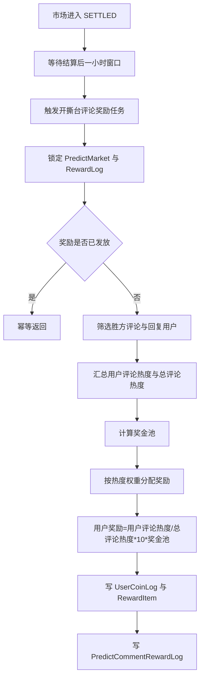

# 预测市场公共部分流程图

## 1. 通用市场创建到下注

```mermaid
flowchart TD
  A["外部来源或站内创建"] --> B["生成 PredictMarket"]
  B --> C["生成 PredictContext"]
  C --> D{"市场是否 OPEN"}
  D -- "是" --> E["用户可下注"]
  D -- "否" --> F["仅展示或等待同步更新"]
  E --> G["POST /api/coin/bet"]
  G --> H["创建 PredictBet"]
  H --> I["扣减 UserCoin 并写 BET 流水"]
  I --> J["更新 PredictMarket 下注池"]
  J --> K["增加 PredictContext.heat（按撕裂带热度计算口径）"]
```

## 2. 通用下注事务

```mermaid
flowchart TD
  A["用户提交下注"] --> B["锁定 PredictMarket"]
  B --> C{"状态是否 OPEN 且未截止"}
  C -- "否" --> D["拒绝下注并回滚"]
  C -- "是" --> E["校验 option"]
  E --> F["读取用户当前开撕台阵营锁"]
  F --> G{"是否存在锁边"}
  G -- "否" --> H["按下注 option 建立强锁边 BET"]
  G -- "是" --> I{"锁边是否与下注 option 一致"}
  I -- "否" --> D
  I -- "是" --> J["保持原锁边"]
  H --> K["计算并锁定赔率"]
  J --> K
  K --> L["创建 PredictBet"]
  L --> M["扣款并写 UserCoinLog"]
  M --> N["更新 poolA poolB poolDraw"]
  N --> O["增加市场热度（按撕裂带热度计算口径）"]
  O --> P["提交事务"]
```

## 2.1 下注触发开撕台锁边

```mermaid
flowchart TD
  A["收到下注请求 marketId option"] --> B["查询 userId + marketId 锁边记录"]
  B --> C{"是否首次下注"}
  C -- "是" --> D["写入 lockType=BET currentOption=下注 option"]
  C -- "否" --> E{"currentOption == 下注 option"}
  E -- "是" --> F["允许下注并保持锁边"]
  E -- "否" --> G["拒绝下注 TEAR_CAMP_LOCKED_BY_BET"]
  D --> H["下注事务继续"]
  F --> H
```

## 3. 运营人工结算

```mermaid
flowchart TD
  A["运营确认市场结果"] --> B["POST /api/admin/predict/market/settle"]
  B --> C["校验管理员权限"]
  C --> D["锁定 PredictMarket"]
  D --> E{"result 是否符合 marketType"}
  E -- "否" --> F["返回错误"]
  E -- "是" --> G["写 status 为 SETTLED"]
  G --> H["写 result"]
  H --> I["写 resolved 和 resolvedAt"]
  I --> J["记录 OperateLog"]
```

## 4. 用户领取结算

```mermaid
flowchart TD
  A["用户请求 /api/coin/settle"] --> B["读取 PredictMarket"]
  B --> C{"市场是否 SETTLED"}
  C -- "否" --> D["拒绝结算"]
  C -- "是" --> E["锁定用户 OPEN 下注单"]
  E --> F["比较 bet.option 与 market.result"]
  F --> G{"是否命中"}
  G -- "是" --> H["按锁定赔率计算 payout"]
  G -- "否" --> I["payout 为 0"]
  H --> J["更新 PredictBet 为 SETTLED"]
  I --> J
  J --> K["派奖并写 SETTLE 流水"]
  K --> L["归并用户市场结果"]
  L --> M["幂等写入 PredictUserMarketStat"]
  M --> N["更新 PredictUserStat"]
```

## 5. 公共查询

```mermaid
flowchart TD
  A["前端请求预测市场列表"] --> B["读取 PredictMarket"]
  B --> C["关联 PredictContext"]
  C --> D["关联当前用户下注状态"]
  D --> E["返回 market context hasBet betSettleResult"]
```

## 6. 用户战绩更新

```mermaid
flowchart TD
  A["用户市场结算完成"] --> B["汇总该市场用户下注单"]
  B --> C{"是否已有用户市场战绩"}
  C -- "是" --> D["跳过战绩更新"]
  C -- "否" --> E{"市场用户结果是否 WIN"}
  E -- "是" --> F["胜场加一"]
  E -- "否" --> G["负场加一"]
  F --> H["最新连胜加一"]
  G --> I["最新连胜归零"]
  H --> J["写 PredictUserStat"]
  I --> J
  J --> K["写 PredictUserMarketStat"]
```

## 7. 账户余额榜

```mermaid
flowchart TD
  A["请求账户余额榜"] --> B["限制 limit 范围"]
  B --> C["按 UserCoin.balance 查询 Top N"]
  C --> D["批量读取 User"]
  D --> E["批量读取 PredictUserStat"]
  E --> F["计算当前用户排名"]
  F --> G["读取当前用户余额和战绩"]
  G --> H["组装榜单和我的摘要"]
  H --> I["返回排行榜"]
```

## 8. 预测市场评论/回复/点赞互动入口

```mermaid
flowchart TD
  A["用户发一级评论"] --> B["校验 marketId 和 option"]
  B --> C{"option 是否符合 marketType"}
  C -- "否" --> D["拒绝请求"]
  C -- "是" --> E["创建 Comment"]
  E --> F["写 PredictCommentMeta"]
  F --> G["按撕裂带口径累计评论热度"]
  H["用户回复评论"] --> I["创建 ReplyComment"]
  I --> J["按撕裂带口径累计回复热度"]
  K["用户点赞评论"] --> L["写 Like 记录并去重"]
  L --> M["按撕裂带口径累计点赞热度"]
```

## 9. 预测市场开撕台评论奖励

```mermaid
flowchart TD
  A["市场进入 SETTLED"] --> B["等待结算后一小时窗口"]
  B --> C["触发开撕台评论奖励任务"]
  C --> D["锁定 PredictMarket 与 RewardLog"]
  D --> E{"奖励是否已发放"}
  E -- "是" --> F["幂等返回"]
  E -- "否" --> G["筛选胜方评论与回复用户"]
  G --> H["汇总用户评论热度与总评论热度"]
  H --> I["计算奖金池"]
  I --> J["按热度权重分配奖励"]
  J --> K["用户奖励=用户评论热度/总评论热度*10*奖金池"]
  K --> L["写 UserCoinLog 与 RewardItem"]
  L --> M["写 PredictCommentRewardLog"]
```
