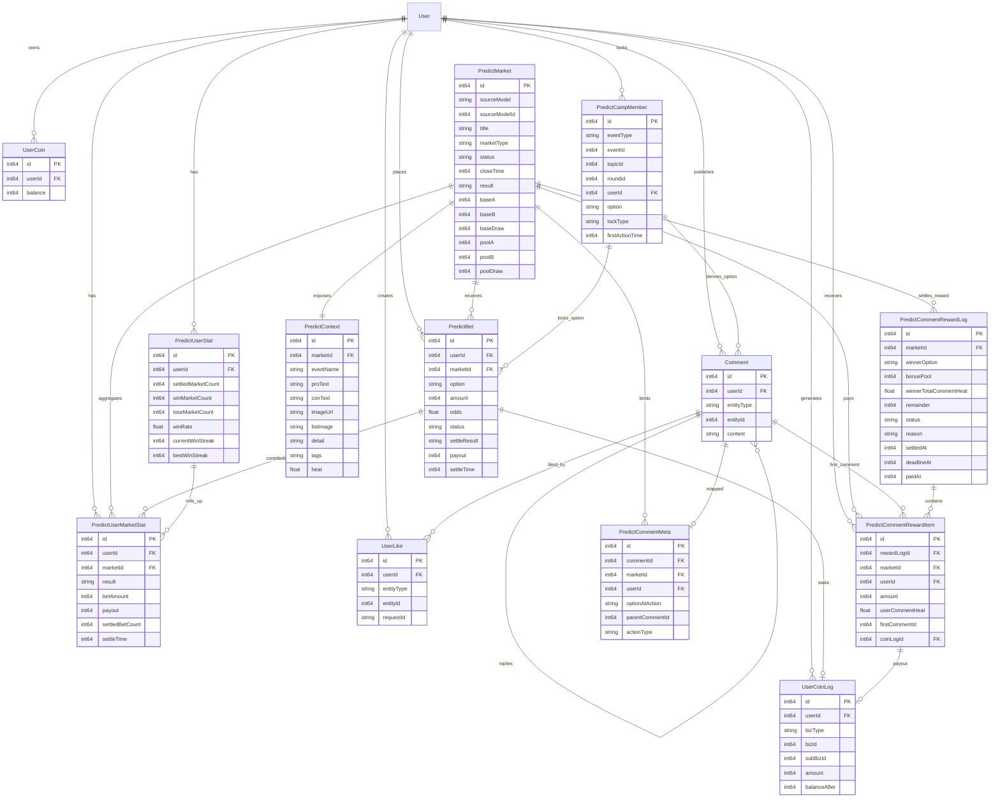

# 预测市场公共部分 ER 关系图

## 关键约束

- PredictBet：唯一键 `(marketId, userId)`。
- PredictUserMarketStat：唯一键 `(userId, marketId)`。
- PredictCommentMeta：唯一键 `(commentId)`。
- PredictCommentRewardLog：唯一键 `(marketId)`。
- PredictCommentRewardItem：唯一键 `(rewardLogId, userId)`。
- PredictCampMember：唯一键 `(eventType, topicId, roundId, userId)`。
- UserLike：唯一键 `(userId, entityType, entityId)`。

## 跨域关系说明

- PredictMarket 是下注、结算、评论奖励的统一主表。
- PredictContext 仅负责展示，不参与结算。
- PredictBet 同时驱动用户资金、用户战绩和市场池变化。
- PredictCommentMeta 记录评论或回复的动作时选项快照。
- PredictCampMember 记录评论、回复、点赞、下注的阵营锁定关系。
- PredictCommentRewardLog 与 PredictCommentRewardItem 记录开撕台铸币发放审计。
- UserCoinLog 承接下注扣款、下注派奖和评论奖励发币。
- UserLike 只负责点赞去重与查询状态，不承载热度公式。
