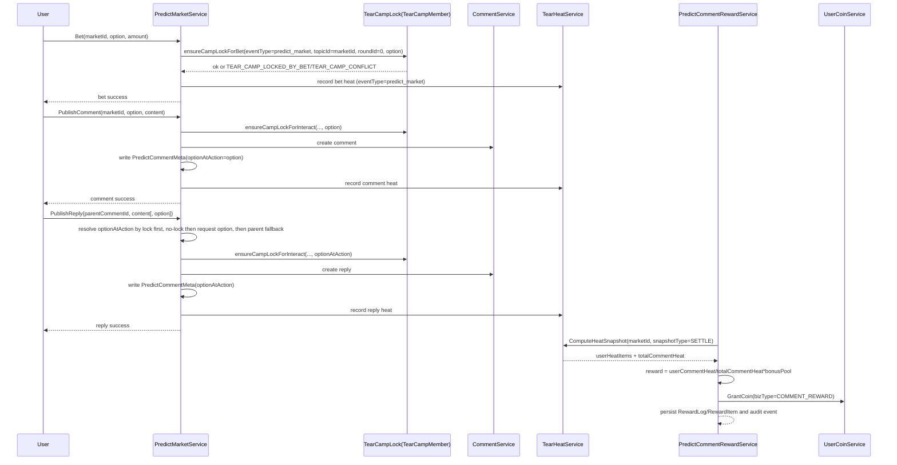

# 预测市场公共部分外部特性依赖详情

> 本文是 [08-外部特性依赖](./08-外部特性依赖.md) 的逐项展开，统一使用确定性规则。

## EXT-01 用户金币账户与流水

### 接口定义

- 接口名：SpendCoin / GrantCoin
- 调用方向：PredictBetService / PredictSettleService / PredictCommentRewardService -> UserCoinService
- 调用方式：进程内服务调用

### 输入参数

| 字段 | 类型 | 必填 | 说明 |
|------|------|------|------|
| userId | int64 | 是 | 用户 ID |
| amount | int64 | 是 | 金额，单位龟币 |
| bizType | string | 是 | `BET` / `SETTLE` / `COMMENT_REWARD` |
| bizId | int64 | 是 | 业务主键 |
| subBizId | int64 | 否 | 用户级幂等子键，评论奖励固定传 userId |

### 输出参数

| 字段 | 类型 | 说明 |
|------|------|------|
| ok | bool | 是否成功 |
| balanceAfter | int64 | 变更后余额 |
| coinLogId | int64 | 金币流水 ID |

### 错误码

| 错误码 | 触发条件 |
|--------|----------|
| COIN_507_INSUFFICIENT | 扣款时余额不足 |
| COIN_409_DUP_BIZ | 幂等键重复 |
| COIN_500_INTERNAL | 账户写入失败 |

### 固定策略

- 超时：300ms。
- 重试：最多 2 次，重试间隔 50ms，仅网络抖动错误可重试。
- 熔断：30 秒窗口内错误率 >= 40% 且请求数 >= 50 时打开，保持 60 秒。
- 并发：单实例最大 200 并发。
- 限速：每实例 500 次/秒。

### 验收标准

- 评论奖励重试不出现重复发币。
- 下注重复请求不出现重复扣款。

## EXT-02 通用评论发布与回复

### 接口定义

- 接口名：PublishComment / PublishReply
- 调用方向：PredictCommentService -> CommentService
- 调用方式：进程内服务调用

### 输入参数

| 字段 | 类型 | 必填 | 说明 |
|------|------|------|------|
| userId | int64 | 是 | 用户 ID |
| entityType | string | 是 | `topic` 或 `comment` |
| entityId | int64 | 是 | 市场 ID 或父评论 ID |
| content | string | 是 | 评论内容 |
| marketId | int64 | 是 | 预测市场 ID |
| option | string | 否 | `A/B/DRAW`。一级评论必填；回复在未锁边时可传，用于弱锁边 |
| requestId | string | 否 | 幂等请求 ID，推荐传 |

### 输出参数

| 字段 | 类型 | 说明 |
|------|------|------|
| commentId | int64 | 评论或回复 ID |
| createTime | int64 | 创建时间戳 |
| optionAtAction | string | 本次动作归属选项 `A/B/DRAW` |

### 错误码

| 错误码 | 触发条件 |
|--------|----------|
| COMMENT_422_INVALID_CONTENT | 内容为空或超长 |
| COMMENT_403_FORBIDDEN | 无评论权限 |
| COMMENT_500_INTERNAL | 写入失败 |

### 固定策略

- 超时：400ms。
- 重试：0 次，防止重复内容。
- 熔断：60 秒窗口内错误率 >= 30% 且请求数 >= 30 时打开，保持 30 秒。
- 并发：单实例最大 150 并发。
- 限速：用户维度 30 次/分钟，IP 维度 120 次/分钟。

### 归属规则（对齐对立PK方案）

- 一级评论：请求必须传 `option`，并在元数据落 `option_at_action`。
- 回复评论：前端主协议不要求传 `option`，系统按以下顺序确定 `option_at_action`：
	- 先读取用户在该 market 的锁边 option。
	- 若存在锁边，使用锁边 option；若请求携带了不同 `option`，返回 `TEAR_CAMP_CONFLICT`。
	- 若不存在锁边且请求携带 `option`，使用该 `option` 并建立 `INTERACT` 弱锁边。
	- 若不存在锁边且未传 `option`，回退父评论的 `option_at_action` 并建立 `INTERACT` 弱锁边。
	- 仍为空则拒绝请求（`TEAR_CAMP_OPTION_REQUIRED`）。
- 回复成功后必须写回评论元数据，保证后续奖励聚合按 `option_at_action` 可追溯。

### 验收标准

- 一级评论与回复均成功写入 `option_at_action`。
- 非法 option 请求被拒绝。

## EXT-03 通用点赞能力

### 接口定义

- 接口名：Like / Unlike / QueryLikeState
- 调用方向：PredictHeatService -> UserLikeService
- 调用方式：进程内服务调用

### 输入参数

| 字段 | 类型 | 必填 | 说明 |
|------|------|------|------|
| userId | int64 | 是 | 用户 ID |
| entityType | string | 是 | 固定 `comment` |
| entityId | int64 | 是 | 评论或回复 ID |

### 输出参数

| 字段 | 类型 | 说明 |
|------|------|------|
| liked | bool | 是否已点赞 |
| likeCount | int64 | 点赞总数 |

### 错误码

| 错误码 | 触发条件 |
|--------|----------|
| LIKE_409_DUP | 重复点赞 |
| LIKE_404_ENTITY | 目标不存在 |
| LIKE_500_INTERNAL | 点赞写入失败 |

### 固定策略

- 超时：200ms。
- 重试：最多 1 次，仅查询接口可重试，写接口不重试。
- 熔断：30 秒窗口内错误率 >= 35% 且请求数 >= 40 时打开，保持 20 秒。
- 并发：单实例最大 300 并发。
- 限速：用户维度 120 次/分钟。

### 验收标准

- 点赞行为 1 秒内反映到热度快照。
- 取消点赞不回滚历史热度。

## EXT-04 内容反垃圾校验

### 接口定义

- 接口名：CheckComment
- 调用方向：PredictCommentService -> SpamService
- 调用方式：进程内服务调用

### 输入参数

| 字段 | 类型 | 必填 | 说明 |
|------|------|------|------|
| userId | int64 | 是 | 用户 ID |
| content | string | 是 | 评论内容 |
| ip | string | 是 | 用户 IP |
| userAgent | string | 是 | 设备标识 |

### 输出参数

| 字段 | 类型 | 说明 |
|------|------|------|
| pass | bool | 是否通过 |
| reason | string | 拒绝原因 |
| riskScore | float64 | 风险分 |

### 错误码

| 错误码 | 触发条件 |
|--------|----------|
| SPAM_403_BLOCKED | 命中黑词或策略拦截 |
| SPAM_429_RATE_LIMIT | 命中频率限制 |
| SPAM_500_INTERNAL | 校验服务异常 |

### 固定策略

- 超时：150ms。
- 重试：0 次。
- 熔断：60 秒窗口内错误率 >= 50% 且请求数 >= 20 时打开，保持 30 秒。
- 并发：单实例最大 400 并发。
- 限速：用户维度 20 次/分钟，IP 维度 60 次/分钟。

### 验收标准

- 命中黑词内容 100% 拒绝。
- 限频触发返回 429。

## EXT-05 开撕台热度计算服务

### 接口定义

- 接口名：ComputeHeatSnapshot / GetHeatSnapshot
- 调用方向：PredictHeatService / PredictCommentRewardService -> TearHeatService
- 调用方式：进程内服务调用

### 输入参数

| 字段 | 类型 | 必填 | 说明 |
|------|------|------|------|
| eventType | string | 是 | 同步开发后默认 `predict_market`，兼容读取 `pk` 历史数据 |
| marketId | int64 | 是 | 预测市场 ID |
| snapshotType | string | 否 | `CHECKPOINT` / `SETTLE` |
| windowType | string | 否 | 固定 `TEAR_STAGE` |

### 输出参数

| 字段 | 类型 | 说明 |
|------|------|------|
| userHeatItems | array | 用户级热度条目 |
| totalCommentHeat | decimal | 总评论热度 |
| totalLikeHeat | decimal | 总点赞热度 |
| snapshotTime | int64 | 快照时间 |

### 错误码

| 错误码 | 触发条件 |
|--------|----------|
| HEAT_404_EVENT_NOT_FOUND | 市场不存在 |
| HEAT_422_EVENT_TYPE_UNSUPPORTED | eventType 不受支持 |
| HEAT_409_WINDOW_CLOSED | 热度窗口已关闭 |
| HEAT_409_SNAPSHOT_NOT_READY | 结算快照未就绪 |
| HEAT_500_INTERNAL | 热度计算异常 |

### 固定策略

- 超时：300ms。
- 重试：最多 1 次，仅读取超时可重试。
- 熔断：30 秒窗口内错误率 >= 35% 且请求数 >= 40 时打开，保持 20 秒。
- 并发：单实例最大 300 并发。
- 限速：市场维度 180 次/分钟。

### 验收标准

- 评论奖励任务读取的总评论热度与快照一致。
- 同一 marketId + snapshotType 结果幂等。

### 同步开发约束

- 接口名 `ComputeHeatSnapshot / GetHeatSnapshot` 保持不变。
- `eventType` 识别范围扩展为 `pk / predict_market`。
- 新流量写路径统一使用 `eventType=predict_market`。
- 迁移窗口内读路径允许先读 `predict_market`，未命中再回退 `pk`。
- 迁移结束后取消回退，仅保留 `predict_market`。
- `roundId` 固定为 `0` 作为预测市场维度映射，不再作为争议项。

## EXT-06 定时任务调度

### 接口定义

- 接口名：RegisterCron / ExecuteTick
- 调用方向：PredictCommentRewardService -> Scheduler
- 调用方式：进程内框架调用

### 输入参数

| 字段 | 类型 | 必填 | 说明 |
|------|------|------|------|
| jobName | string | 是 | 固定 `predict_comment_reward` |
| cronExpr | string | 是 | 默认 `* * * * *` |
| lockKey | string | 是 | 分布式锁键 |

### 输出参数

| 字段 | 类型 | 说明 |
|------|------|------|
| runId | string | 本次执行 ID |
| success | bool | 是否成功 |
| durationMs | int64 | 执行耗时 |

### 错误码

| 错误码 | 触发条件 |
|--------|----------|
| SCHED_409_LOCKED | 分布式锁被占用 |
| SCHED_504_TIMEOUT | 单次执行超时 |
| SCHED_500_INTERNAL | 执行异常 |

### 固定策略

- 超时：单次执行 5s。
- 重试：失败后 1 次重试，间隔 200ms。
- 熔断：连续 5 次失败暂停 120 秒。
- 并发：同一 jobName 全局并发 = 1。
- 限速：每分钟 1 次。

### 验收标准

- 结算后一小时窗口内至少触发一次奖励扫描。
- 同一 marketId 不会重复发放。

## EXT-07 开撕台奖励审计事件总线

### 接口定义

- 接口名：PublishRewardAuditEvent
- 调用方向：PredictCommentRewardService -> EventBus
- 调用方式：异步事件发布

### 输入参数

| 字段 | 类型 | 必填 | 说明 |
|------|------|------|------|
| eventType | string | 是 | 固定 `PREDICT_TEAR_REWARD_PAID` |
| marketId | int64 | 是 | 市场 ID |
| rewardLogId | int64 | 是 | 奖励批次 ID |
| userCount | int | 是 | 发放用户数 |
| totalAmount | int64 | 是 | 发放总额 |

### 输出参数

| 字段 | 类型 | 说明 |
|------|------|------|
| accepted | bool | 是否接收 |
| messageId | string | 消息 ID |

### 错误码

| 错误码 | 触发条件 |
|--------|----------|
| BUS_503_UNAVAILABLE | 消息服务不可用 |
| BUS_500_INTERNAL | 发布异常 |

### 固定策略

- 超时：100ms。
- 重试：最多 3 次，间隔 100ms/200ms/400ms。
- 熔断：30 秒窗口内错误率 >= 50% 且请求数 >= 20 时打开，保持 30 秒。
- 并发：单实例最大 500 并发发布。
- 限速：每实例 1000 次/秒。

### 验收标准

- 评论奖励批次 `PAID` 后 1 秒内发布审计事件。
- 同一 `rewardLogId` 仅发布一次成功事件。

## P0-闭环补丁（预测市场复用 PK 锁边）

本节用于直接消除阻塞开发的 P0 缺陷，作为 05/06 的外部契约基线。

### P0-1 字段映射表（预测市场 -> PK 锁边/热度维度）

| 预测市场字段 | PK/撕裂带字段 | 传值规则 | 说明 |
|------|------|------|------|
| marketId | eventId | `eventId = marketId` | 热度与锁边统一主键 |
| marketId | topicId | `topicId = marketId` | 复用 PK topic 维度 |
| 无 round 概念 | roundId | 固定 `0` | 复用唯一键结构 |
| option(A/B/DRAW) | option | 原值透传 | 与阵营锁一致 |
| 一级评论 option | optionAtAction | 原值透传 | 写入评论元数据 |
| 回复评论 | optionAtAction | 用户锁边优先；未锁边时请求 option；再父评论兜底 | 对齐 PK 回复规则并支持弱锁边 |
| 热度服务 eventType | eventType | 默认 `predict_market`，迁移期兼容读取 `pk` | 与同步开发策略一致 |

### P0-2 时序图（下注锁边 + 评论回复 + 奖励）



### P0-3 错误码矩阵（调用方处理约定）

| 分类 | 错误码 | 触发点 | 调用方处理 |
|------|------|------|------|
| 锁边冲突 | `TEAR_CAMP_LOCKED_BY_BET` | 已有 BET 强锁且与当前 option 冲突 | 直接失败，提示用户阵营已锁定 |
| 锁边冲突 | `TEAR_CAMP_CONFLICT` | 互动/下注与现有锁边冲突 | 直接失败，不重试 |
| 回复缺归属 | `TEAR_CAMP_OPTION_REQUIRED` | 无用户锁边、请求未传 option 且父评论无 optionAtAction | 直接失败，提示先在市场选边评论 |
| 热度契约 | `HEAT_422_EVENT_TYPE_UNSUPPORTED` | 服务端尚未放开 `predict_market` 时收到新值 | 迁移期开启回退读取并按灰度开关降级 |
| 热度状态 | `HEAT_409_SNAPSHOT_NOT_READY` | 结算快照未就绪 | 延迟重试（任务重试） |
| 热度状态 | `HEAT_409_WINDOW_CLOSED` | 超过可计算窗口 | 标记奖励 `EXPIRED` |
| 资源不存在 | `HEAT_404_EVENT_NOT_FOUND` | marketId 不存在或映射对象缺失 | 记录失败并人工排查 |
| 资金幂等 | `COIN_409_DUP_BIZ` | 重复发币请求 | 视为成功（幂等接受） |

### P0-4 奖金池接口契约（必须落地）

P0 明确口径：

- 奖金池只允许取“单个预测市场总池的 10%”，即：

```text
bonusPool = (poolA + poolB + poolDraw) * 10%
```

- `binary` 市场中 `poolDraw` 固定为 0。
- 奖励任务必须读取市场实时池并固化计算后的 `bonusPool` 到 `PredictCommentRewardLog.bonusPool`。
- 任何全站池、活动池、配置常量池都不得作为该公式入参。

接口落参要求：

| 字段 | 来源 | 必填 | 说明 |
|------|------|------|------|
| marketId | PredictMarket.Id | 是 | 奖励主键 |
| bonusPool | `(poolA+poolB+poolDraw)*10%` | 是 | 固化到奖励日志 |
| winnerOption | PredictMarket.result | 是 | 胜方选项 |
| snapshotType | 固定 `SETTLE` | 是 | 保证结算口径一致 |

### P0-5 已确认决议

1. 热度服务同步开发，一并支持 `eventType=predict_market`，接口名与参数结构不变。
2. `roundId` 固定为 `0` 作为预测市场复用 PK 锁边维度映射。
3. 前端回复主协议为 `commentId/content/marketId/requestId`；未锁边时允许可选传 `option` 作为弱锁边。
4. 奖金池唯一来源为单市场总池的 `10%`，并且奖励日志必须固化该值。
