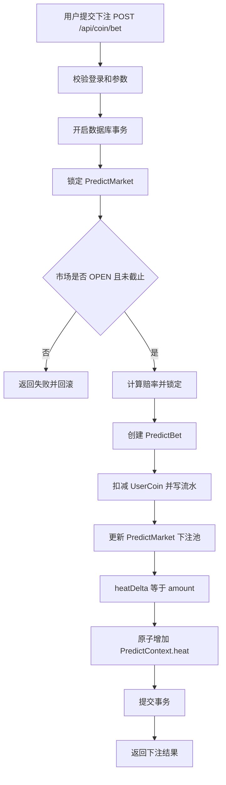
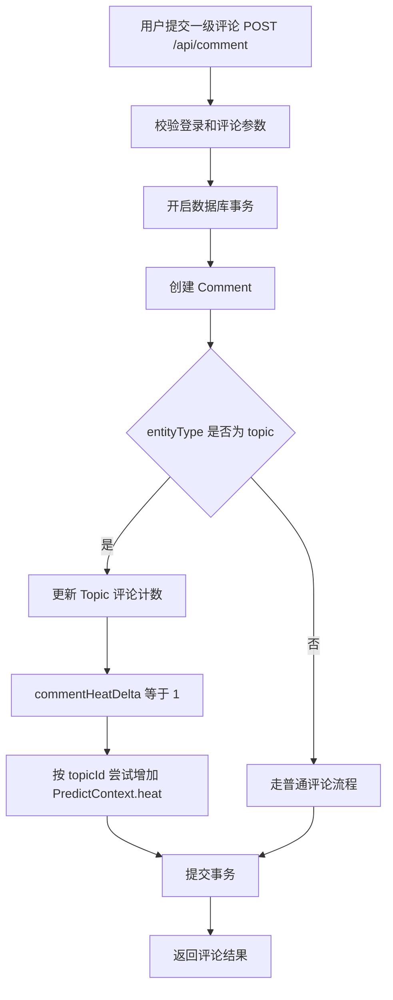
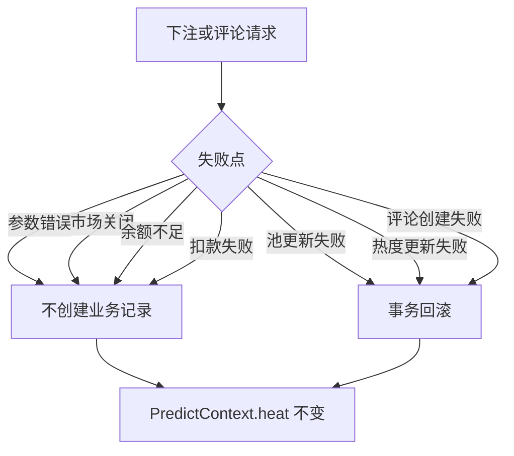
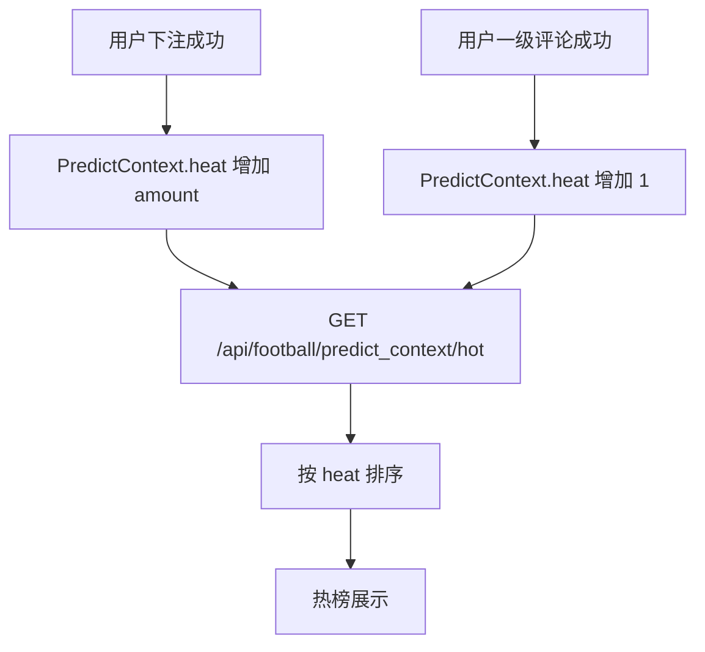
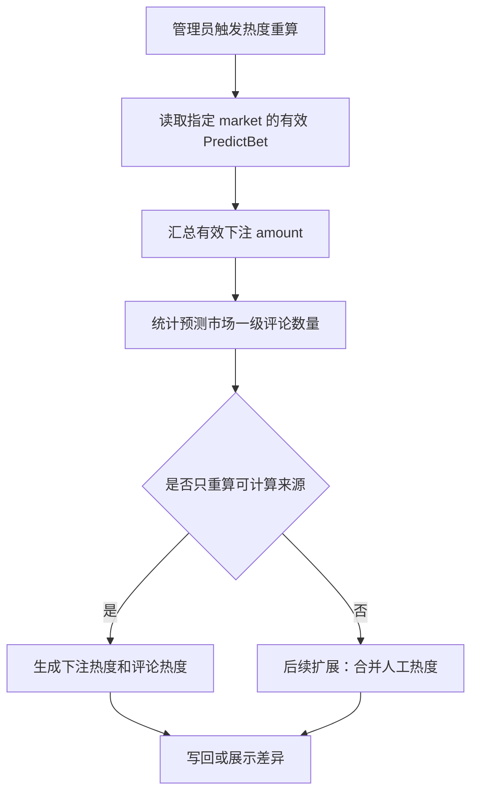

# 预测市场热度流程图

## 1. 下注增加热度

```mermaid
flowchart TD
  A["用户提交下注 POST /api/coin/bet"] --> B["校验登录和参数"]
  B --> C["开启数据库事务"]
  C --> D["锁定 PredictMarket"]
  D --> E{"市场是否 OPEN 且未截止"}
  E -- "否" --> R1["返回失败并回滚"]
  E -- "是" --> F["计算赔率并锁定"]
  F --> G["创建 PredictBet"]
  G --> H["扣减 UserCoin 并写流水"]
  H --> I["更新 PredictMarket 下注池"]
  I --> J["heatDelta 等于 amount"]
  J --> K["原子增加 PredictContext.heat"]
  K --> L["提交事务"]
  L --> M["返回下注结果"]
```

## 2. 评论增加热度

```mermaid
flowchart TD
  A["用户提交一级评论 POST /api/comment"] --> B["校验登录和评论参数"]
  B --> C["开启数据库事务"]
  C --> D["创建 Comment"]
  D --> E{"entityType 是否为 topic"}
  E -- "否" --> F["走普通评论流程"]
  E -- "是" --> G["更新 Topic 评论计数"]
  G --> H["commentHeatDelta 等于 1"]
  H --> I["按 topicId 尝试增加 PredictContext.heat"]
  I --> J["提交事务"]
  F --> J
  J --> K["返回评论结果"]
```

## 3. 失败不增加热度

```mermaid
flowchart TD
  A["下注或评论请求"] --> B{"失败点"}
  B -->|"参数错误"| C["不创建业务记录"]
  B -->|"市场关闭"| C
  B -->|"余额不足"| C
  B -->|"扣款失败"| C
  B -->|"池更新失败"| D["事务回滚"]
  B -->|"热度更新失败"| D
  B -->|"评论创建失败"| D
  C --> E["PredictContext.heat 不变"]
  D --> E
```

## 4. 热榜读取

```mermaid
flowchart TD
  A["用户下注成功"] --> B["PredictContext.heat 增加 amount"]
  C["用户一级评论成功"] --> D["PredictContext.heat 增加 1"]
  B --> E["GET /api/football/predict_context/hot"]
  D --> E
  E --> F["按 heat 排序"]
  F --> G["热榜展示"]
```

## 5. P1 重算预留

```mermaid
flowchart TD
  A["管理员触发热度重算"] --> B["读取指定 market 的有效 PredictBet"]
  B --> C["汇总有效下注 amount"]
  C --> D["统计预测市场一级评论数量"]
  D --> E{"是否只重算可计算来源"}
  E -- "是" --> F["生成下注热度和评论热度"]
  E -- "否" --> G["后续扩展：合并人工热度"]
  F --> H["写回或展示差异"]
  G --> H
```
